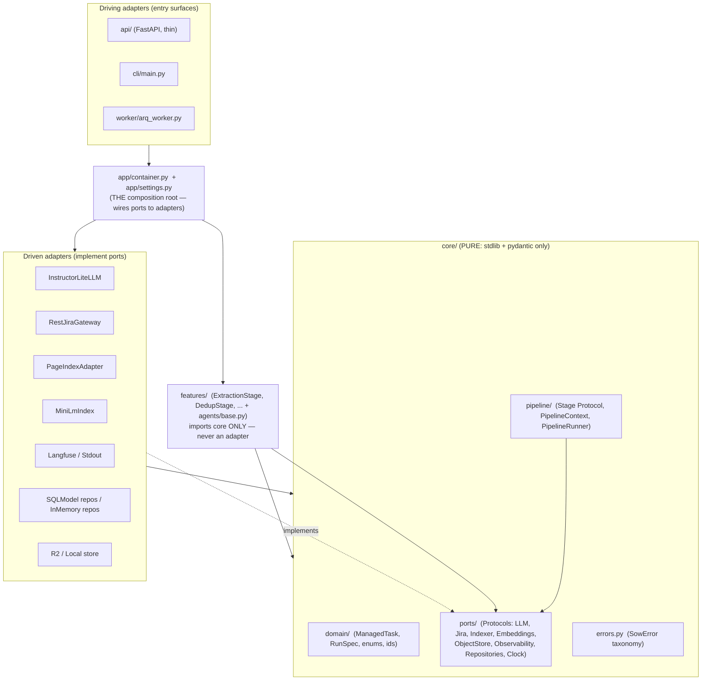

# Target Architecture — SOW-to-Jira

> **Status:** Target blueprint for the internal-software-architecture elevation.
> **Scope:** This document defines the *internal* architecture that makes SOW-to-Jira stable, testable, and extensible. The platform migration (Render, Postgres, Arq, R2, Langfuse Cloud) is sequenced separately in `ELEVATION-PLAN.md` / `RENDER-MIGRATION.md`; this architecture is what those waves migrate *onto*.
> **Proportionality:** Single-org internal SaaS (calibraint), ~6k LOC. Every decision below favors the simplest design that buys stability + testability + extensibility. No microservices, no CQRS/event-sourcing, no DI framework, no Temporal, no Haystack.

---

## 1. Architecture Principles

These are the durable rules. Everything in the rest of the document is an application of one of them.

### P1 — Dependency points inward, always
A new `core/` package (domain models, ports, the Stage protocol, the pipeline runner) imports **only stdlib + pydantic**. It imports nothing from `litellm`, `jira`, `sqlmodel`, `os.environ`, the filesystem, or any adapter. `features/` and `adapters/` depend on `core`; the composition root (`app/`) depends on everything. This is enforceable with an `import-linter` contract in CI.

> Fixes today: `pipeline/orchestrator.py` importing concrete `LLMClient` + every concrete agent; `pipeline/agents/extraction.py` importing `LLMClient` directly; agents reading `os.environ` and `data/sessions/` in their own bodies.

### P2 — Ports & adapters at every I/O edge
Each external system is a `typing.Protocol` in `core/ports/`: **LLM, Jira, document indexer, embedding index, object store, the repositories (Run / Task / StageResult / Credential / Coverage / Audit), and observability.** Concrete adapters implement them; they are constructed in exactly one place. This is the single seam the codebase lacks today — there is currently no way to mock the LLM or Jira without monkeypatching `os.environ` and `litellm`.

### P3 — Failure is data, never a swallowed exception
The pervasive `except Exception: return []` pattern is banned. Adapters **raise** typed errors at the seam; the core **catches** them and records an explicit health verdict (`OK | DEGRADED | FAILED`) with a reason. This directly fixes the audit's "100% INCOMPLETE / 0 dedup merges / critic conf=0.00" — those failure modes become visible degraded-stage records instead of vanishing into empty lists.

### P4 — Structured output is the contract, not a parse step
Every LLM call declares a Pydantic `response_model` and **Instructor** guarantees a validated instance or a typed failure. The hand-rolled regex-scrape `complete_json` and the hard-coded `max_tokens=4096` truncation (the #1 root-cause bug) are deleted outright.

### P5 — Config loaded once, typed, validated at startup
One frozen `AppSettings` (Pydantic Settings) replaces the three-way tangle: `os.environ` mutation in `ui/server.py`, the encrypted `data/settings.json` read inside `llm_router.py` on every call, and the inline `config/sow_config.json` load. Nothing reads `os.environ` at call-time. Per-*user* credentials are **not** in settings — they live encrypted in Postgres and are resolved per request.

### P6 — Group-by-feature over layer-folders
Modules are organized by domain capability (`extraction/`, `dedup/`, `jira_push/`), each owning its DTO + stage + prompts, rather than global `services/`, `repositories/`, `dtos/` buckets. A reviewer touching extraction opens one folder. Keeps a 6k-LOC app navigable.

### P7 — One composition root, plain factory — no DI framework
A single `app/container.py` builds adapters from typed settings + the authenticated user's decrypted credentials, and hands them to the runner. For one process with <10 wired dependencies, a factory is simpler, fully type-checked, and trivially overridable in tests. `dependency-injector` / `punq` would add indirection for zero benefit.

### P8 — Tenant-scoped from the schema up
Every persisted row carries `org_id` (+ `user_id` where user-owned). Every repository method takes a `TenantContext` and filters on it unconditionally. Postgres Row-Level Security (`set_config('app.tenant_id', ...)`) is added as a **defense-in-depth net**, not the primary control — app-layer scoping is the primary boundary.

### P9 — Proportionate durability: per-stage persistence, not a workflow engine
Resumability comes from persisting each stage's typed output keyed by `(run_id, stage)` plus Arq's at-least-once retry. **No Temporal** (flagged as a future option only if LLM-replay cost demands it), **no event-sourcing**, **no DAG engine** — the data dependency is a linear list.

---

## 2. Target Module / Directory Tree

```
sow2jira/
  core/                          # PURE domain. stdlib + pydantic ONLY. No I/O, no litellm, no jira, no os.environ, no Path.
    domain/
      models.py                  # ManagedTask (transport), RunSpec, SourceRef, AcceptanceCriterion ...
      extraction.py              # RawTask, TaskDependency, DedupDecision — transport-only, never tables
      ids.py                     # RunId, UserId, OrgId value types  (closes the "no tenant entity" gap)
      enums.py                   # ALL closed-set enums + _NormalizedEnum (_missing_ coercion for dirty LLM output)
    errors.py                    # SowError taxonomy (see §7)
    ports/                       # Protocols only — THE hexagon boundary
      llm.py                     # LLMProvider
      jira.py                    # JiraGateway
      indexer.py                 # DocumentIndexPort
      embeddings.py              # EmbeddingIndexPort
      object_store.py            # ObjectStore
      observability.py           # ObservabilityPort
      repositories.py            # Run / StageResult / Task / Credential / Coverage / Audit repos + RepositoryBundle
      tenant.py                  # TenantContext
      clock.py                   # Clock  (deterministic created_at/updated_at in tests)
    pipeline/
      stage.py                   # Stage Protocol + BaseStage + StageResult + StageStatus
      context.py                 # PipelineContext (carries ports + RunSpec + working set; NO globals)
      runner.py                  # PipelineRunner.run(ctx, resume=) — replaces orchestrator.run()

  features/                      # group-by-domain. Each owns dto + stage (+ prompt file).
    indexing/      stage.py
    extraction/    stage.py  dto.py
    state/         stage.py                       # pure, no LLM
    dedup/         stage.py  dto.py
    coverage/      stage.py  dto.py
    classifier/    stage.py  dto.py
    critic/        stage.py  dto.py
    gap_recovery/  stage.py
    cross_run/     stage.py
    jira_push/     service.py  dto.py
    agents/
      base.py                    # BaseAgent[I,O] — the one place broad try/except + retry + audit lives

  prompts/                       # versioned prompt assets (was 180-line inline f-strings)
    extraction.v1.txt  critic.v1.txt  dedup.v1.txt  coverage.v1.txt  classifier.v1.txt  gap.v1.txt
    registry.py                  # PromptRegistry.get(prompt_id, version) -> PromptTemplate

  adapters/                      # concrete impls of core/ports. Import inward only.
    llm/instructor_litellm.py    # LLMProvider via Instructor + LiteLLM (kills complete_json regex-scrape)
    llm/router.py                # resolve provider/model from AppSettings + UserCredentials (was llm_router.py)
    llm/retry.py                 # transient-429/5xx retry — MOVED verbatim out of llm_client.py
    jira/rest_gateway.py         # JiraGateway via jira SDK; creds injected, NOT os.environ
    indexer/pageindex.py         # wraps vendored pageindex/  (was pipeline/indexer.py)
    embeddings/minilm.py         # SentenceTransformer + .npz  (pulled out of dedup + cross_run agents)
    object_store/r2.py           # + local.py dev fallback
    observability/langfuse.py    # ObservabilityPort -> Langfuse/OTLP  (Argus fan-out dropped)
    observability/stdout.py      # loguru-to-stdout, the test/dev default
    persistence/
      tables.py                  # SQLModel rows (Org, User, Credential, Run, Task, StageResult, CoverageReport, AuditEntry)
      session.py                 # async engine + sessionmaker + RLS set_config hook
      repositories/sqlmodel/     # Postgres adapters
      repositories/memory/       # in-memory fakes (tests)
      factory.py                 # get_repositories(session) -> RepositoryBundle
      migrations/                # Alembic

  app/
    settings.py                  # AppSettings(BaseSettings, frozen=True) + get_settings() lru_cache
    container.py                 # THE composition root: build_container(settings, creds, session) -> Container
    pipelines.py                 # default_stage_order(flags) -> list[Stage]  (per-stage enable flags)

  api/                           # FastAPI surface ONLY. Thin: maps HTTP <-> DTO <-> service.
    server.py                    # routes; was ui/server.py (719 LOC) minus all business logic
    deps.py                      # FastAPI Depends() -> session -> Container
    schemas.py                   # request/response DTOs
    errors.py                    # single @app.exception_handler(SowError) -> HTTP status
  worker/
    arq_worker.py                # Arq task: build_container() then PipelineRunner.run()  (replaces BackgroundTask)
  cli/
    main.py                      # was main.py; builds container, calls runner

  pageindex/                     # vendored, untouched (only adapters/indexer/pageindex.py imports it)
  tests/
    unit/        # core + features with fake ports — the bulk (~70%)
    contract/    # one file per adapter (typed-error mapping, schema-return)
    pipeline/    # runner sequencing/resume/fatal with fake stages
    integration/ # orchestrator end-to-end: fake LLM + real Postgres (testcontainer)
    eval/        # recorded SOW cassettes through real Instructor path (CI-gated)
    fakes/       # FakeLLMProvider, FakeObservability, InMemoryBundle, FakeObjectStore ...
```

---

## 3. Layered + Hexagonal View

The dependency rule (P1) in one picture: arrows point **toward** `core`. The composition root is the only place that knows about everything.



**Read it as:** `api / cli / worker` → `app` → `features + adapters` → `core`. `core` points at nobody. All three driving surfaces converge on `PipelineRunner.run()` exactly as they converge on `PipelineOrchestrator.run()` today.

---

## 4. Pluggable Pipeline / Stage Framework

Replaces the 270-line linear `PipelineOrchestrator.run()` and its in-memory accumulators with a typed, registry-driven, per-stage-persisted architecture. ~250 LOC of plumbing for 9 stages — a **list, not a graph** (the data dependency *is* linear).

### 4.1 The contracts (`core/pipeline/`)

```python
# core/pipeline/stage.py
from typing import Protocol, runtime_checkable, Generic, TypeVar
from enum import Enum
from pydantic import BaseModel, Field

I = TypeVar("I"); O = TypeVar("O")

class StageStatus(str, Enum):
    OK = "ok"
    DEGRADED = "degraded"   # ran, quality compromised (e.g. coverage flagged everything) — RECORDED
    FAILED = "failed"       # produced no usable output
    SKIPPED = "skipped"     # resumed from cached output

class StageResult(BaseModel):
    stage: str
    status: StageStatus = StageStatus.OK
    duration_ms: int = 0
    metrics: dict = Field(default_factory=dict)      # node_count, merges, conf -> observability
    warnings: list[str] = Field(default_factory=list)
    error: str | None = None                         # explicit, not a silent empty list
    output: dict | None = None                       # the stage's typed output, serialized for persistence

@runtime_checkable
class Stage(Protocol):
    name: str
    fatal: bool                                      # if True, FAILED aborts the run
    def run(self, ctx: "PipelineContext") -> StageResult: ...
```

```python
# core/pipeline/context.py — replaces ~8 orchestrator instance attrs + 6 in-method accumulators
class PipelineContext(BaseModel):
    model_config = {"arbitrary_types_allowed": True}
    spec: RunSpec                                    # carries user_id/org_id/run_id — NO globals
    ports: "Ports"                                   # ctx.ports.llm / .jira / .audit / .runs ...
    nodes: list[dict] = Field(default_factory=list)
    tasks: list[ManagedTask] = Field(default_factory=list)   # the working set
    coverage_report: dict = Field(default_factory=dict)
    results: list[StageResult] = Field(default_factory=list)
    def record(self, r: StageResult) -> None: self.results.append(r)
```

`BaseStage` supplies uniform timing + the degrade-don't-crash contract: a raising `_execute` becomes a `FAILED` `StageResult` with `error` set — **never** a swallowed empty list.

### 4.2 The runner (`core/pipeline/runner.py`)

```python
class PipelineRunner:
    def __init__(self, stages: list[Stage], stages_repo: StageResultRepository):
        self._stages = stages; self._repo = stages_repo

    def run(self, ctx: PipelineContext, *, resume: bool = False) -> PipelineContext:
        total = len(self._stages)
        for i, stage in enumerate(self._stages):
            if ctx.ports.stop and ctx.ports.stop.is_set():
                break
            if resume and self._repo.has(ctx.spec.run_id, stage.name):   # skip completed stage
                self._repo.load_into(ctx, stage.name); continue
            ctx.ports.status(i + 1, f"{stage.name}...", (i + 1) / total)
            res = stage.run(ctx)
            ctx.record(res)
            self._repo.upsert(ctx.spec.tenant, ctx.spec.run_id, stage.name, res)   # durable per-stage checkpoint
            if res.status is StageStatus.FAILED and stage.fatal:
                break
        return ctx
```

The runner has **zero knowledge of which stages exist** — ordering lives in `app/pipelines.py`. Durability = `upsert(run_id, stage, result)` per stage + Arq retries. No Temporal.

### 4.3 Each current agent becomes a Stage

| Today (`pipeline/agents/…`) | Becomes (`features/…/stage.py`) | Notes |
|---|---|---|
| `indexer.py` + tree load/persist | `IndexingStage` | wraps `DocumentIndexPort` |
| `extraction.py` (per-node loop) | `ExtractionStage` | owns classifier-gate → extract → state → critic → coverage loop; rolls per-section health into one `StageResult` |
| `state.py` | `StateStage` | pure, no LLM |
| `deduplication.py` | `DedupStage` | `DEGRADED` + warning when `before>1 and merges==0` — surfaces the audit's "0 merges" |
| `coverage_check.py` + `coverage.py` | `CoverageStage` | |
| `classifier.py` | `ClassifierStage` | |
| `critic.py` | `CriticStage` | |
| `gap_recovery.py` | `GapRecoveryStage` | |
| `cross_run_index.py` | `CrossRunStage` | currently dormant — slots in as one list entry |

Example, the dedup stage making degradation visible:

```python
class DedupStage(BaseStage):
    name = "deduplication"; fatal = False
    def _execute(self, ctx, res):
        before = len(ctx.tasks)
        result = self._agent.run(ctx.tasks)          # AgentResult[list[ManagedTask]]
        ctx.tasks = result.value
        merges = before - len(ctx.tasks)
        res.metrics = {"in": before, "out": len(ctx.tasks), "merges": merges}
        if result.status is AgentStatus.DEGRADED:
            res.status = StageStatus.DEGRADED; res.warnings.append(result.reason)
        elif before > 1 and merges == 0:
            res.status = StageStatus.DEGRADED; res.warnings.append("dedup produced 0 merges across >1 task")
```

### 4.4 Stage ordering & flags (`app/pipelines.py`)

```python
def default_stage_order(flags: PipelineFlags, ports: Ports) -> list[Stage]:
    stages = [IndexingStage(ports.indexer), ExtractionStage(ports), StateStage()]
    if flags.dedup:    stages.append(DedupStage(ports))
    if flags.coverage: stages.append(CoverageStage(ports))
    if flags.critic:   stages.append(CriticStage(ports))
    stages.append(GapRecoveryStage(ports))
    return stages
```

Add/remove/reorder a stage = edit one list. The scattered `os.getenv('SOW_CRITIC_ENABLED')` toggles become validated `PipelineFlags` fields.

---

## 5. LLM / Agent Layer (Instructor + response-model-per-call)

### 5.1 The port (`core/ports/llm.py`)

```python
T = TypeVar("T", bound=BaseModel)

class LLMProvider(Protocol):
    def structured(
        self, *, response_model: type[T], system: str, prompt: str,
        max_tokens: int, temperature: float = 0.0,
        agent_name: str, node_id: str = "", max_retries: int = 2,
    ) -> T: ...
```

Pydantic-in / Pydantic-out. The regex-scrape `complete_json` dies at the boundary, not in the agents.

### 5.2 The adapter (`adapters/llm/instructor_litellm.py`)

```python
import instructor, litellm

class InstructorLiteLLM:                              # implements LLMProvider
    def __init__(self, provider_cfg, retry, observability):
        self._client = instructor.from_litellm(litellm.completion)
        self._cfg = provider_cfg
    def structured(self, *, response_model, system, prompt, max_tokens,
                   temperature=0.0, agent_name, node_id="", max_retries=2):
        return self._retry(lambda: self._client.chat.completions.create(
            model=self._cfg.model, api_key=self._cfg.api_key, api_base=self._cfg.api_base,
            response_model=response_model,
            max_retries=max_retries,        # Instructor: reprompt on SCHEMA-validation failure (truncation/garbage)
            max_tokens=max_tokens,          # per-call, NOT 4096 hard-coded — kills the truncation root cause
            temperature=temperature,
            messages=[{"role": "system", "content": system},
                      {"role": "user", "content": prompt}],
        ))
```

**Two deliberately-separate retry layers:** Instructor `max_retries` handles schema-validation failure; `adapters/llm/retry.py` (the *good* logic lifted verbatim from `llm_client.py:34-204`) handles transient 429/5xx. Today both are conflated and neither catches truncated-but-valid-prefix JSON.

### 5.3 One BaseAgent, thin subclasses (`features/agents/base.py`)

The broad `except` each agent repeats today lives **once**, and records a reason instead of returning `[]`:

```python
class BaseAgent(Generic[I, O]):
    name: str; prompt_id: str; prompt_version: str = "v1"
    response_model: type[BaseModel]
    max_tokens: int = 8192                            # generous default; per-agent override
    def run(self, inp: I) -> "AgentResult[O]":
        prompt = self._render(inp)
        try:
            parsed = self._llm.structured(
                response_model=self.response_model, system=self._system, prompt=prompt,
                max_tokens=self.max_tokens, agent_name=self.name, node_id=getattr(inp, "node_id", ""))
        except LLMValidationError as e:               # Instructor exhausted schema retries
            self._audit("LLM_SCHEMA_FAIL", str(e))
            return AgentResult(status=AgentStatus.FAILED, value=self._empty(inp), reason=str(e), agent=self.name)
        # LLMTransportError is NOT caught — it propagates so the stage is marked FAILED (resumable),
        # instead of the agent pretending success.
        return AgentResult(status=AgentStatus.OK, value=self._to_domain(parsed, inp), agent=self.name)
```

```python
class AgentResult(BaseModel, Generic[T]):
    status: AgentStatus                               # OK | DEGRADED | FAILED
    value: T | None
    reason: str = ""
    agent: str; node_id: str = ""
```

### 5.4 Per-agent response models (each agent shrinks 40-60%)

| Agent | `response_model` | What moves into `_to_domain` |
|---|---|---|
| Extraction | `ExtractionEnvelope(scratchpad: str, tasks: list[RawTask])` | LOW_CONFIDENCE auto-flag, AC normalization. `max_tokens=12288` |
| Dedup | `DedupReport(decisions: list[DedupDecision])` | embedding/sklearn math untouched; only the LLM call + hand-parse replaced |
| Critic | `CritiqueResponse(critiques: list[TaskCritique])` | `_apply` auto-fix logic kept |
| Coverage | `CoverageResponse(missed_items: list[MissedItem])` | min-confidence filter |
| Classifier | `ClassificationResult` | `_default_mixed` returned with `DEGRADED` so "MIXED because the call failed" ≠ a real MIXED |
| Gap recovery | `GapResponse(tasks: list[RawTask])` | GAP_RECOVERED flag |

### 5.5 Prompts are versioned assets
The ~180-line inline f-strings move to `prompts/extraction.v1.txt` etc., served by a filesystem-backed `PromptRegistry`. A prompt change becomes reviewable/diffable in a PR and pinnable per-run for reproducible evals. (Filename versioning is enough until evals demand a DB-backed prompt service.)

---

## 6. Domain Model + Repository Layer

### 6.1 The persistence / transport split (the central decision)

- **Transport / LLM-facing** (Pydantic, never tables): `RawTask`, `AcceptanceCriterion`, `TaskDependency`, `SourceRef`, `DedupDecision`. These live inside a `Task.payload` JSONB column.
- **Persistence** (SQLModel rows, own the DB shape, carry `org_id`/`user_id`): `Org`, `User`, `Credential`, `Run`, `Task`, `StageResult`, `CoverageReport`, `AuditEntry`.

**ORM choice: SQLModel** (Pydantic v2 + SQLAlchemy 2.0, async via `asyncpg`). We're already all-in on Pydantic v2; SQLModel lets a row and its validation share one class def and bridges cleanly to the transport models the API returns. Raw SQLAlchemy would force a second hand-maintained mapping layer for zero benefit at single-org scale.

### 6.2 Key tables (`adapters/persistence/tables.py`)

```python
class Credential(SQLModel, table=True):       # replaces os.environ + data/settings.json
    id: UUID = Field(default_factory=uuid4, primary_key=True)
    org_id: UUID = Field(foreign_key="org.id", index=True)
    user_id: UUID = Field(foreign_key="user.id", index=True)
    kind: CredentialKind                       # LLM_PROVIDER | JIRA
    provider: str
    secret_enc: bytes                          # Fernet ciphertext, never plaintext
    meta: dict = Field(sa_column=Column(JSONB))
    __table_args__ = (UniqueConstraint("user_id", "kind", "provider"),)

class Run(SQLModel, table=True):               # replaces metadata.json + process-global active_runs
    id: UUID = Field(default_factory=uuid4, primary_key=True)
    org_id: UUID; user_id: UUID
    status: RunStatus = RunStatus.PENDING      # PENDING|RUNNING|COMPLETED|FAILED|CANCELLED
    sow_object_key: str                        # R2 key (was local sow_pdf_path)
    config: dict = Field(sa_column=Column(JSONB))
    current_stage: StageName | None = None     # progress / resumability
    error: str | None = None

class Task(SQLModel, table=True):              # the durable ManagedTask (was only in pipeline_output.json)
    id: UUID = Field(default_factory=uuid4, primary_key=True)
    org_id: UUID; run_id: UUID = Field(foreign_key="run.id", index=True)
    title: str; status: TaskStatus; confidence: float
    flags: list[TaskFlag] = Field(sa_column=Column(JSONB))
    jira_issue_key: str | None = None
    payload: dict = Field(sa_column=Column(JSONB))   # acceptance_criteria, source_refs, dependencies...

class StageResult(SQLModel, table=True):       # NEW — the resumability backbone
    id: UUID = Field(default_factory=uuid4, primary_key=True)
    org_id: UUID; run_id: UUID = Field(foreign_key="run.id", index=True)
    stage: StageName; status: StageStatus      # OK|DEGRADED|FAILED (replaces silent-swallow)
    output: dict = Field(sa_column=Column(JSONB))
    error: str | None = None; duration_ms: int = 0
    __table_args__ = (UniqueConstraint("run_id", "stage"),)   # the upsert key
```

`AuditEntry` and `CoverageReport` follow the same shape; `audit/logger.py`'s raw SQLite is deleted and folded behind `AuditRepository`.

### 6.3 Closed-set enums with normalizing coercion (`core/domain/enums.py`)

Bare-`str` fields become enums that tolerate dirty LLM output:

```python
class _NormalizedEnum(str, Enum):
    @classmethod
    def _missing_(cls, value):                 # "Merge ", "MERGE", "merge" -> DedupAction.MERGE
        if isinstance(value, str):
            v = value.strip().lower().replace(" ", "_")
            for m in cls:
                if m.value.lower() == v: return m
        return None

class DedupAction(_NormalizedEnum):    MERGE="merge"; KEEP_BOTH="keep_both"; KEEP_FIRST="keep_first"; KEEP_SECOND="keep_second"
class DependencyKind(_NormalizedEnum): BLOCKS="blocks"; RELATES_TO="relates_to"; DUPLICATES="duplicates"
class VerifiedBy(_NormalizedEnum):     TEST="test"; REVIEW="review"; DEMO="demo"; INSPECTION="inspection"
```

`RunStatus`, `StageName`, `StageStatus`, `CredentialKind`, `AuditAction` also live here; existing `TaskStatus`/`TaskFlag`/`JiraHierarchy` move here unchanged.

### 6.4 Repository ports (`core/ports/repositories.py`)

Every method takes a frozen `TenantContext(org_id, user_id)` and filters on it (P8).

```python
class RunRepository(Protocol):
    async def create(self, ctx: TenantContext, run: Run) -> Run: ...
    async def get(self, ctx: TenantContext, run_id: UUID) -> Run | None: ...
    async def set_status(self, ctx, run_id, status: RunStatus, error: str | None = None) -> None: ...
    async def set_current_stage(self, ctx, run_id, stage: StageName) -> None: ...

class StageResultRepository(Protocol):
    async def upsert(self, ctx, run_id, stage: StageName, result: StageResult) -> StageResult: ...
    async def has(self, ctx, run_id, stage: StageName) -> bool: ...
    async def list_for_run(self, ctx, run_id) -> list[StageResult]: ...

class TaskRepository(Protocol):
    async def bulk_upsert(self, ctx, run_id, tasks: list[Task]) -> None: ...
    async def list_for_run(self, ctx, run_id) -> list[Task]: ...
    async def mark_pushed(self, ctx, task_id, jira_key: str) -> None: ...

# + CredentialRepository, CoverageRepository, AuditRepository

@dataclass
class RepositoryBundle:
    runs: RunRepository; stages: StageResultRepository; tasks: TaskRepository
    credentials: CredentialRepository; coverage: CoverageRepository; audit: AuditRepository
```

```python
# adapters/persistence/factory.py — composition root, no DI framework
def get_repositories(session: AsyncSession) -> RepositoryBundle:
    return RepositoryBundle(SqlRunRepository(session), SqlStageResultRepository(session),
                            SqlTaskRepository(session), SqlCredentialRepository(session),
                            SqlCoverageRepository(session), SqlAuditRepository(session))
# FastAPI Depends -> session -> get_repositories ;  Arq ctx["repos"] = get_repositories(session)
# Tests: InMemoryBundle()  — same Protocols, dict-backed
```

Every SQL adapter runs `set_config('app.tenant_id', ctx.org_id)` once per session **and** adds `.where(Table.org_id == ctx.org_id)` — belt (app filter) and braces (RLS).

One Alembic chain owns schema evolution; SQLite `audit.db` and the JSON checkpoint files are migrated in and **deleted**, not maintained in parallel.

---

## 7. Cross-Cutting: Config, Errors, Observability, Tests

### 7.1 Typed Settings (`app/settings.py`)

```python
class AppSettings(BaseSettings):
    model_config = SettingsConfigDict(env_prefix="SOW_", env_file=".env", frozen=True)
    database_url: PostgresDsn
    redis_url: RedisDsn
    r2_bucket: str
    fernet_key: str                              # was data/.keyfile branch
    langfuse_public_key: str | None = None
    langfuse_secret_key: str | None = None
    log_level: str = "INFO"
    env: str = "prod"                            # prod | dev | test
    # pipeline caps (was config/sow_config.json)
    max_nodes: int = 200
    extraction_confidence_threshold: float = 0.6
    dedup_threshold: float = 0.85
    llm_max_tokens: int = 8192                   # replaces hard-coded 4096

@lru_cache
def get_settings() -> AppSettings:
    return AppSettings()                         # raises ValidationError at startup on misconfig
```

Per-*user* provider/Jira creds are **not** here — they resolve from `CredentialRepository` per request. The Bifrost/Ollama branches in `llm_router` are deleted (dropped per the locked target).

### 7.2 Error taxonomy (`core/errors.py`)

```python
class SowError(Exception): ...                   # root

# domain (recoverable; the CORE decides)
class DomainError(SowError): ...
class ExtractionEmptyError(DomainError): ...     # node genuinely had no tasks

# adapter/transport (raised AT the seam)
class AdapterError(SowError):
    def __init__(self, *, provider: str, retryable: bool, cause: Exception | None = None):
        self.provider, self.retryable, self.cause = provider, retryable, cause
class LLMTransportError(AdapterError): ...        # 5xx/timeout/conn reset — retryable=True
class LLMValidationError(AdapterError): ...       # Instructor couldn't satisfy schema after retries
class LLMAuthError(AdapterError): ...             # 401/403 — retryable=False
class JiraPushError(AdapterError): ...
class RepositoryError(AdapterError): ...
```

The adapter classifies **once**, at the seam, from the provider's typed exceptions (`litellm.AuthenticationError -> LLMAuthError`, `RateLimitError/Timeout -> LLMTransportError`). The substring-matching `_is_non_retryable_llm_error` and the `_extract_status_code` regex are deleted. HTTP mapping lives in exactly one place:

```python
# api/errors.py
@app.exception_handler(SowError)
def handle(req, exc):
    status = {LLMAuthError: 502, JiraPushError: 502, DomainError: 422}.get(type(exc), 500)
    return JSONResponse(status, {"error": type(exc).__name__, "detail": str(exc)})
```

### 7.3 Observability seam (`core/ports/observability.py`)

The core never imports otel/loguru. `observability.py`'s import-time `init_argus()` side effect and the `SYNC_ENABLED` global are gone.

```python
class ObservabilityPort(Protocol):
    def bind(self, *, run_id: str, user_id: str) -> None: ...
    def span(self, name: str, **attrs) -> ContextManager[None]: ...
    def log(self, level: str, msg: str, **fields) -> None: ...
    def record_llm(self, *, model: str, tokens_in: int, tokens_out: int, latency_s: float) -> None: ...
```

Two adapters: `LangfuseObservability` (built only when keys present) and `StdoutObservability` (the test/dev default). The Argus/Tempo/Loki fan-out and `INSTANCE_ID` are dropped — one hosted Render instance needs only direct-to-Langfuse + stdout.

### 7.4 Test strategy & coverage gate

| Layer | What | Externals | Speed |
|---|---|---|---|
| **Unit (~70%)** | core services + stages + agents with **fake ports** (`FakeLLMProvider` returns canned Pydantic objects, `InMemoryBundle`, `FakeObservability`) | none | <2s |
| **Pipeline** | `PipelineRunner` with trivial fake stages → asserts sequencing, resume-skip, fatal-abort, stop-event | none | fast |
| **Contract** | one file per adapter: e.g. `InstructorLiteLLM` returns requested schema; stubbed 401 → `LLMAuthError(retryable=False)`, timeout → `LLMTransportError(retryable=True)` | stubbed client | fast |
| **Integration (thin)** | orchestrator end-to-end: fake LLM + **real Postgres** (testcontainer) → proves stage persistence + resumability | Postgres | slow, few |
| **Eval (CI-gated)** | recorded SOW cassettes through the real Instructor path, asserting extraction-count / dedup-merge / critic-confidence thresholds — the regression net that *would have caught* "100% INCOMPLETE / 0 merges" | recorded | CI only |

The existing 14 agent unit tests port over by swapping the `LLMClient` mock for `FakeLLMProvider`. **Coverage gate:** fail CI below **85% on `core/` + `features/`** only; adapters are covered by contract tests, not a line-coverage number. The currently-red default `pytest tests/` is flipped green (offline, fakes-only) and a CI workflow is added as the gate's home — fixing the "red on checkout, no CI" problem.

---

## 8. Reconciled Decisions (where the six designs differed)

| Topic | Decision | Why |
|---|---|---|
| Domain folder name | `core/` (single pure package) | Two designs proposed `core/` + `domain/`; one merged. Single `core/` with `domain/` + `ports/` + `pipeline/` subpackages keeps the import-linter rule trivial. |
| Stage vs. Agent abstraction | **Both, layered.** `Stage` is the pipeline-orchestration contract (§4); `BaseAgent[I,O]` is the LLM-call contract (§5). A Stage *uses* an agent. | The pipeline concern and the LLM concern are genuinely separate seams; collapsing them would force non-LLM stages (state) through an LLM base. |
| Status enum values | `OK / DEGRADED / FAILED / SKIPPED` (one set, in `core/domain/enums.py`) | Designs used slightly different sets; unified. `SKIPPED` is needed for resume. |
| LLM port method name | `structured(...)` | Two of three designs; clearest verb. |
| Embeddings | A first-class `EmbeddingIndexPort` (not folded into dedup) | Lets dedup + cross-run become pure logic and unlocks a future hosted-embedding swap. |
| Audit store | Behind `AuditRepository` as a Postgres table (SQLite deleted) | One design kept SQLite-behind-a-seam; the persistence design's Postgres `AuditEntry` table wins for the multi-user target — no parallel stores. |
| RunContext naming | `PipelineContext` carrying `RunSpec` + `Ports` | Reconciles "RunContext carries ports" with "PipelineContext carries run state." |

---

## 9. Explicit Non-Goals (proportionality guard)

- **No DI framework** — `app/container.py` factory wires <10 deps, fully type-checked.
- **No Temporal / workflow engine** — per-stage persistence + Arq retries cover crash-resume; flagged future option only.
- **No Haystack / LangGraph** — a ~250-LOC custom Stage framework fits 9 bespoke domain stages; LangGraph only if true agentic cycles emerge inside one stage.
- **No CQRS / event-sourcing / outbox / message bus** — stages pass typed objects via the runner loop.
- **No strict layer-folders** — group-by-feature (P6).
- **No org-management UI / RBAC** — one `Org` row (calibraint) + scoping columns; RLS is a one-line net, not a policy matrix.
- **Tasks not fully normalized** — `acceptance_criteria`/`source_refs`/`dependencies` stay in JSONB; we don't query inside them.
- **No generic parser-plugin system** — one `DocumentIndexPort` wraps the vendored `pageindex/`.

---

## Proportionality & Risk Review

> Reviewer stance: skeptical staff engineer. Target is a **single-org internal SaaS (calibraint, many users)** — not a public multi-tenant platform. Owner values avoiding over-engineering and shipping iteratively. Verdict below is graded against *that* bar, and against whether the audit's CRITICAL bug classes are *structurally* prevented from recurring (not merely made visible).

### Overall judgement

**Mostly proportionate and well-sequenced — but it has one serious under-design and a couple of over-builds that should be cut or deferred.** The hexagonal core, the Stage runner, the Instructor swap, the composition-root factory (no DI framework), and the introduce-seams-first PR ordering are all correctly sized for ~6k LOC and genuinely strangler-safe. The doc is unusually honest about its own non-goals.

The one thing that actually worries me: **the headline product bug — C-4, "100% of tickets flagged INCOMPLETE" — is not structurally fixed by this architecture.** The doc repeatedly frames the intelligence-layer failures as a *truncation* problem solved by Instructor + a *visibility* problem solved by `DEGRADED` status. But per the audit, C-4's root cause is **orchestration logic**: it flags every task in a section the moment one `missed_item` appears, ignores the checker's own `min_confidence`/`checker_confidence`, and runs per-section against pre-dedup output instead of run-wide against the final corpus. Instructor fixes truncation (C-5); `DEGRADED` only *labels* "coverage flagged everything" — line 196 literally describes the failure mode as a status value, not a thing that no longer happens. A `CoverageStage` that is one entry in a linear list, running before dedup like today, cannot do the run-wide post-dedup similarity filtering + confidence gating + report-level (not per-ticket) flagging that the audit's C-4 elevation prescribes. **This is the most important adjustment: the Stage contract and `default_stage_order` must make coverage a two-phase, post-dedup, confidence-gated stage, and the eval cassette must assert the INCOMPLETE *rate*, not just that a result was produced.** Otherwise the migration ships a re-housed version of the same broken engine.

Secondary concern: **the security-class findings barely appear in this document.** Auth (C-8), upload path traversal + size/content validation (C-13/upload), IDOR ownership checks (H-22), and dependency pinning (H-21) are recurrence-prone CRITICAL/HIGH items. The `TenantContext` gives the *seam* for isolation, but the doc never states that the API edge must enforce `run.org_id == ctx.org_id` ownership, never mentions an auth dependency, and explicitly lists RBAC as a non-goal without separating "no RBAC matrix" (fine) from "no authentication at all" (not fine for a hosted multi-user app). These may be owned by `RENDER-MIGRATION.md`/`ELEVATION-PLAN.md`, but this architecture should at least name the seam so the structural prevention is on record.

### Concern table

| Concern | Verdict | Recommendation |
|---|---|---|
| C-4 "100% INCOMPLETE" coverage logic | **UNDER** | Biggest gap. Make coverage a confidence-gated, **post-dedup, run-wide** two-phase stage; flag at report level not per-ticket; eval must assert INCOMPLETE-rate threshold. `DEGRADED` makes it visible, not fixed. |
| Auth on endpoints (C-8) | **UNDER** | Name the auth seam (a `current_user` FastAPI dependency feeding `TenantContext`). "No RBAC matrix" is fine; "no authentication" is not. State it here even if implemented in the migration plan. |
| Upload path traversal / size / content validation (C-13) | **UNDER** | The `ObjectStore` port + server-generated `{user_id}/{run_id}/` keys should *forbid* user-controlled filenames structurally. Add this as an explicit contract on the port, plus a size cap in `AppSettings`. |
| IDOR / ownership checks (H-22) | **UNDER** | `TenantContext` filtering is stated for repos; explicitly require the API layer to 404 on cross-tenant `run_id`/`session_id`. Currently only implied. |
| Dependency pinning + untrusted-PDF parsing (H-21) | **UNDER** | Out of arch scope but should be cross-referenced; a lockfile is a one-line structural fix and the audit flags PyPDF2 on untrusted input. |
| Jira idempotency (C-11) | **OK-ish** | The `Task.jira_issue_key` column is the right primitive. Make it a *stated contract*: `jira_push` MUST skip any task with a non-null key. Right now it's implied by the column, not by a rule. |
| C-5 truncation / `max_tokens=4096` → Instructor | **OK** | Correct fix, correct seam, correctly sequenced (S8 after the port exists). Keep the two-retry-layer separation. |
| Ports & adapters at every I/O edge | **OK** | Right call. This is the one seam the codebase genuinely lacks; cheap and high-leverage. |
| Stage runner (custom, ~250 LOC, list not graph) | **OK** | Proportionate. Correctly rejects Temporal/LangGraph. Data dependency *is* linear. |
| No DI framework (factory composition root) | **OK** | Correct for <10 deps. `dependency-injector` would be over-engineering. |
| SQLModel + async asyncpg | **OK / mild OVER** | SQLModel is the right pragmatic pick. Async is defensible with Arq, but for single-org volume a sync engine would be simpler; don't let async bleed complexity into repos if it isn't earning its keep. |
| Postgres RLS (`set_config`) as defense-in-depth | **mild OVER** | Belt-and-braces is reasonable, but for ONE org row, app-layer `org_id` filtering is the real control. Keep RLS as a single net only if it costs ~one hook; do not build per-policy RLS. Stated as such — acceptable. |
| First-class `EmbeddingIndexPort` separate from dedup | **mild OVER** | Justified as "unlocks hosted-embedding swap," but there is no concrete near-term need. Fine to define the Protocol; defer any second adapter. Don't let it grow features. |
| `ObjectStore` (R2) seam | **OK** | Needed once on Render (ephemeral disk). `LocalObjectStore` shim keeps it cheap in Wave 0. Proportionate. |
| `Clock` port | **mild OVER** | Tiny, but a `Clock` Protocol for deterministic timestamps is gold-plating at 6k LOC; a `freezegun`/injected `datetime` default would do. Harmless — keep only if it stays one line. |
| `cross_run/` stage (currently dormant) | **DEFER** | Re-enabling a dormant feature mid-rearchitecture adds risk for no current value. Slot the Protocol; do not implement the stage until the core fixes land. |
| 85% coverage gate on core+features | **OK** | Sensible to scope the number to pure code and cover adapters by contract tests. Good proportional call. |
| Prompts as versioned files | **OK** | Cheap, high-value for eval reproducibility. Correctly avoids a DB-backed prompt service. |
| Introduce-seams-first / strangler PR ordering | **OK** | This is the strongest part of the plan. S0→S9 each stay green; no step changes an impl and its callers together. Low sequencing risk. |
| S6→S7 orchestrator strangle (6 accumulators, ordering matters) | **OK, watch** | Highest behavioral risk but correctly mitigated (golden test, one stage at a time, serialized `PipelineContext` diff). The gap-recovery → re-run-dedup ordering must be preserved in `default_stage_order`; call it out as a test assertion. |
| S8 Instructor swap (strict validation rejects junk old regex tolerated) | **OK, watch** | Correctly flagged as reversible-by-one-constructor and gated behind eval cassettes. Land cassettes in the same PR as stated. |

### Minimum viable architecture — do FIRST vs defer

**DO FIRST (the subset that actually de-risks the product and the migration):**
1. **S0 — CI + green tests + lockfile + `.dockerignore`.** Precondition for "stays green"; also closes H-21/C-13 image-bake in one cheap step.
2. **Ports + composition root + Stage runner (S1–S5), delegating to existing concretes.** Pure seams, zero behavior change — this is the leverage.
3. **Instructor swap behind the LLM port (S8) WITH eval cassettes.** Kills C-5 truncation, the single highest-leverage fix.
4. **Fix C-4 in the coverage stage logic — NOT just `DEGRADED`.** Confidence-gated, post-dedup, run-wide, report-level flagging. This must be an explicit stage-contract change, with an eval asserting the INCOMPLETE rate. *(This is the item the current doc under-designs.)*
5. **Per-user credential injection seam (S5 `SettingsCredentialRepository` shim) + an auth dependency feeding `TenantContext`.** Closes the cross-tenant credential leak (C-6/C-9/C-10) at the *injection* layer before the storage move.
6. **Jira idempotency contract:** persist `jira_issue_key` per task and skip-if-present on re-push (C-11).

**DEFER until the above is green:**
- Postgres/SQLModel/Alembic + R2 swap (Wave 1) — adapter swaps once the ports exist; no rush before the engine is fixed.
- RLS policies beyond a single set_config net.
- `cross_run/` stage re-enablement and any second `EmbeddingIndexPort` adapter.
- `Clock` port abstraction (use an injected default unless tests demand more).
- Langfuse cutover (Stdout adapter is enough to ship; Langfuse is Wave 4).

**One-line bottom line:** ship the seams + Instructor + a *genuinely* rewritten coverage stage first; everything platform-shaped is a deferred adapter swap, and the only real hole is treating C-4 as a visibility problem when it is a logic problem.
