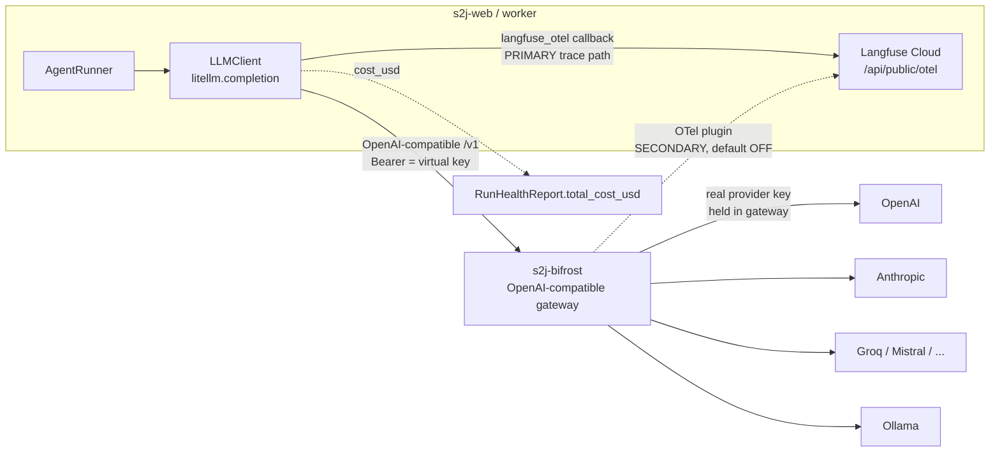

# BIFROST-LANGFUSE — LLM Gateway + Cloud Tracing + Secure Key Storage

**Status:** Design doc (pre-implementation)
**Branch:** `elevation/wave-0`
**Scope:** Re-introduce **Bifrost** as the single LLM gateway for SOW-to-Jira, pair it with **Langfuse Cloud** for tracing, and move provider secrets to a **virtual-key** model with per-user encrypted storage in Postgres.
**Wave placement:** Platform work — slots beside **Wave 4 (Render deploy + hosted observability cutover)**, depends on **Wave 1 (Postgres + per-user crypto)**. Needs two external prerequisites a code change can't supply: a running **Bifrost service** on Render and a **Langfuse Cloud** account/project.

---

## 0. Why this exists (the four goals)

The user wants, concretely:

1. **Route ALL LLM calls via Bifrost** — one OpenAI-compatible gateway in front of every provider.
2. **Trace everything in Langfuse Cloud** — per-run, per-user, per-model.
3. **The user-selected model is registered in BOTH systems** — Bifrost (routing/allowlist) and Langfuse (tracking/price/tags), from one config value.
4. **Securely store the API keys users provide** — encrypted at rest, revocable, scoped.

This is a *re-introduction*: the repo previously had `BIFROST_BASE_URL` / `BIFROST_API_KEY` wiring in `pipeline/llm_router.py` and an OTel "Argus" stack in `pipeline/observability.py`. The elevation plan (Wave 4) **dropped Argus/OTel/Bifrost** in favor of stdout logs + Langfuse. We now bring Bifrost back **as the gateway** (not just an observability backbone) and keep Langfuse Cloud as the trace sink. The dead wiring is still in the tree (`llm_router.py:46-53`, `observability.py:18-153`) — we revive the useful parts and delete the rest.

**The single-seam property is the load-bearing fact.** Every model call already funnels through one place:

```
agents → AgentRunner (core/agent_runner.py) → self.runner.complete_json/complete
        → LLMClient (pipeline/llm_client.py) → litellm.completion(**kwargs)  ← the ONE physical call
        ProviderConfig built by configure_litellm_for_mode (pipeline/llm_router.py)
```

`core/ports.py:LLMProvider` (the Protocol the core depends on) has exactly two methods — `complete` / `complete_json` — and **neither changes**. All the work here is in *how `ProviderConfig` is resolved* and *what metadata rides alongside the call*, not in the call surface. So `AgentRunner` and every agent stay byte-for-byte unchanged.

---

## 1. Target architecture

### 1.1 Request + trace topology

```
                            ┌──────────────────────────────────────────────┐
                            │            Render private network             │
                            │                                                │
  ┌──────────────┐   vkey   │   ┌────────────────────┐   real provider key  │
  │  FastAPI web │──────────┼──▶│   s2j-bifrost       │──────────┐           │
  │  (s2j-web)   │  OpenAI- │   │  (Docker, :8080)    │          │           │
  │  + worker    │  compat  │   │  OpenAI-compatible  │          ▼           │
  │              │  /v1     │   │  gateway            │   ┌──────────────┐   │
  │ LLMClient    │◀─────────┼───│  - virtual keys     │   │  OpenAI      │   │
  │ (one seam)   │ response │   │  - model allowlist  │   │  Anthropic   │   │
  └──────┬───────┘          │   │  - budgets / RL     │   │  Groq / ...  │   │
         │                  │   │  - failover         │   │  Ollama      │   │
         │ langfuse_otel    │   │  - real keys in     │   └──────────────┘   │
         │ (app-level,      │   │    env-group        │                      │
         │  primary)        │   └─────────┬──────────┘                      │
         │                  │             │ OTel plugin (optional, OFF)      │
         └──────────────────┼─────────────┼──────────────────────────────────
                            │             │
                            ▼             ▼
                   ┌────────────────────────────────┐
                   │        Langfuse Cloud           │
                   │  (US/EU) /api/public/otel       │
                   │  Basic base64(pk:sk), HTTP      │
                   │  traces · sessions · users ·    │
                   │  model price → USD cost         │
                   └────────────────────────────────┘
```

### 1.2 Mermaid (same topology, render-friendly)



**Two paths to Langfuse, and we deliberately pick one as primary:**

- **PRIMARY — app-level LiteLLM `langfuse_otel` callback.** Fires from `LLMClient`, which already has `run_id`, `agent_name`, `self.model` and (after this work) `user_id`/`org_id` in scope. Gives rich per-user / per-run / per-agent attribution. ~30 lines.
- **SECONDARY — Bifrost's OTel plugin → Langfuse.** Gateway-level, zero app code, but coarse (it can't see your `run_id`/`user_id` unless forwarded, and emits generic GenAI spans, not Langfuse sessions/users). **Default OFF.** Document it as a backstop for non-app traffic only; running both into the same project double-traces.

For a single-org SaaS the app-level path is strictly better, so we ship that and leave the gateway exporter as a documented toggle.

---

## 2. Gateway routing design (Goal 1)

### 2.1 Where it plugs in

The only physical LLM call is `litellm.completion(**kwargs)` in `LLMClient._perform_one_call` (`pipeline/llm_client.py:370`). It already forwards `kwargs["api_base"]`, `kwargs["api_key"]`, and `extra_headers` from `self.provider_config`. So **routing-through-Bifrost is purely a `ProviderConfig`-resolution change** — no change to `LLMClient.complete`, `complete_json`, the `LLMProvider` port, or `AgentRunner`.

### 2.2 `ProviderConfig` gets two additive fields

`models/schemas.py:14`:

```python
class ProviderConfig(BaseModel):
    provider: str
    model: str
    api_key: str = ""          # carries the Bifrost VIRTUAL KEY when gateway routing is on
    api_base: str = ""         # carries the Bifrost base URL when gateway routing is on
    azure_api_version: str = ""
    azure_deployment_name: str = ""
    via_gateway: bool = False   # NEW: True when routed through Bifrost
    virtual_key: str = ""       # NEW: explicit Bifrost vkey, kept distinct from api_key for telemetry clarity
```

Both default-off, so existing tests that build `ProviderConfig(provider=..., model=...)` (`tests/test_phase2_runtime_reliability.py`, `tests/test_complete_json_truncation.py`) keep passing untouched.

### 2.3 Rework `configure_litellm_for_mode` — gateway-first resolution

Today `pipeline/llm_router.py:46-53` already half-wires Bifrost (the dead `BIFROST_API_KEY`/`BIFROST_BASE_URL`/`ZAI_MODEL` fallback inside `mode == API`). We **formalize** that into a leading gateway branch that wraps ALL modes:

```python
GATEWAY_ENABLED = os.environ.get("BIFROST_ENABLED", "true").lower() == "true"
bifrost_base = _ensure_docker_host(os.environ.get("BIFROST_BASE_URL", ""))

if GATEWAY_ENABLED and bifrost_base:
    # build_litellm_model still produces "openai/gpt-4o", "anthropic/claude-...",
    # "ollama/qwen2.5:7b". Bifrost is OpenAI-compatible, so that model id IS the
    # routing key Bifrost matches against its configured model list.
    config.api_base   = bifrost_base.rstrip("/")            # e.g. http://s2j-bifrost:8080/v1
    config.virtual_key = _resolve_virtual_key(settings, mode)  # per-user vkey (see §4)
    config.api_key     = config.virtual_key                  # LiteLLM sends this as the Bearer to Bifrost
    config.via_gateway = True
    # provider stays the logical provider for Langfuse tags; routing is by model + vkey allowlist
    return config

# else: legacy direct-to-provider path (unchanged) — break-glass for local dev / Bifrost down
```

`model` is **still** produced by `build_litellm_model(provider, model, ...)` (`config/settings.py:51`), so LOCAL yields `ollama/qwen2.5:7b`, API/CUSTOM yield `openai/gpt-4o`, etc. LiteLLM in OpenAI-compatible mode sends `model` verbatim in the body and `api_key` as the Bearer; Bifrost reads the vkey from the Bearer, applies allowlist/budget, and forwards to the real provider with the real key it holds internally. **The same string is the Bifrost routing key AND the Langfuse `model` tag** — that's Goal 3, satisfied by one config value.

`_ensure_docker_host` (`config/settings.py:27`) already rewrites `localhost → host.docker.internal` for local dev and is a no-op on a real `s2j-bifrost` hostname, so one code path works locally and on Render.

### 2.4 Delete the leftover hacks

- `pipeline/llm_router.py:46-53` — `ZAI_MODEL` default + the "Default to Bifrost" half-wiring fold into the gateway branch.
- `pipeline/llm_client.py:290-293` — remove `x-zai-api-key` and `x-ollama-base-url` `extra_headers`. With Bifrost, provider routing is the vkey's job, not an app-injected header. (Keep the OpenRouter `HTTP-Referer`/`X-Title` block at `:296-300` only if OpenRouter stays a direct fallback; under full gateway routing it's dead too.)
- `pipeline/evals/judges.py:27-28` already hardcodes a Bifrost URL (`s2j-admin-bifrost:8081`) + admin key — align it to `BIFROST_BASE_URL` + a vkey instead of the hardcoded admin key.

### 2.5 Bifrost config shape (lives in the gateway, never in the app)

```json
{
  "providers": {
    "openai":    { "keys": [{"value": "env.OPENAI_API_KEY",    "models": ["gpt-4o","gpt-4o-mini"]}] },
    "anthropic": { "keys": [{"value": "env.ANTHROPIC_API_KEY", "models": ["claude-3-7-sonnet"]}] },
    "ollama":    { "base_url": "env.OLLAMA_BASE_URL", "models": ["qwen2.5:7b"] }
  },
  "virtual_keys": [
    { "name": "vk_user_<id>", "value": "env.<hashed>",
      "allowed_models": ["gpt-4o","claude-3-7-sonnet"],
      "budget": {"max_usd": 25, "window": "1M"},
      "key_ids": ["openai","anthropic"] }
  ],
  "fallbacks": { "gpt-4o": ["claude-3-7-sonnet"] }
}
```

Failover / load-balancing live **here**, not in app code. The app-side retry loop in `LLMClient` (`is_retryable_remote_error`, 429/5xx handling) stays as the outer belt-and-suspenders; Bifrost's failover is the faster inner layer.

### 2.6 Free wins

- **PageIndex** routes through Bifrost automatically: `pipeline/orchestrator.py:102` calls the same `configure_litellm_for_mode`, so the indexer's LLM calls go through the gateway with zero extra work.
- **Local Ollama timeout detection** (`is_local_ollama`, `llm_client.py:336`) keys on `mode == LOCAL or model startswith "ollama/"` — the model string is still `ollama/...` under gateway routing, so the 3600s local timeout still applies. (Verify Bifrost doesn't impose a shorter upstream timeout on Ollama.)

### 2.7 Bifrost as a Render Docker service

A separate **private** Render Docker service `s2j-bifrost` (image `maximhq/bifrost` or the official OSS image), listening on `:8080`, reachable only over Render's private network at `http://s2j-bifrost:8080/v1`. The web/worker services set `BIFROST_BASE_URL=http://s2j-bifrost:8080/v1`. Bifrost's `config.json` + real provider keys come from a Render env-group attached **only** to `s2j-bifrost`.

---

## 3. Langfuse tracing design (Goal 2 + 3)

### 3.1 Enable the callback once (replace the Argus block in `observability.py`)

Today `observability.py` does `litellm.success_callback = ["opentelemetry"]` gated on `SYNC_ENABLED` (the dropped Argus path) and hand-rolls an `OTLPSpanExporter` with base64 auth (`:94-107`). Replace with:

```python
LANGFUSE_ENABLED = bool(os.environ.get("LANGFUSE_PUBLIC_KEY") and os.environ.get("LANGFUSE_SECRET_KEY"))

def init_tracing():
    if not LANGFUSE_ENABLED:
        logger.info("Langfuse disabled (no keys); stdout logs only.")
        return
    # langfuse SDK reads LANGFUSE_PUBLIC_KEY / LANGFUSE_SECRET_KEY / LANGFUSE_HOST from env
    litellm.callbacks = ["langfuse_otel"]   # success + failure in one
    logger.info(f"Langfuse OTel callback enabled → {os.environ.get('LANGFUSE_HOST')}")
```

`langfuse_otel` is LiteLLM's OTLP bridge — it ships spans to `LANGFUSE_HOST/api/public/otel` with the `Basic base64(pub:sec)` header built by the SDK, over HTTP (not gRPC), trace type `genai_extension` — exactly the 2026 research path, but driven by LiteLLM so we don't hand-roll the exporter. It replaces the entire `Traceloop.init(...)` + manual exporter + base64 block in `init_argus()`.

### 3.2 Forward metadata on every call (the load-bearing change)

In `LLMClient._perform_one_call`, add a `metadata` kwarg next to the existing `extra_headers`:

```python
kwargs = {
    "model": self.model,
    "messages": [...],
    "temperature": temperature,
    "max_tokens": max_tokens,
    "extra_headers": self.extra_headers,
    "metadata": {
        "trace_user_id": self.user_id or "anonymous",   # → Langfuse "User" dimension
        "session_id": self.run_id,                       # groups one pipeline run's agent calls
        "generation_name": agent_name,                   # extraction / dedup / gap_recovery / judge
        "trace_name": f"sow-run-{self.run_id}",
        "tags": [f"org:{self.org_id}", f"agent:{agent_name}", f"model:{self.model}", f"mode:{self.mode.value}"],
        "trace_metadata": {"org_id": self.org_id, "run_id": self.run_id, "node_id": node_id, "model": self.model},
    },
}
```

`LLMClient.__init__` (`:270`) gains two optional identity fields — `user_id: str = ""`, `org_id: str = "calibraint"` — threaded from the authenticated request via `app/container.py:139` and `pipeline/orchestrator.py:51`. Tests/CLI default them to `""`/`"calibraint"`. The `LLMProvider` port is unchanged because attribution rides on **construction**, not the call signature.

### 3.3 Cost (do NOT compute in app code)

Langfuse derives USD cost from `model` + `usage` automatically **once the model is registered in its model-price list** — this is the Langfuse half of Goal 3. For models Langfuse doesn't know (zai/glm, ollama, custom aliases), add a Langfuse **"model definition"** (regex match on the model string + per-token price) in the Langfuse UI. **Make this a setup step, not an afterthought** — unregistered models show cost `$0`/null.

The per-run health number is the in-app mirror: keep `litellm.completion_cost(response)` (or `response._hidden_params["response_cost"]`) flowing into `usd_cost` so `AgentRunner._split_result` (`core/agent_runner.py:200`, already reads `metrics["cost_usd"]`) → `StageResult.cost_usd` → `RunHealthReport.total_cost_usd` keeps working. Surface it as **"estimated"**; Bifrost's budget ledger is authoritative.

### 3.4 What to delete / retire

- `traceloop-sdk`, `opentelemetry-instrumentation-logging`, the `init_argus()` body, `resolve_collector_endpoint`, `_use_local_collector`, `ARGUS_*` / `BIFROST_LOKI_URL` / `BIFROST_TELEMETRY_URL` plumbing, the `llm_token_usage` / `llm_operation_duration` OTel meters.
- `pipeline/llm_client.py:284-286` — the `litellm.success_callback = ["opentelemetry"]` block.
- `pipeline/llm_client.py:388-392` — the Argus metric `.add()` / `.record()` calls.
- Keep `tracer` / `trace_span` as **no-op shims** so other importers don't break (sweep them in a follow-up). Keep `audit/logger.py` (SQLite) and the stdout/JSONL loguru sinks — those are the local-first floor and stay regardless of Langfuse.

### 3.5 Align the eval scripts

`scripts/run_eval_dataset.py`, `scripts/seed_langfuse_dataset.py`, and `pipeline/evals/judges.py` already import `langfuse` / point at a self-hosted URL. Align them to the same `LANGFUSE_HOST` + keys (they currently default to localhost / a hardcoded admin Bifrost).

---

## 4. Secure key-storage design (Goal 4) — **lead recommendation: virtual keys**

### 4.1 The recommended model (virtual keys)

> **Real provider keys live ONLY inside Bifrost.** Each user gets a Bifrost-issued **virtual key** (model-allowlist + budget + rate-limit, no direct link to the real key). **Our Postgres stores ONLY that virtual key**, Fernet-encrypted with `APP_ENC_KEY` / `MultiFernet`. `LLMClient` stops sending any real provider key — it sends the user's vkey as the Bearer to the one Bifrost endpoint.

**Why:** a Postgres dump then leaks **revocable, budget-capped vkeys scoped to allowed models**, never a live provider key with full account scope. Revocation is a Bifrost operation, not an org-wide key rotation.

### 4.2 Where the change lands (seam already exists)

`configure_litellm_for_mode` already builds `ProviderConfig(api_key=..., api_base=...)` from decrypted settings, and `_perform_one_call` passes them straight into `litellm.completion`. That single funnel is where keys flow today. In API mode, instead of resolving the per-provider real key from `settings.json`, resolve the per-user vkey and point at Bifrost (§2.3). `resolve_user_virtual_key` decrypts **inside the request that needs it**, hands plaintext to `ProviderConfig`, and never persists or logs it. The existing `logger.info("› Resolved LLM config ...")` line logs provider/model/base only — **keep it that way; never add the key.**

### 4.3 Credential store

Replace the per-provider `api_key` blob in `settings.json` with a Postgres `user_provider_credentials` table behind the forward-looking `core/ports.py:CredentialRepository` (which already mandates "encrypted at rest, no plaintext fallback"). Two column families:

- `virtual_key_enc` — **default path.** Fernet(`APP_ENC_KEY`) ciphertext of the Bifrost vkey. For shared-org keys this is all that's stored.
- `byok_provider_key_enc` — **opt-in.** Fernet ciphertext of a user's own raw provider key, used only at provisioning time to register a dedicated provider-key + vkey pair in Bifrost via its admin API — then we can drop the raw copy and keep only the resulting vkey.

`config/settings.py:encrypt_secret`/`decrypt_secret` + `_load_or_create_fernet_key` migrate onto the `APP_ENC_KEY`/`MultiFernet` helper (RENDER-MIGRATION already establishes `APP_ENC_KEY` as canonical, aliasing `SOW_FERNET_KEY`, with `APP_ENC_KEY_OLD` for rotation).

### 4.4 Two ownership models, concrete

- **(B) Shared org key — DEFAULT for single-org calibraint.** One real OpenAI/Anthropic key sits in Bifrost config sourced from a Render env-group attached to `s2j-bifrost` (NOT the app). Bifrost mints one vkey per user (or team) via its `key_ids` binding, so per-user budgets/allowlists apply while sharing the underlying key. The app stores only each user's vkey. **Users never paste a provider key — they pick a model and get a budget.**
- **(A) BYOK — per-user opt-in.** At credential-save time, the app calls the Bifrost admin API to register the user's raw provider key as a Bifrost-managed key, gets back a vkey bound via `key_ids`, stores the vkey, discards/encrypts the raw key. The key is now isolated in Bifrost, billed to them, revocable centrally.

### 4.5 The simpler fallback (and why it's the fallback)

**Pass-through:** "encrypt the raw provider key in Postgres, decrypt per request, send to Bifrost (or direct)." Simpler, no Bifrost admin API. **But** a Postgres + `APP_ENC_KEY` compromise leaks live provider keys with full account scope and no budget cap; revocation means rotating the real key for everyone. Keep it only as an explicit per-user-BYOK transition path, not the default.

### 4.6 Render-no-Vault reality

Bifrost *supports* HashiCorp Vault / AWS Secrets Manager / Google Secret Manager / Azure Key Vault as secret backends with zero-downtime rotation — **but Render offers none of these** (only secret env-groups). So:

- Real provider keys → a Render **secret env-group attached only to `s2j-bifrost`**, read via `env.OPENAI_API_KEY`-style config refs.
- `APP_ENC_KEY` (the Postgres-decryption master) → a **separate** env-group attached only to the FastAPI app/worker.

Render thus gives **blast-radius separation** between "the thing that holds real provider keys" (Bifrost svc) and "the thing that holds the DB-decryption key" (app svc) **without a managed KMS**. `MultiFernet` (key list) gives rotation: prepend a new key, re-encrypt lazily, drop the old one. **Rotation must be a guarded migration** — a half-rotated `virtual_key_enc` column with the old key already dropped is unrecoverable.

---

## 5. User model-config propagation + governance + cost (Goal 3 end-to-end)

The carrier of "who + what model + what budget" is the **per-user virtual key**. Flow:

**1) UI save** (`ui/server.py:470` `save_settings`). Today it writes `settings["providers"][provider] = {model, api_key(enc), base_url,...}`. **Add a governance hook** right after `settings_manager.save(settings)`: `BifrostAdmin.provision_virtual_key(user_id, provider, model, budget)` which (a) ensures the org provider key is registered in Bifrost (idempotent, keyed by provider), (b) creates-or-patches a vkey whose `allowed_models = [build_litellm_model(provider, model, ...)]` and whose `key_ids` bind it to that provider key, with budget + rate-limit from the user's plan. Persist the returned **vkey id** into `settings["providers"][provider]["bifrost_virtual_key"]` (encrypted via `encrypt_secret` for defense-in-depth). On the existing `prev_model != model` branch (`ui/server.py:522`), re-patch the allowlist so **Bifrost routing == Langfuse tag == user's choice** — Goal 3.

**2) Router** (`configure_litellm_for_mode`). Gateway branch (§2.3) decrypts `pset["bifrost_virtual_key"]` into `config.virtual_key`, sets `config.api_base = BIFROST_BASE_URL`, leaves `config.model` as the user-picked model. `run_id` isn't known at router time, so populate user/model here and inject `run_id` at `LLMClient` construction (it already takes `run_id`).

**3) Request** (`_perform_one_call`). vkey rides as the Bearer (`kwargs["api_key"] = virtual_key`, the OpenAI-compatible default) — or as `x-bf-vk` if Bifrost is configured for header-auth. Langfuse attribution flows via the app-level `metadata` (§3.2). If you also run the Bifrost OTel path, forward `x-bf-trace-user-id` / `x-bf-trace-session-id` / `x-bf-trace-tags` headers so gateway spans aren't coarse — but app-level is primary, so this is optional.

**4) Cost-back.** `litellm.completion_cost(response)` → `usd_cost` → `AgentRunner._split_result` (`:200`) → `StageResult.cost_usd` → `RunHealthReport.total_cost_usd` → `orchestrator.health_report.to_dict()` → UI. Authoritative per-user spend lives in Bifrost governance (Customer `calibraint` → Team `sow-to-jira` → per-user vkey budgets); the health report is the per-run **estimated** mirror, reconcilable from the vkey usage endpoint.

**Governance topology (proportionate for one org):** one Bifrost Customer `calibraint` → one Team `sow-to-jira` → one virtual key per app user. Hierarchical budget: Team cap (org ceiling) > per-vkey cap (per-user). A new `integrations/bifrost_admin.py` adapter wraps Bifrost's governance REST API (`ensure_provider_key`, `create_virtual_key`, `patch_virtual_key`, `get_virtual_key_usage`, `delete_virtual_key` on offboarding), authenticated with `BIFROST_ADMIN_API_KEY` (org-level env-group secret). This is provisioning, not the hot path, so it lives in `integrations/` without needing a new port.

---

## 6. Concrete env-vars / config / render.yaml fragment

### 6.1 Env vars

| Var | Service | Purpose |
|-----|---------|---------|
| `BIFROST_ENABLED` | web, worker | Master gateway toggle (default `true`). Set `false` for break-glass direct-to-provider. |
| `BIFROST_BASE_URL` | web, worker | `http://s2j-bifrost:8080/v1` (Render private) / `http://localhost:8080/v1` (local). **Revives the dead var at `llm_router.py:51`.** |
| `BIFROST_ADMIN_API_KEY` | web, worker | Org admin key for the governance REST API (vkey mint/patch). High-value secret. |
| `APP_ENC_KEY` / `APP_ENC_KEY_OLD` | web, worker | MultiFernet master + rotation key for the Postgres credential table. Supersedes `data/.keyfile` + `SOW_FERNET_KEY` (aliased). |
| `DATABASE_URL` | web, worker | Postgres holding `user_provider_credentials` (`virtual_key_enc` / `byok_provider_key_enc`). |
| `LANGFUSE_PUBLIC_KEY` (`pk-lf-…`) | web, worker | Langfuse Cloud, read by langfuse SDK / litellm callback. |
| `LANGFUSE_SECRET_KEY` (`sk-lf-…`) | web, worker | Langfuse Cloud secret. |
| `LANGFUSE_HOST` | web, worker | `https://us.cloud.langfuse.com` (US) or `https://cloud.langfuse.com` (EU). **Region decision.** |
| `OPENAI_API_KEY` / `ANTHROPIC_API_KEY` / … | **`s2j-bifrost` ONLY** | Real provider keys, held only inside the gateway. |
| `OLLAMA_BASE_URL` | `s2j-bifrost` | Moves from an app `extra_header` to a Bifrost provider `base_url`. |

**Retire / drop:** `ZAI_MODEL`, `ZAI_API_KEY`, the `x-zai-api-key` header; `BIFROST_API_KEY` as a shared *call* credential (vkey replaces it — keep only as an optional gateway bootstrap key); `ARGUS_SYNC_ENABLED`, `ARGUS_COLLECTOR_URL`, `SOW_INSTANCE_ID`, `BIFROST_LOKI_URL`, `BIFROST_TELEMETRY_URL`, `BIFROST_TELEMETRY_TOKEN`, `BIFROST_GATEWAY_URL`, `BIFROST_BACKBONE_TOKEN` (the `.env.example` observability block); the per-provider `api_key` blob in `data/settings.json`.

### 6.2 `settings.json` shape change

```jsonc
"providers": {
  "openai": {
    "model": "gpt-4o",
    "bifrost_virtual_key": "<Fernet-encrypted vkey id>",   // NEW — replaces "api_key"
    "base_url": ""                                          // unused under gateway routing
  }
}
```

### 6.3 `render.yaml` fragment

```yaml
services:
  - type: web                       # existing s2j-web — add Bifrost + Langfuse vars
    name: s2j-web
    envVars:
      - key: BIFROST_ENABLED
        value: "true"
      - key: BIFROST_BASE_URL
        value: http://s2j-bifrost:8080/v1   # private network DNS
      - fromGroup: sow-app-secrets          # APP_ENC_KEY, BIFROST_ADMIN_API_KEY, LANGFUSE_*
      - key: DATABASE_URL
        fromDatabase: { name: s2j-postgres, property: connectionString }

  - type: pserv                     # NEW private service — the gateway
    name: s2j-bifrost
    runtime: docker
    dockerfilePath: ./infra/bifrost/Dockerfile   # or image: maximhq/bifrost
    plan: starter
    envVars:
      - fromGroup: sow-bifrost-secrets   # OPENAI_API_KEY, ANTHROPIC_API_KEY, OLLAMA_BASE_URL, vkey seeds
    # config.json mounted/baked with provider + virtual_key + fallbacks (§2.5)

envVarGroups:
  - name: sow-app-secrets            # attached to web + worker ONLY
    envVars:
      - key: APP_ENC_KEY             # Postgres decryption master (Fernet). Dashboard secret.
      - key: APP_ENC_KEY_OLD         # set ONLY during MultiFernet rotation
      - key: BIFROST_ADMIN_API_KEY
      - key: LANGFUSE_PUBLIC_KEY
      - key: LANGFUSE_SECRET_KEY
      - key: LANGFUSE_HOST
        value: https://us.cloud.langfuse.com

  - name: sow-bifrost-secrets        # attached to s2j-bifrost ONLY — blast-radius separation
    envVars:
      - key: OPENAI_API_KEY          # REAL provider keys live here, never on the app
      - key: ANTHROPIC_API_KEY
      - key: OLLAMA_BASE_URL
```

The two separate env-groups are the no-KMS substitute for blast-radius isolation: app holds the DB key, Bifrost holds the provider keys, neither holds both.

---

## 7. Ordered integration plan (change-ids, wave-aligned)

Platform work — **must land after Wave 1 (Postgres + per-user crypto)** and folds into the **Wave 4** Render/observability cutover. Two external prerequisites first.

**Prereqs (external, not code):**
- **BL-P1** — Stand up `s2j-bifrost` as a Render private Docker service with a minimal `config.json` (one provider, one test vkey). Reachable at `http://s2j-bifrost:8080/v1`.
- **BL-P2** — Create a Langfuse Cloud project; obtain `pk-lf-…` / `sk-lf-…`; register the org's chosen model(s) in the Langfuse model-price list.

**Wave-4-adjacent change set:**

| ID | Change | Files | Dep |
|----|--------|-------|-----|
| **BL-1** | Add `via_gateway` + `virtual_key` to `ProviderConfig` (additive, default-off). | `models/schemas.py:14` | — |
| **BL-2** | Gateway-first branch in `configure_litellm_for_mode`; revive `BIFROST_BASE_URL`; fold/delete `ZAI_MODEL` + half-wiring. | `pipeline/llm_router.py:14-78` | BL-1, BL-P1 |
| **BL-3** | Delete `x-zai-api-key` / `x-ollama-base-url` `extra_headers`; verify nothing else reads them. | `pipeline/llm_client.py:290-293` | BL-2 |
| **BL-4** | Replace Argus block with `init_tracing()` + `litellm.callbacks=["langfuse_otel"]`; keep `tracer`/`trace_span` as no-op shims; drop OTel meters/exporter. | `pipeline/observability.py:13-156` | BL-P2 |
| **BL-5** | Add `metadata` kwarg to `_perform_one_call`; add `user_id`/`org_id` to `LLMClient.__init__`; remove `success_callback=["opentelemetry"]` + Argus metric calls. | `pipeline/llm_client.py:270-392` | BL-4 |
| **BL-6** | Thread `user_id`/`org_id` from request context into `LLMClient`. | `app/container.py:139`, `pipeline/orchestrator.py:51` | BL-5, Wave-2 auth |
| **BL-7** | `user_provider_credentials` table + `CredentialRepository` impl (`virtual_key_enc`, `byok_provider_key_enc`); migrate `encrypt/decrypt` onto `APP_ENC_KEY`/MultiFernet. | `core/ports.py:CredentialRepository`, new `config/crypto.py`, `config/settings.py:90-150` | Wave-1 Postgres + crypto |
| **BL-8** | `_resolve_virtual_key(settings, mode)` reads decrypted vkey from the credential store. | `pipeline/llm_router.py` | BL-2, BL-7 |
| **BL-9** | `integrations/bifrost_admin.py` (`ensure_provider_key`, create/patch/get-usage/delete vkey); validate signatures against the running Bifrost build. | new file | BL-P1 |
| **BL-10** | Governance hook in `save_settings` (provision/patch vkey on model save + on `prev_model` change); store encrypted vkey id. **Best-effort/async with a "pending" state**, not a hard 400. | `ui/server.py:470-528` | BL-9 |
| **BL-11** | Cost-back: ensure `litellm.completion_cost` → `usd_cost` flows to `RunHealthReport.total_cost_usd`, surfaced as "estimated". | `pipeline/llm_client.py:374-403`, `pipeline/orchestrator.py:381,404` | BL-5 |
| **BL-12** | Align eval/judge scripts to `BIFROST_BASE_URL` + vkey and `LANGFUSE_HOST`/keys. | `pipeline/evals/judges.py:27-28`, `scripts/run_eval_dataset.py`, `scripts/seed_langfuse_dataset.py` | BL-2, BL-4 |
| **BL-13** | `requirements.txt`: add `langfuse>=3.0`; remove `traceloop-sdk`, `opentelemetry-instrumentation-logging`; verify remaining `opentelemetry-*` only if `langfuse_otel` needs the OTLP-http exporter. | `requirements.txt` | BL-4 |
| **BL-14** | `render.yaml`: add `s2j-bifrost` pserv + two env-groups (§6.3); grep tests for `ARGUS_*`/`opentelemetry` callback assertions before deleting. | `render.yaml`, `tests/` | all above |

**Smoke gate (before deleting the Argus/legacy path):** one end-to-end run shows a Langfuse trace with `user_id` + `session_id` populated, cost computed for a registered model, and the call provably went through `s2j-bifrost` (gateway logs).

---

## 8. Risks (reconciled)

- **Single point of failure** — all LLM traffic funnels through one Bifrost service. Mitigation: `BIFROST_ENABLED=false` break-glass to direct-provider + Render health checks + the existing app-side retry loop. Document a degraded mode.
- **Model-id ↔ Bifrost alias mismatch** — `build_litellm_model` emits `openai/gpt-4o` / `ollama/qwen2.5:7b`; Bifrost must recognize those exact ids or routing 404s. One alignment pass needed; pin a single canonical model id used for allowlist + Langfuse tag + request body.
- **Cost shows $0 in Langfuse** for any model not in its price list (likely for zai/glm, ollama, custom aliases) until a Langfuse model-definition is added. Mitigation: make registration a setup step (Goal 3).
- **Attribution depends on identity plumbing** — if Wave-2 auth doesn't thread `user_id`/`org_id` to `LLMClient`, every trace lands as `anonymous`. BL-6 gates this.
- **Provisioning latency/outage** — a Bifrost admin-API outage must not hard-block saving model prefs; BL-10 is best-effort/pending.
- **MultiFernet rotation** of the vkey column is a guarded migration; a half-rotated table with the old key dropped = unrecoverable creds.
- **PII / data residency** — prompts/SOW bodies go into trace bodies on Langfuse Cloud (US by default). For confidential client SOWs, consider EU region or Langfuse masking.
- **`BIFROST_ADMIN_API_KEY` is now a crown-jewel secret** on the app svc; if leaked, an attacker can mint vkeys. Least-privilege the env-group.
- **Test breakage** — removing `ARGUS_*` / `opentelemetry` callbacks may break tests asserting that behavior; grep before deleting (BL-14).
- **litellm callback-name drift** — confirm `langfuse_otel` (OTel bridge) vs the older `langfuse` (native SDK) callback on the pinned litellm version; smoke-test before deleting the Argus path.

---

## 9. Decisions to confirm

These need a human call before BL-2 / BL-7 / BL-10 land:

1. **Key ownership model (the big one).** Default **shared org key (B)** — users pick a model + get a budget, never paste a provider key — with **BYOK (A)** as opt-in? Or BYOK-first? *Recommendation: shared-org default for single-org calibraint; simpler and more secure.* This decides whether per-user *provider* secrets exist at all.
2. **Secret backend on Render.** Confirm the no-KMS posture: real provider keys in a Bifrost-only env-group + `APP_ENC_KEY` in an app-only env-group + MultiFernet rotation. *Recommendation: accept it for one org; document rotation = redeploy env-group + Bifrost zero-downtime reload.* (Bifrost *could* use Vault/AWS-SM/GCP-SM/Azure-KV later if you move off Render.)
3. **Hard cutover vs toggle.** Always-Bifrost, or keep `BIFROST_ENABLED` with a direct-provider break-glass? *Recommendation: keep the toggle, default `true`.*
4. **Local/Ollama routing.** Route LOCAL mode through Bifrost's Ollama provider (uniform tracing, one hop more) or stay direct-to-Ollama for local dev? *Recommendation: gateway in hosted SaaS, direct when `BIFROST_ENABLED=false` locally.*
5. **Langfuse region.** US (`us.cloud.langfuse.com`) vs EU (`cloud.langfuse.com`) vs HIPAA — driven by calibraint's client data-residency. *Recommendation: US unless a client SOW requires EU.* Also: send full prompt/response bodies, or mask?
6. **Primary trace path.** Confirm app-level `langfuse_otel` as primary (rich attribution), Bifrost OTel exporter OFF? *Recommendation: yes — only add the gateway exporter if you need to trace non-app traffic hitting the same Bifrost.*
7. **Virtual-key granularity.** One vkey per **user** (clean per-user budget + Langfuse `user_id`) vs per user+provider vs one shared org vkey with `user_id` as metadata? *Recommendation: per-user; the allowlist already encodes the model.*
8. **Provisioning trigger.** Synchronous on `save_settings` vs background/best-effort with a "pending" state? *Recommendation: background/best-effort so a Bifrost outage doesn't block changing models.*
9. **App→Bifrost auth mode.** `Authorization: Bearer <vkey>` (OpenAI-compatible default) vs `x-bf-vk` header — must match the gateway's configured vkey auth.
10. **Migration of existing `data/settings.json` keys.** Re-register them in Bifrost as BYOK and discard, or honor as legacy pass-through during a transition window?

---

## Security Review — Key Handling

**Reviewer:** Security engineering pass against the stated goal — *compromise of our app DB or logs must not leak a usable provider key, on Render (no managed Vault).*

**Verdict: CONDITIONALLY SOUND — the virtual-key model is the right design and does meet the goal, but only if four currently-unaddressed code paths are closed first.** The architecture is genuinely strong: the real provider key never enters the app's process, DB, or logs under shared-org mode (§4.1), and the two-env-group split (§6.3) is a legitimate no-KMS substitute for blast-radius isolation on Render. The redaction on `GET /api/settings` is already correct (`api_key: "***"`, `ui/server.py:459/467`) and the resolved-config log line is already clean (`llm_router.py:77` logs provider/model/base only). **However, the doc is silent on the single most dangerous existing path: `_apply_settings_to_env_legacy` (`ui/server.py:84-116`) decrypts the real provider key and the Jira token into long-lived *process-global* env vars (`os.environ["LITELLM_API_KEY"]` line 96, `JIRA_API_TOKEN` line 114) at startup.** Until that function is deleted as part of the cutover, the vkey model is defeated — a heap dump, `/proc/<pid>/environ` read, a crashed-worker core, or any library that logs its environment re-exposes a live, full-scope provider key that the design claims no longer exists in the app. The doc must promote this from an unstated assumption to an explicit BL-step. Two more gaps are real-but-secondary: decryption scope is never bounded to in-request (BL-8's `_resolve_virtual_key` could trivially cache plaintext in a module global), and Langfuse traces send full SOW bodies to a US cloud by default with masking only mentioned as an aside.

### Risk table

| Risk | Severity | Mitigation |
|------|----------|------------|
| **`_apply_settings_to_env_legacy` leaves the decrypted provider key + Jira token in `os.environ` for the process lifetime** (`ui/server.py:96,114`). Defeats the vkey model for the entire transition window; readable via `/proc/self/environ`, crash cores, env-dumping libs, or a subprocess that inherits env. | **Critical** | Add an explicit cutover step: delete `_apply_settings_to_env_legacy` (and its startup call) in the same change that lands gateway routing. Never write a decrypted secret to `os.environ`. If a legacy bridge is unavoidable, scope it to a request-local value, not a global. Add a startup assertion that `LITELLM_API_KEY`/`JIRA_API_TOKEN` are unset on the app/worker once Bifrost is enabled. |
| **`byok_provider_key_enc` is a raw full-scope provider key sitting in our Postgres**, exactly the artifact the goal forbids. §4.3 says it's dropped "then," but defines no TTL, no delete-after-provision guarantee, and no enforcement. | **High** | Make BYOK provisioning a transactional one-shot: decrypt in-request → register in Bifrost → confirm vkey returned → delete the `byok_provider_key_enc` row in the same transaction. Never let a raw key persist past one successful provision. If provisioning fails, do NOT store the raw key — return an error and have the user re-enter. Add a reaper that alerts on any `byok_provider_key_enc` row older than N minutes. |
| **Decryption scope not bounded to in-request** — BL-8 `_resolve_virtual_key` / `config/crypto.py` could cache plaintext vkeys in a module-level dict or on the long-lived `SettingsManager`/`LLMClient`. | **High** | Mandate: decrypt only inside the request/run that needs it, hand the plaintext straight to `ProviderConfig`, never assign it to a module global, class attribute that outlives the call, or an LRU cache. `ProviderConfig.api_key`/`virtual_key` already live only for the call duration — keep it that way. Forbid `functools.lru_cache` on any decrypt path. |
| **`APP_ENC_KEY` leak → full DB-credential exposure.** If the app env-group leaks, every `virtual_key_enc` and any lingering `byok_provider_key_enc` decrypts. | **High** (vkey-only) / **Critical** (if BYOK rows linger) | Accept the blast radius *because* it's bounded: with shared-org keys, an `APP_ENC_KEY` + Postgres leak yields only revocable, budget-capped, model-allowlisted vkeys — not provider keys. Revoke/rotate vkeys via Bifrost admin (fast) rather than rotating the real provider key org-wide. Enforce the "no lingering BYOK row" rule above so this stays "High," never "Critical." Keep `APP_ENC_KEY` in an app-only env-group; never co-locate with provider keys. |
| **`BIFROST_ADMIN_API_KEY` is a crown-jewel on the app service.** Leak → attacker mints vkeys, reads usage, deletes keys, and (depending on Bifrost RBAC) may read provider-key material. | **High** | Least-privilege the admin token to vkey CRUD + usage only, not provider-key read. Scope the env-group to web/worker only. Treat admin calls as a privileged audited path (`audit/logger.py`). Consider a separate provisioning worker so the web tier doesn't hold mint authority at all. Rotate on any suspected app compromise. |
| **Bifrost secret backend leak (the env-group attached to `s2j-bifrost`) → all real provider keys exposed.** This is the irreducible single basket on Render-without-Vault. | **High** | This is the accepted residual risk of the design and the reason isolation matters: it requires compromising a *different* service than the one holding `APP_ENC_KEY`/DB. Attach `sow-bifrost-secrets` to `s2j-bifrost` ONLY. Use provider keys scoped/restricted at the provider (project-scoped OpenAI keys, spend caps) so even a Bifrost leak is bounded. Plan the Vault/AWS-SM path for when off Render (Bifrost already supports it, §4.6). |
| **Langfuse Cloud traces leak prompt + SOW content.** §3.2 sends full messages; SOW bodies are confidential client material going to a US cloud by default. Keys themselves don't ride in the body, but PII/IP does. | **High** | Decide region by data-residency (Decision #5) and default to **masking on**: configure Langfuse/LiteLLM input-output masking or send metadata-only spans for confidential orgs. Never put any secret in `metadata`/`tags` (vkey, admin key, DATABASE_URL) — audit the §3.2 dict; it currently carries only ids/model, keep it that way. Treat trace bodies as client-confidential data under the same handling as the SOW PDFs. |
| **Half-rotated `MultiFernet` column = unrecoverable creds** (already flagged §4.6/§8). | **Medium** | Guarded migration: add new key to the front of the list, re-encrypt all rows, verify a decrypt round-trip on every row, *then* drop `APP_ENC_KEY_OLD`. Never drop the old key in the same deploy that adds the new one. Back up the column pre-rotation. |
| **Render image-bake / build-context leak.** Secrets baked into the Docker image layer would ship the key everywhere the image goes. | **Low (currently)** | Verified: `.dockerignore` excludes `.env`, `.env.*`, `data/` (the keyfile + `settings.json`), and `.git/` — so neither the Fernet keyfile nor encrypted settings bake in, and secrets arrive only as runtime env vars. **Keep it that way:** never `COPY .env`, never `ARG`/`ENV` a secret in the Dockerfile (build args persist in image history), and don't add `data/` back to the build context. Add a CI check that greps the built image history for `OPENAI_API_KEY`/`APP_ENC_KEY` patterns. |
| **Render env-group over-attachment / drift.** A future service or a careless `fromGroup` attaching both groups to one service collapses the blast-radius separation that the whole no-KMS design rests on. | **Medium** | Treat group↔service attachment as a reviewed invariant in `render.yaml`: `sow-app-secrets` → web/worker only, `sow-bifrost-secrets` → `s2j-bifrost` only, never both on one service. Add a Blueprint review check. The isolation is only as good as this mapping. |
| **`x-zai-api-key` / `x-ollama-base-url` extra-headers + hardcoded admin Bifrost key in judges** (`llm_client.py:290-293`, `evals/judges.py:27-28`). Hardcoded `s2j-admin-bifrost:8081` + admin key is a plaintext secret in source. | **Medium** | BL-3/BL-12 already delete these — confirm they land. Grep the tree for any remaining hardcoded key/URL before declaring the cutover done; the hardcoded admin key in `judges.py` should be treated as already-compromised and rotated. |

### Minimum secure baseline (callout)

> **These are non-negotiable for the goal to hold. Ship none of the gateway cutover without all five:**
>
> 1. **Delete `_apply_settings_to_env_legacy` (and its startup invocation) in the same change that enables Bifrost.** No decrypted provider key or Jira token may ever live in `os.environ`. Add a startup assertion that confirms it's gone.
> 2. **Real provider keys exist in exactly one place — the `s2j-bifrost` env-group — and nowhere in the app DB, app env, app logs, or image.** Shared-org mode is the default; BYOK is opt-in and transactional.
> 3. **BYOK raw keys are delete-after-provision in a single transaction** — never persisted past one successful Bifrost registration; failure path stores nothing.
> 4. **Decryption is in-request only.** Plaintext vkeys are never cached in a module global, class attribute, or LRU; they live only for the duration of one `litellm.completion` call.
> 5. **`APP_ENC_KEY` and the provider-key env-group are attached to different services and never co-located.** Langfuse masking is ON (or metadata-only) for confidential SOWs, and no secret ever enters a trace's body/metadata/tags.
>
> With these five in place, an app-DB or app-log compromise leaks only revocable, budget-capped, model-scoped virtual keys — never a usable provider key. That is the goal, met.
