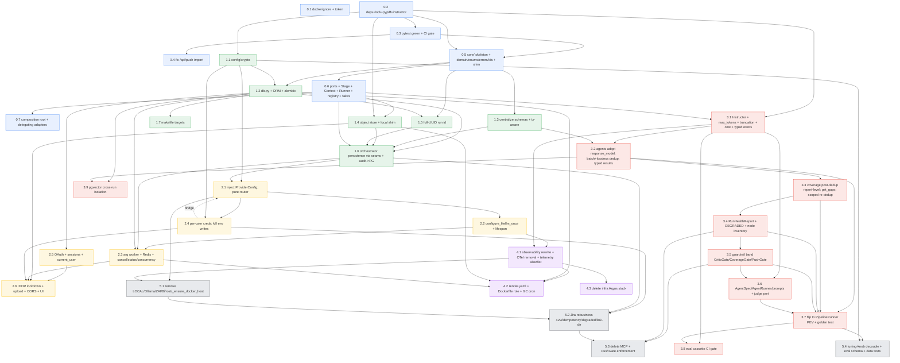

# SOW-to-Jira Elevation — Master Implementation Plan

This is the ordered, executable plan that implements the planning record in `.planning/elevation/`
(`AUDIT.md`, `ELEVATION-PLAN.md`, `RENDER-MIGRATION.md`, `ARCHITECTURE.md`, `REFACTOR-MAP.md`,
`HARNESS-ARCHITECTURE.md`). It sequences the 100+ verified change-ids from the 9 cluster scouts into
small, green-at-every-step PRs using the strangler-fig / seams-first method of `REFACTOR-MAP.md`.

---

## How to read this

Each **STEP** is one small PR. For every step you get:

- **Goal** — one sentence.
- **Changes** — the exact ordered change-ids, each with `file` · `action` · the one-line required change.
- **New files** — files created in this step.
- **Acceptance** — the observable done-criterion + the test that proves it.
- **Depends on** — prior steps that must land first.
- **Stays-green** — why `pytest tests/` + CI remain green after this PR.

Change-id prefixes map to the scout clusters: `mode-*` (model boundary / LLM client+router+telemetry),
`orch-*`/`cov-*` (orchestration & coverage), `agen-*` (cognition agents), `web_-*` (web/API & CLI),
`jira-*` (Jira integration), `doma-*` (domain model / audit / settings), `harn-*` (NEW core/ harness
package), `infr-*` (infra/deploy/observability), `test-*` (tests/CI/evals).

> **Verifier corrections are folded in.** Where a scout's `current_behavior` cited a wrong line number,
> function name, or incomplete caller list, this plan uses the verifier's correction. Notably:
> `infr-2` drops the git-history scrub (`.github_token` was never committed); `web_-9`/`doma-13` use
> `ProviderConfig.api_base` (NOT `base_url`) and the `current_provider_config` ContextVar; `jira-9` does
> NOT touch `requirements.txt` (`mcp` is transitive); `infr-15c` must also remove the 7 direct
> `tracer.start_as_current_span(...)` blocks in `orchestrator.py`/`jira_client.py`; `agen-12` coverage
> parse is at `coverage_check.py:275-294`; `harn` adds the missed `core/pipeline/registry.py`.

### Dependency strategy (the spine of the plan)

Per `REFACTOR-MAP.md` (seams-first S1→S8) we change **structure before behavior**:

1. **Wave 0 — make it safe & green first.** Stop the bleeding: `.dockerignore` + token rotation, pin
   deps + lockfile + `pypdf`, unblock `pytest` collection (langchain guard), CI gate (`ruff F821` +
   `pytest --cov` + `pip-audit`), the `/api/push` `JiraClient` NameError import. Then lay the
   **core/ ports + composition root + StageRunner that delegate to today's concrete code** — no behavior
   change, fully unwired/additive.
2. **Wave 1 — data platform under the seams.** `pipeline/db.py` + Alembic + `config/crypto.py` +
   `integrations/object_store.py`; centralize enums/schemas into `models/`; tz-aware datetimes; full-UUID
   run ids; rewrite audit to Postgres. Orchestrator persistence routed through the ObjectStore/repository
   seams (LocalObjectStore shim keeps current behavior).
3. **Wave 2 — multi-tenant + worker.** Per-user credentials (no `os.environ`/`SettingsManager` global),
   Google OAuth + opaque sessions + `current_user` + IDOR scoping on every route, arq worker +
   Redis (enqueue-only web, polled cancel, Redis progress), `configure_litellm_once()` at startup,
   inject per-run `ProviderConfig`.
4. **Wave 3 — the intelligence fix (highest leverage).** Swap `complete_json`→Instructor structured
   output with payload-sized `max_tokens` + `finish_reason=length` rejection; batch dedup; gate critic
   on confidence; move coverage post-dedup, report-level; scoped re-dedup; per-run `RunHealthReport`;
   AgentSpec/AgentRunner + guardrail band; eval-cassette CI gate.
5. **Wave 4 — observability + Render deploy.** Rewrite `observability.py` to stdout-JSON + Langfuse
   (delete OTel/Argus/Bifrost), telemetry allowlist, `render.yaml`, Dockerfile `$PORT`+`SOW_ROLE`,
   nightly GC cron, delete `infra/` Argus stack.
6. **Wave 5 — dead-code removal.** Delete `LLMMode.LOCAL`/Ollama/ZAI/Bifrost/`_ensure_docker_host`,
   the unbounded Ollama loop and 3600s timeout, the unwired MCP client; Jira robustness (429/Retry-After,
   idempotency, hierarchy-degraded flag, link direction); PushGate enforcement; CLI cleanup; delete the
   dropped-feature tests.

**The flip rule (from `REFACTOR-MAP.md`):** the live `PipelineOrchestrator.run()` keeps working until
every stage is in the registry and a golden end-to-end test (fake LLM, 103-node cassette) matches
task-count/dedup/flags before vs after. We never delete `run()` until that golden test is green on the
new `PipelineRunner` path.

---

## WAVE 0 — Safety net, green CI, and the core/ skeleton (delegating only)

> Goal of the wave: a clean checkout has green `pytest tests/`, a CI gate, no secrets in the image, and
> the full `core/` ports + composition root + `StageRunner` exist but **only delegate to today's code**.

### STEP 0.1 — Stop secret/bulk leakage into the image

- **Goal:** No secrets or bulk dirs bake into the Docker image; rotate the leaked PAT.
- **Changes:**
  - `infr-1` · `.dockerignore` · **create** — exclude `.env*`, `.github_token`, `data/`, `.git/`,
    `venv/`, `__pycache__/`, `.planning/`, `infra/`, `*.pdf`, `test_*.py`, `.claude/`, keep
    `requirements.txt`/app packages/`pageindex/`/`config/`.
  - `infr-2` · `.github_token` · **delete** — delete on-disk file; confirm `.gitignore`+`.dockerignore`
    cover it; **rotate the leaked PAT in GitHub**. *(Verifier: file was never committed — NO
    `git rm --cached`, NO `filter-repo` history scrub, NO force-push.)*
- **New files:** `.dockerignore`.
- **Acceptance:** `docker build -t sow:test .` then `docker run --rm sow:test sh -c 'test ! -f /app/.github_token && test ! -d /app/data && echo OK'` prints `OK`; `config/` and `pageindex/config.yaml` present.
- **Depends on:** none.
- **Stays-green:** No Python changes; tests untouched.

### STEP 0.2 — Pin deps, lockfile, `PyPDF2`→`pypdf`, add platform + dev deps

- **Goal:** Reproducible, audited dependency set; modern PDF lib; deps that later waves need declared.
- **Changes:**
  - `infr-3` · `requirements.txt` · **modify** — pin every dep to `==` + commit a lockfile (uv or
    pip-tools); replace `PyPDF2>=3.0.1` with pinned `pypdf`; **remove** `opentelemetry-*` +
    `traceloop-sdk`; **add** (pinned) `sqlalchemy[asyncio]`, `asyncpg`, `alembic`, `boto3`, `arq`,
    `redis`, `authlib`, `itsdangerous`, `pgvector`.
  - `mode-14` · `requirements.txt` · **modify** — add pinned `instructor`, `json-repair`, `langfuse`
    (verify `instructor.from_litellm` against pinned `litellm>=1.82.0`).
  - `infr-3b` · `pageindex/utils.py` · **modify** — `import PyPDF2`→`import pypdf`; all
    `PyPDF2.PdfReader(...)`→`pypdf.PdfReader(...)`; default + branch `pdf_parser="PyPDF2"`→`"pypdf"`.
  - `test-6` · `requirements.txt` (dev group) · **modify** — add `ruff`, `pytest-cov`, `pip-audit`,
    `respx`.
- **New files:** lockfile (`uv.lock` or `requirements.lock`); optional `requirements.in`.
- **Acceptance:** `make verify` imports clean; `venv/bin/python -c 'import instructor, json_repair, langfuse, pypdf'`; `pip-audit` runs (no high/critical, or documented allowlist); indexing `test_sow_tmp.pdf` produces unchanged token/page counts.
- **Depends on:** none (lockfile owner coordinates).
- **Stays-green:** `pypdf` 3.x `PdfReader` is API-identical to `PyPDF2` 3.x; OTel removal here is deps-only — the code removal happens in W4 (importers still import the now-removed packages, so **observability code is NOT yet touched**; keep `opentelemetry-*`/`traceloop-sdk` until STEP 4.1 if `import pipeline.observability` would break — see note). **Sequencing guard:** do NOT remove `opentelemetry-*`/`traceloop-sdk` from requirements until STEP 4.1 lands the observability rewrite; in this step only ADD new deps + swap PyPDF2. (Pin/lock everything else now.)

> **Correction folded in:** OTel/traceloop removal from `requirements.txt` is moved to land **with**
> STEP 4.1 (`infr-15`), so collection never breaks. This step only adds new deps and swaps PyPDF2.

### STEP 0.3 — Unblock `pytest` collection + pytest/ruff config + CI gate

- **Goal:** `pytest tests/` collects and runs green; CI catches undefined-name bugs and CVEs.
- **Changes:**
  - `test-1` · `tests/test_hierarchical_judge.py` · **modify** — add
    `pytest.importorskip("langchain_openai")` before importing `pipeline.evals.judges` (root cause:
    `judges.py:7-8` import langchain, not in requirements).
  - `infr-19` · `pipeline/evals/judges.py` · **modify** — make the langchain imports lazy/guarded so
    `pytest --collect-only` never errors (belt-and-suspenders with `test-1`).
  - `test-2` · `pyproject.toml` · **create** — `[tool.pytest.ini_options] testpaths=["tests"]`,
    `--strict-markers`, register `integration`/`asyncio` markers; `[tool.ruff.lint] select=["F","I"]`.
  - `test-3` · root `test_*.py` · **move** — `test_jira_api.py`/`test_jira_mcp.py`→`scripts/check_*.py`
    (live-cred scripts, never assert); **migrate** `test_settings.py`/`test_discovery.py` real units into
    `tests/` (gate `test_discovery` on W2 MODEL_CACHE removal). *(also `infr-21`, same move.)*
  - `test-5` · `Makefile` · **modify** — add `test`/`lint`/`coverage` targets + `COV_FLOOR` var.
  - `test-4` · `.github/workflows/ci.yml` · **create** — `ruff check --select F821 .` + full `ruff check`,
    `pytest tests/ -m 'not integration' --cov --cov-fail-under=<measured floor>`, `pip-audit`; CI must
    NOT install langchain (keeps judge skipped).
  - `infr-20` · `.github/workflows/ci.yml` · **create/modify** — same CI workflow (merge with `test-4`):
    F821 import-lint catches the `/api/push` NameError class of bug.
- **New files:** `pyproject.toml`, `.github/workflows/ci.yml`, `scripts/check_jira_api.py`,
  `scripts/check_jira_mcp.py`, migrated `tests/test_settings.py`/`tests/test_discovery.py`.
- **Acceptance:** `venv/bin/pytest tests/ -q` → 100 collected, green, 1 skipped (judge); root has no
  collectable `test_*.py`; a PR introducing an undefined name fails the F821 step.
- **Depends on:** 0.2 (ruff/pytest-cov/pip-audit installed; lockfile for CI install).
- **Stays-green:** Measure `--cov-fail-under` from the first green run (do not set 100). `asyncio_mode`
  keeps async tests valid. Migrating (not deleting) `test_settings`/`test_discovery` preserves coverage.

### STEP 0.4 — Fix the dead `/api/push` import (Wave-0 unblock)

- **Goal:** `/api/push` no longer raises `NameError`.
- **Changes:**
  - `web_-1` / `jira-1` · `ui/server.py` · **modify** — add `from integrations.jira_client import JiraClient`
    to the top-level imports (used un-imported at `:664`). Do NOT import the MCP client.
  - `test-18` · `tests/test_api_routes.py` (or `tests/test_push_smoke.py`) · **modify/create** — smoke
    test that the push handler references an imported `JiraClient` (the durable guard is the F821 step).
- **New files:** possibly `tests/test_push_smoke.py`.
- **Acceptance:** `python -c 'import ui.server; assert ui.server.JiraClient'`; F821 step green; reverting
  the import makes both F821 and the smoke test red.
- **Depends on:** 0.3 (CI/F821).
- **Stays-green:** Pure additive import; `jira_client` already imports `observability` which `server.py`
  imports — no new circular import.

### STEP 0.5 — Create the `core/` package skeleton + domain/enums/errors/ids (with re-export shim)

- **Goal:** The inward-only hexagon root exists; closed-set enums + error taxonomy + value types defined;
  `models/schemas.py` becomes a re-export shim so every existing import keeps working.
- **Changes:**
  - `harn-1` · `core/__init__.py` (+ `core/domain`, `core/ports`, `core/pipeline`, `core/guardrails`
    inits) · **create** — package root; dependency rule: core imports only stdlib + pydantic.
  - `harn-7` · `core/domain/enums.py` · **create** — `_NormalizedEnum(str,Enum)` with `_missing_`
    (lowercase/strip/space→underscore); `DedupAction`, `DependencyKind`, `VerifiedBy`, `StageName`,
    `StageStatus(OK/DEGRADED/FAILED/SKIPPED)`; **move** `TaskStatus`/`TaskFlag`/`JiraHierarchy`/
    `AcceptanceCriterionType`/`LLMMode` here, re-export from `models/schemas.py`. *(also `doma-2`.)*
  - `harn-8` · `core/errors.py` · **create** — `SowError`→`DomainError`/`AdapterError`(+`provider`,
    `retryable`,`cause`), `LLMTransportError`/`LLMValidationError`/`LLMAuthError`/`JiraPushError`/
    `RepositoryError`/`ExtractionEmptyError`.
  - `harn-5` · `core/domain/ids.py` (+ `core/ports/tenant.py`) · **create** — `UserId`/`OrgId`/`RunId`
    value types; `make_run_id()` (full UUID); frozen `TenantContext(org_id,user_id)`.
  - `harn-4` · `core/domain/models.py` (+ `core/domain/extraction.py`) · **create** — move `ManagedTask`
    (bound `confidence` `[0,1]`, tz-aware datetimes, `extra='forbid'`), `SourceRef`,
    `AcceptanceCriterion`, `RunSpec`, `JiraPushResult`; `extraction.py` holds `RawTask`,
    `TaskDependency(kind:DependencyKind)`, `DedupDecision(decision:DedupAction)`; **`models/schemas.py`
    becomes a re-export shim** (`from core.domain.models import *`). `ProviderConfig` +
    `current_provider_config` ContextVar STAY in `models/schemas.py` for now.
  - `harn-6` · `core/domain/models.py` · **modify** — `RunSpec` carries `user_id/org_id/run_id` +
    `PipelineFlags` + `RunLimits`; add `from_run_config(RunConfig,*,user_id,org_id)` classmethod
    reproducing the `os.getenv` toggle defaults exactly.
- **New files:** `core/__init__.py`, `core/domain/{__init__,enums,errors? (errors at core/errors.py),models,extraction,ids}.py`, `core/ports/__init__.py`, `core/ports/tenant.py`, `core/pipeline/__init__.py`, `core/guardrails/__init__.py`, `core/errors.py`.
- **Acceptance:** `python -c 'import core, core.domain, core.ports, core.pipeline, core.guardrails'`;
  `from models.schemas import ManagedTask, TaskStatus` still resolves (shim); `tests/unit/test_enums.py`
  (`DedupAction('Merge ')==MERGE`, `'keepboth'` raises), `tests/unit/test_errors.py`,
  `tests/unit/test_ids.py`, `tests/unit/test_domain_models.py` (confidence `1.5` rejected, tz-aware,
  extra key rejected) all pass; existing `tests/test_structured_acceptance.py` green via the shim.
- **Depends on:** 0.3.
- **Stays-green:** The shim preserves every existing import path. **Risk to manage:** `extra='forbid'`
  on LLM-facing models can reject legacy checkpoints with stray keys — apply `forbid` only to the
  transport models (`RawTask`/`DedupDecision`/`SourceRef`/`AcceptanceCriterion`/`TaskDependency`), NOT to
  `ManagedTask` round-trip from disk, and keep `normalize_acceptance_criteria`. *(This is `doma-6`,
  applied here to the moved models.)*

### STEP 0.6 — Define all port Protocols + Stage/StageResult/PipelineContext/Runner/registry

- **Goal:** Every seam Protocol, the Stage abstraction, the run-state carrier, the PEV runner, and the
  stage registry exist — unwired and additive.
- **Changes:**
  - `harn-2` · `core/pipeline/stage.py` · **create** — `StageStatus`, `StageResult(BaseModel)`,
    `Stage(Protocol)`, `BaseStage(ABC)` whose `run()` is the single try/except that converts any raise
    into `StageResult(FAILED,...)` (never swallowed empty list).
  - `harn-10` · `core/ports/llm.py` · **create** — `LLMProvider(Protocol).structured(*,response_model,
    system,prompt,max_tokens,...)`; `LLMResult(BaseModel){content,finish_reason,tokens_in,tokens_out,
    usd_cost,latency_ms}`. *(`mode-1` `LLMResult` lives here; reconcile field names with HARNESS doc.)*
  - `harn-11` · `core/ports/jira.py` · **create** — `JiraGateway(Protocol).push_tasks(...)`.
  - `harn-12` · `core/ports/indexer.py` · **create** — `DocumentIndexPort(Protocol)`.
  - `harn-13` · `core/ports/embeddings.py` · **create** — `EmbeddingIndexPort(Protocol)` (numpy kept as
    `Any`); `search_cross_run(...)` signature defined, adapter deferred.
  - `harn-14` · `core/ports/object_store.py` · **create** — `ObjectStore(Protocol)` with `key_for(*,
    user_id,run_id,name)` that builds `users/{uid}/runs/{rid}/{name}` and rejects path separators.
  - `harn-15` · `core/ports/observability.py` (+ `core/ports/audit.py`, `core/ports/clock.py`) · **create**
    — `ObservabilityPort`, `AuditSink` (`.log()` byte-matching today's `AuditLogger.log`), `Clock`.
  - `harn-16` · `core/ports/repositories.py` · **create** — async repo Protocols each taking
    `TenantContext`; `StageResultRepository` (resumability backbone); `RepositoryBundle` dataclass.
  - `harn-3` · `core/pipeline/context.py` · **create** — `PipelineContext` (spec/ports/nodes/tasks/
    coverage_report/results/`record`) + `Ports` frozen bundle + `RunContext`.
  - `harn-9` · `core/pipeline/runner.py` · **create** — `PipelineRunner(stages, stages_repo)`; PEV loop:
    stop-check → resume-skip → status → `stage.run` → record → `stages_repo.upsert` → fatal-FAILED aborts
    dependents (SKIPPED); `RunResult.status = worst(...)`. **Sync runner**; repo adapters bridge.
  - **`core/pipeline/registry.py`** · **create** — `StageRegistry` mapping `StageName`→Stage factory
    (the missed-change the harness verifier flagged; the strangler needs it to assemble stages one-at-a-
    time). *(Net-new, faithful to `REFACTOR-MAP.md` PR-3.)*
  - `harn-22` · `.importlinter` (+ CI step) · **create** — forbid `core` importing
    litellm/jira/sqlmodel/numpy/sklearn/adapters/features/app; layered `app → features,adapters → core`.
  - `harn-23` · `tests/fakes/__init__.py` (+ fakes) · **create** — `FakeLLMProvider` (canned/
    programmable-raise), `InMemoryBundle` (working `StageResultRepository`), `FakeObservability`,
    `FakeJiraGateway`, `FakeIndexer`, `FakeEmbeddingIndex`, `FakeObjectStore`.
- **New files:** `core/pipeline/{stage,context,runner,registry}.py`, `core/ports/{llm,jira,indexer,embeddings,object_store,observability,audit,clock,repositories}.py`, `.importlinter`, `tests/fakes/*`, `tests/pipeline/test_runner.py`, `tests/contract/test_*_port.py`.
- **Acceptance:** `tests/pipeline/test_runner.py` (fake stages: sequencing, fatal-FAILED → SKIPPED
  dependents, never propagates a stage exception, resume from `InMemoryBundle`); `tests/contract/*`
  assert each fake satisfies its `runtime_checkable` Protocol; `lint-imports` passes (and fails if you
  add `import litellm` to a core module).
- **Depends on:** 0.5.
- **Stays-green:** All net-new and unwired; `PipelineOrchestrator.run()` is untouched. The async-vs-sync
  fork is resolved here: **runner is sync, `StageResultRepository` exposes sync-callable wrappers** (the
  worker runs the runner under `asyncio.to_thread`).

### STEP 0.7 — Composition root + default stage order (delegating adapters only)

- **Goal:** One `build_container()` wires Ports → adapters that **delegate to today's concretes**;
  behavior identical, only wiring exists.
- **Changes:**
  - `harn-20` · `app/container.py` · **create** — `build_container(settings, creds, repos, *,
    status_callback, stop_event) -> Container(ports, runner)`. Adapters delegate: `InstructorLiteLLM`
    wraps existing `LLMClient.complete_json` (until W3), `RestJiraGateway` wraps `JiraClient`,
    `PageIndexAdapter` wraps `DocumentIndexer`, `MiniLmIndex` wraps dedup embedding code, `SqliteAuditSink`
    wraps `AuditLogger`, `LocalObjectStore` writes under `data/`, `StdoutObservability` is a no-op now.
  - `harn-21` · `app/pipelines.py` · **create** — `default_stage_order(flags, ports)`; for W0 a single
    `AdapterStage` wraps `PipelineOrchestrator.run()` so the runner is exercisable end-to-end. The
    PEV re-ordering (coverage post-dedup) lands in W3.
- **New files:** `app/__init__.py`, `app/container.py`, `app/pipelines.py`, `app/settings.py` (stub),
  `tests/unit/test_container.py`.
- **Acceptance:** `tests/unit/test_container.py` builds a `Container` with fakes; its `runner.run` over a
  one-stage (AdapterStage) list produces the **same task count** as calling `PipelineOrchestrator.run()`
  directly on a fixture (golden baseline).
- **Depends on:** 0.6.
- **Stays-green:** The live surfaces (`ui/server.py`, `main.py`) still call `PipelineOrchestrator.run()`
  directly; the container path is exercised only by tests until W3.

---

## WAVE 1 — Data platform behind the seams

> Goal: Postgres + Alembic + crypto + object store exist; schemas/enums centralized; tz-aware; full-UUID
> run ids; audit on Postgres; orchestrator persistence routed through ObjectStore/repo seams. Persistence
> moves but **app behavior is unchanged** (LocalObjectStore shim + DB write-through).

### STEP 1.1 — Crypto helper (`config/crypto.py`) + retire keyfile-on-disk

- **Goal:** `MultiFernet` via `APP_ENC_KEY` (+`APP_ENC_KEY_OLD`), fail-fast on bad key, no disk keyfile.
- **Changes:**
  - `infr-7` / `doma-3` · `config/crypto.py` · **create** — `encrypt_secret`/`decrypt_secret` over
    `MultiFernet([Fernet(APP_ENC_KEY), Fernet(APP_ENC_KEY_OLD)?])`; alias `SOW_FERNET_KEY`; validate key
    shape at import; surface (not swallow) decrypt failures without logging secrets.
- **New files:** `config/crypto.py`, `tests/test_crypto.py`.
- **Acceptance:** `tests/test_crypto.py` round-trips; rotation (encrypt under OLD, decrypt with both,
  re-encrypt → new only); missing/malformed `APP_ENC_KEY` raises a clear non-secret error.
- **Depends on:** 0.2.
- **Stays-green:** New module; `SettingsManager` still uses its own Fernet until STEP 2.x — no caller flips
  yet. (Local dev needs `APP_ENC_KEY` set, or the alias to `SOW_FERNET_KEY`.)

### STEP 1.2 — Async DB engine + ORM models + Alembic baseline

- **Goal:** `pipeline/db.py` async engine/session + all tenant tables; Alembic migration to head.
- **Changes:**
  - `infr-6` · `pipeline/db.py` · **create** — `normalize_db_url` (`postgresql://`→`postgresql+asyncpg://`,
    idempotent); `create_async_engine` (small pool, `pool_pre_ping`); `async_sessionmaker`; ORM models
    `User/Session/UserCredential/Run/Task/CoverageReport/AuditLog`, all tenant tables carry `user_id` FK
    + index, JSONB round-trips Pydantic, TIMESTAMPTZ/BYTEA/INET.
  - `doma-1` · `models/tables.py` (or fold into `pipeline/db.py`) · **create** — SQLModel/ORM rows per
    `RENDER-MIGRATION §3.1`; `Task.id == ManagedTask.id` (never regenerate). *(Reconcile location with
    `infr-6`; one ORM module is the source of truth — recommend `pipeline/db.py`.)*
  - `infr-12` · `alembic/` · **create** — `alembic init`; `env.py` reads `DATABASE_URL` (sync driver for
    migrations); `0001_baseline` creates all 7 tables + indexes; `pgcrypto` for `gen_random_uuid()`;
    `CREATE EXTENSION IF NOT EXISTS vector` (pgvector, used by W3 cross-run).
- **New files:** `pipeline/db.py`, `alembic.ini`, `alembic/env.py`, `alembic/versions/0001_baseline.py`,
  `tests/test_tables.py`.
- **Acceptance:** `normalize_db_url` unit (idempotent); against local Postgres `alembic upgrade head`
  creates all tables/indexes, `downgrade base` clean, re-upgrade no-op; round-trip a `Run` with JSONB
  config.
- **Depends on:** 0.5 (enums/models exist), 1.1.
- **Stays-green:** New modules + migration; nothing reads/writes the DB at runtime yet (orchestrator still
  uses FS until STEP 1.6). `infr-24` Makefile `migrate` target added here.

### STEP 1.3 — Centralize intelligence + coverage schemas; tz-aware datetimes

- **Goal:** The persisted intelligence schemas live in `models/`; one tz-aware `utcnow()` helper.
- **Changes:**
  - `doma-12` / `agen-18` / `cov-1` · `models/intelligence_schemas.py` · **create** — move
    `MissedItem`/`SectionCoverageReport` (`coverage_check.py:41,48`), `TaskCritique`/`CritiqueReport`/
    `CritiqueIssue` (`critic.py:45,55,64`), `ClassificationResult`/`SectionType` (`classifier.py:31,40`),
    `EvaluationScores` (`judges.py:13`); add `Field(ge=0,le=1)` bounds + `extra='forbid'` on LLM-facing
    models; re-export from agent modules (import shims keep `isinstance` identity).
  - `doma-11` / `agen-19` · `models/schemas.py` + agents · **modify** — add `utcnow()` helper
    (`datetime.now(timezone.utc)`); replace naive `datetime.utcnow()` in `ManagedTask` default_factory,
    `AuditEntry`, `deduplication.py:446-447`, `state.py:240-241`, `coverage_check.py:54`,
    `cross_run_index.py:115`, **`ui/server.py:64,255,587,588`** (verifier-added). Do this atomically.
  - `doma-4` · `models/schemas.py` · **modify** — `ManagedTask.confidence: Field(ge=0,le=1)` +
    `@model_validator` MERGED⇒non-empty `merged_from`. **Gate the validator** until the dedup fix (W3
    `agen-4`) populates `merged_from`, OR land both together. *(Sequenced: validator ships in W3 with
    `agen-4`; bounds ship now.)*
  - `doma-5` · `models/schemas.py` · **modify** — `SourceRef` validator `page_end>=page_start`,
    `depth: Field(ge=0)`. Verify against `data/sessions` fixtures; clamp in migration if needed.
- **New files:** `models/intelligence_schemas.py`, contract tests.
- **Acceptance:** imports still resolve via shims; `SectionCoverageReport().checked_at` tz-aware;
  `MissedItem` rejects unknown key; `ManagedTask(confidence=1.5)` rejected; `SourceRef(page_start=5,
  page_end=3)` rejected; `tests/test_coverage_check.py`/`test_critic.py`/`test_classifier.py` green.
- **Depends on:** 0.5.
- **Stays-green:** Re-export shims keep agent imports working. Confidence-bound migration clamp protects
  legacy data. The MERGED-`merged_from` validator is **deferred to W3** to avoid raising on today's lossy
  dedup. **Watch:** `test_classifier.py` asserts confidence `1.7` *clamps* to `1.0` — decide clamp-vs-reject
  and align this test (verifier missed-change).

### STEP 1.4 — Object store (R2/boto3) + LocalObjectStore shim

- **Goal:** Swappable artifact store with user-prefixed keys; local shim preserves current behavior.
- **Changes:**
  - `infr-9` · `integrations/object_store.py` · **create** — boto3 S3 client (`endpoint_url=R2_*`),
    `put_artifact/get_artifact/presign_get/delete_run_prefix/stream_upload`, keys
    `users/{user_id}/runs/{run_id}/{name}`; provide a `LocalObjectStore` adapter (writes under `data/`)
    implementing `ObjectStore` (harn-14) for the strangler period.
- **New files:** `integrations/object_store.py`, `tests/test_object_store.py`.
- **Acceptance:** put→get round-trips; key is user-scoped; `key_for(..,'../x')` rejected; `delete_run_prefix`
  removes a run's objects; LocalObjectStore round-trips on disk.
- **Depends on:** 0.6 (`ObjectStore` Protocol), 0.2 (boto3).
- **Stays-green:** New module; orchestrator still writes FS directly until STEP 1.6.

### STEP 1.5 — Full-UUID run identity

- **Goal:** One run-id factory (full UUID); kill the timestamp-slug + `uuid4()[:8]`.
- **Changes:**
  - `doma-8` · `models/schemas.py` · **modify** — `RunConfig.run_id` and `AcceptanceCriterion.id`
    default_factory → `str(uuid4())`.
  - `infr-11` / `web_-19` · `ui/server.py` · **modify** — replace `run_id = f"{timestamp}-{clean_name}"`
    (`:531-534`, verifier line) with `make_run_id()`; store filename as `Run.label`/`legacy_run_id`; push
    job id full UUID.
- **New files:** none (helper `make_run_id()` from `core/domain/ids.py`, STEP 0.5).
- **Acceptance:** `RunConfig().run_id` is a 36-char UUID; grep shows no `uuid4()[:8]` in `models/`; two
  same-filename uploads get distinct ids; UI shows the friendly label.
- **Depends on:** 0.5, 1.2.
- **Stays-green:** Old `data/sessions/<slug>/` dirs are mapped via `legacy_run_id` during migration; UI
  display switches to the stored label.

### STEP 1.6 — Route orchestrator persistence through the seams (LocalObjectStore + DB write-through)

- **Goal:** No hard-coded `data/sessions/...` `open()` writes in the orchestrator; artifacts via
  ObjectStore, run/tasks/coverage via repositories — behavior identical via LocalObjectStore.
- **Changes:**
  - `orch-8` · `pipeline/orchestrator.py` · **modify** — replace the 4 direct writes (`document_tree.json`
    `:111,125`; `node_index.json` `:183,197`; `pipeline_output.json` `:362-376`; `coverage_reports.json`
    `:380-382`) with `self.object_store.put(key=...)`; inject `object_store` port; key on `run_id` until
    `user_id` exists (W2). *(Caller fix: `ui/server.py:get_session_path` `:169-172`, verifier name.)*
  - `orch-9` · `pipeline/orchestrator.py` · **modify** — replace the Step-5 `json.dump` with run-row upsert
    + task bulk-upsert (`Task.id == ManagedTask.id`) + coverage rows; large blobs to ObjectStore keys; do
    NOT serialize `provider_config` plaintext — snapshot `credential_id` only.
  - `infr-10` · `pipeline/orchestrator.py` · **modify** — same Step-5 move; set `pdf_object_key`/
    `tree_object_key`/`node_index_object_key`; remove `sync_telemetry()` calls at `:136,399` (defer real
    removal to W4 — for now keep `sync_telemetry` as a no-op so import survives).
  - `infr-8` · `audit/logger.py` · **modify** — rewrite to insert into Postgres `audit_log` via a **sync**
    SQLAlchemy session (orchestrator runs in a thread); add `user_id` param (tolerant default during
    migration); `get_run_logs(run_id, user_id)`; tz-aware ts; accept `run_id` in `__init__` (fixes
    `scripts/run_eval_dataset.py:31`).
  - `doma-9` · `audit/logger.py` · **modify** — same rewrite; map to `AuditEntry`/`AuditLog`; per-call
    sync session (no per-call connect storm).
- **New files:** `scripts/migrate_fs_to_pg.py` (reproduces `task_count`/`coverage_pct`; re-encrypts
  legacy `settings.json` under `APP_ENC_KEY`); `tests/test_orchestrator_integration.py`.
- **Acceptance:** `tests/test_orchestrator_integration.py` runs the pipeline against a stubbed
  LLM/indexer with an in-memory fake ObjectStore + test Postgres; asserts a `runs` row, N `tasks` rows
  (ids preserved), per-node coverage rows, **no plaintext `api_key` in any persisted row**, and that all
  4 artifacts go through `put` with the expected keys (no `open()` on the real FS). `migrate_fs_to_pg` on
  a fixture session reproduces the same `task_count`.
- **Depends on:** 1.2, 1.3, 1.4, 1.5; 0.6 (`ObjectStore`/repo ports).
- **Stays-green:** LocalObjectStore preserves on-disk behavior during cutover; DB write-through is additive
  (UI still reads `pipeline_output.json` until W2 switches reads). `user_id` is keyed as a placeholder
  until W2 auth threads `current_user`. The audit `user_id` default-tolerant signature avoids breaking the
  100+ `.log()` call sites before W2.

### STEP 1.7 — Makefile worker/migrate/lock targets; verify list refresh

- **Goal:** Dev ergonomics + CI parity for the new platform.
- **Changes:**
  - `infr-24` · `Makefile` · **modify** — add `worker`/`migrate`/`lock`/`lint`/`audit`/`test` targets;
    refresh `verify` import list to include `sqlalchemy/asyncpg/arq/redis/boto3/authlib/langfuse/instructor`,
    drop opentelemetry/traceloop (effective once W4 removes them).
- **New files:** none.
- **Acceptance:** `make verify` green; `make migrate` runs alembic; `make lint`/`make test` run.
- **Depends on:** 1.2, 0.2.
- **Stays-green:** Dev convenience only.

---

## WAVE 2 — Multi-tenant auth, per-user credentials, and the worker

> Goal: every data route is behind `current_user` + `WHERE user_id` (IDOR closed); credentials are
> per-user encrypted rows (no `os.environ` global); the pipeline runs in an arq worker (enqueue-only web);
> cancel/status/concurrency move to Redis/Postgres; litellm configured once at startup with the per-run
> `ProviderConfig` injected.

### STEP 2.1 — Per-run `ProviderConfig` injection; kill global settings reads in the router

- **Goal:** Provider config is caller-supplied per run; no `SettingsManager`/`os.environ` reads in routing.
- **Changes:**
  - `mode-5` · `pipeline/llm_router.py` · **modify** — replace `configure_litellm_for_mode` with a pure
    `resolve_provider_config(provider, model, api_key, api_base="", azure_*)` (no global/env reads); drop
    the `SettingsManager().load()` default; `LLMClient` must require `provider_config` (drop the default
    fallback at `llm_client.py:259`).
  - `web_-9` · `ui/server.py` + `pipeline/orchestrator.py` + `pipeline/llm_client.py` · **modify** —
    populate `RunConfig.provider_config = ProviderConfig(provider=..., model=..., api_key=..., **api_base=...**)`
    and/or set the `current_provider_config` ContextVar from the per-user credential row. *(Verifier:
    field is `api_base`, NOT `base_url`; the orchestrator imports the `current_provider_config` ContextVar
    at `orchestrator.py:9` — that is the real provider-routing seam.)*
  - `doma-13` · `models/schemas.py` · **modify** — `ProviderConfig.api_key` never serialized in persisted
    `RunConfig` (use `SecretStr` and/or `model_dump(exclude=...)`); persist `credential_id` only.
  - `infr-23` (router half) · `pipeline/llm_router.py` · **modify** — remove Bifrost/ZAI API-mode defaults
    and the LOCAL/Ollama branch from routing (the enum + client-side branch removal is W5).
- **New files:** none.
- **Acceptance:** `resolve_provider_config` reads no env (monkeypatch `os.environ` to raise on access);
  two concurrent `LLMClient`s built with different `ProviderConfig`s carry their own `api_key`; persisted
  `RunConfig` has no `api_key`.
- **Depends on:** 1.1 (crypto), 1.6 (credential_id snapshot). **Cross-cluster:** needs the credential row
  (STEP 2.4) to source real creds — land 2.4 in the same PR train or behind a temporary env bridge.
- **Stays-green:** Until 2.4 lands the credential rows, build `ProviderConfig` from the existing global
  settings as a temporary bridge so runs keep working; remove the bridge in 2.4.

### STEP 2.2 — `configure_litellm_once()` at startup; FastAPI lifespan

- **Goal:** litellm global state (callbacks/verbosity) set exactly once; deprecated `on_event` → lifespan.
- **Changes:**
  - `mode-7` · `pipeline/llm_client.py` · **modify** — move all litellm global mutation into idempotent
    `configure_litellm_once()` (module `_CONFIGURED` guard); `LLMClient.__init__` no longer mutates
    litellm globals; tests may call it lazily.
  - `web_-3` · `ui/server.py` · **modify** — replace `@app.on_event('startup')` with an
    `@asynccontextmanager lifespan`; call `configure_litellm_once()`; create arq pool + redis client on
    `app.state`; remove `_apply_settings_to_env_legacy`/`sync_telemetry` calls (coincide with 2.4/4.1).
  - `infr-16` · `ui/server.py` + `pipeline/worker.py` · **modify** — configure litellm callbacks +
    Langfuse once in both web lifespan and worker `on_startup` (web and worker are separate processes).
- **New files:** none.
- **Acceptance:** constructing two `LLMClient`s does not re-assign `litellm.success_callback` (monkeypatch
  call-count); `configure_litellm_once()` twice is a no-op; app starts and callbacks set once.
- **Depends on:** 2.1. (Langfuse callback wiring finalized in W4; here it may be a no-op if keys unset.)
- **Stays-green:** Tests construct `LLMClient` directly — `configure_litellm_once()` is safe to call lazily
  / idempotent so no lifespan is required in unit tests.

### STEP 2.3 — Worker + Redis: enqueue-only web, polled cancel, Redis progress

- **Goal:** Pipeline + push run in an arq worker; web enqueues and reads Redis/Postgres; cancel via Redis.
- **Changes:**
  - `infr-13` · `pipeline/jobs.py` + `pipeline/worker.py` · **create** — `run_pipeline_job`/`run_push_job`
    rebuild `RunConfig`/creds **from the DB row** (not the request), run `orch.run()` via
    `asyncio.to_thread`, write `progress:{run_id}` to Redis, poll `cancel:{run_id}`; `WorkerSettings`
    (`functions`, `RedisSettings.from_dsn(REDIS_URL)`, `max_jobs`, `job_timeout`, `keep_result`,
    `handle_signals`, stale-run requeue on startup).
  - `infr-14` · `pipeline/jobs.py` + `ui/server.py` lifespan · **modify** — `create_pool` on
    `app.state.arq`; `_job_id=run_id` idempotency; `worker_heartbeat`; `requeue_or_fail_stale_runs`;
    per-user concurrency cap.
  - `web_-12` · `ui/server.py` · **modify** — `start_processing`/`push_to_jira` enqueue via arq (delete the
    in-process `run_pipeline_task`/`run_push_task` bodies + `BackgroundTasks`/`threading`).
  - `orch-13` · `pipeline/orchestrator.py` (+ `pipeline/indexer.py`, `pipeline/llm_client.py`) · **modify**
    — replace the in-process `threading.Event` with an injected `cancel_check: Callable[[], bool]` (Redis
    in prod, Event in tests); thread through indexer `build_tree` (`indexer.py:40/:76`, passed at
    `orchestrator.py:120` — verifier) and `llm_client`.
  - `web_-14` · `ui/server.py` · **modify** — `/api/cancel/{run_id}` sets Redis `cancel:{run_id}` (owner-
    scoped, 404 otherwise); remove `active_orchestrators` lookup; `delete_session` routes through the same
    flag.
  - `web_-13` · `ui/server.py` · **modify** — `/api/status` reads Redis `progress:{run_id}` with Postgres
    fallback; require `current_user` + ownership; promote `ProcessingStatus.kind` to a `RunKind` enum;
    emit `total_steps`.
  - `web_-16` · `ui/server.py` · **modify** — per-user concurrency: refuse enqueue (409) if the user has a
    QUEUED/RUNNING run; remove the in-process `:702` guard.
  - `web_-11` · `ui/server.py` · **modify** — delete `active_runs`/`active_orchestrators`/`MODEL_CACHE`
    process-global dicts; migrate all readers to Redis/Postgres; MODEL_CACHE → short-TTL Redis keyed by
    `{user_id}:{provider}:{base_url_hash}` (never by raw `api_key` — verifier: current key embeds plaintext
    `api_key`). Fix the `@retry`-on-route-handler smell on `get_provider_models`.
- **New files:** `pipeline/jobs.py`, `pipeline/worker.py`.
- **Acceptance:** local Redis+Postgres: `/api/process` enqueues and returns immediately (no in-process run;
  `runs` row QUEUED); worker dequeues, writes progress, persists run+tasks; `cancel:{run_id}` honored at
  next checkpoint; `kill -9` worker mid-run → next worker startup fails/requeues the stale row; with 2 web
  workers, `/api/status` served by either reads Redis/PG (not Idle); second concurrent run → 409.
- **Depends on:** 1.2, 1.6, 2.2; auth (2.4–2.6) for `current_user`.
- **Stays-green:** API contracts (`/api/process`, `/api/cancel`, `/api/status` JSON shape) preserved.
  Cancel stays cooperative (next-checkpoint). The worker is a separate Render service; web no longer holds
  work.

### STEP 2.4 — Per-user credentials: rewrite settings to `user_credentials` rows; kill env writes

- **Goal:** Credentials are per-user encrypted rows; no `os.environ['LITELLM_*'/'JIRA_*']` anywhere.
- **Changes:**
  - `web_-8` · `ui/server.py` · **modify** — `get_settings`/`save_settings` read/write `user_credentials`
    scoped to `current_user` (encrypted via `config.crypto`); delete every `os.environ['LITELLM_*'/
    'JIRA_*']` write; delete `_apply_settings_to_env_legacy` + its startup call; mask secrets as `***`.
  - `jira-3` · `models/schemas.py` + `integrations/jira_client.py` · **modify** — add `JiraCredentials`
    model (server_url/email/api_token/project_key); `JiraClient.__init__(..., credentials: JiraCredentials,
    ...)` — no `os.environ` reads. Update test construction sites: `tests/test_hierarchy_preservation.py:289`
    **and `:369`** and **`tests/test_structured_acceptance.py:214`** (verifier-added callers).
  - `jira-4` · `ui/server.py` · **modify** — delete `os.environ['JIRA_PROJECT_KEY']` write at
    `run_push_task:649` (verifier-added), `os.environ['JIRA_SERVER'/'JIRA_API_TOKEN']` at `:499,:503`;
    build `JiraCredentials` from the user's row; precedence `PushRequest.jira_project_key > stored`.
  - `web_-9` (jira half) · `ui/server.py` · **modify** — rework `get_tasks` `env_defaults` (`:221-224`,
    verifier-added) to read the user's own creds, not `os.environ`.
  - `doma-14` · `config/settings.py` · **modify** — `SettingsManager.encrypt/decrypt` delegate to
    `config.crypto`; drop keyfile-write fallback; repurpose `SettingsManager` to legacy-read-only for the
    migration script.
- **New files:** none (`scripts/migrate_fs_to_pg.py` from 1.6 re-encrypts legacy `settings.json`).
- **Acceptance:** two users save different OpenRouter+Jira creds; grep test asserts no `LITELLM_*`/`JIRA_*`
  in `os.environ` after save; each user's `GET /api/settings` returns only their masked config; a run/push
  uses the run-owner's creds (mock JIRA/litellm, inspect args).
- **Depends on:** 1.1, 1.2, 2.1 (removes the temporary env bridge here).
- **Stays-green:** Must land with 2.1's `ProviderConfig` injection and `jira_client` creds constructor in
  one PR train, or LLM/Jira calls lose config. The legacy `data/settings.json` is migrated, not read at
  runtime.

### STEP 2.5 — Google OAuth + opaque sessions + `current_user`

- **Goal:** `@calibraint.com`-gated Google OIDC login, server-side opaque sessions, a `current_user` dep.
- **Changes:**
  - `web_-4` · `ui/server.py` · **modify** — authlib Google OIDC: `/api/auth/login|callback|logout|me`;
    enforce `email_verified` AND `email.endswith('@calibraint.com')` server-side (treat `hd` as hint only);
    upsert user row + create session on success. (authlib added in 0.2.)
  - `web_-5` · `ui/server.py` · **modify** — opaque sessions: `secrets.token_urlsafe(32)`, store
    `sha256(token)` in `sessions`, HttpOnly+Secure(env-gated)+SameSite=Lax cookie;
    `_create_session`/`_revoke_session`; never store raw token.
  - `web_-6` · `ui/server.py` · **modify** — `async def current_user(request)`: hash cookie → unexpired
    session join users → return `User`; 401 if missing/invalid/expired.
- **New files:** `tests/test_api_routes.py`.
- **Acceptance:** callback with non-`@calibraint.com` verified email → 403, no session; valid email →
  user row + session cookie; DB stores sha256 not raw; expired/forged cookie → 401; `/api/auth/me`
  unauth → 401.
- **Depends on:** 1.2 (users/sessions tables), 1.1.
- **Stays-green:** New routes are additive; existing routes get the dependency in 2.6.

### STEP 2.6 — IDOR lockdown: `Depends(current_user)` + `WHERE user_id` + ownership-404 everywhere

- **Goal:** Every data route is authenticated and tenant-scoped; uploads hardened; CORS locked.
- **Changes:**
  - `web_-7` · `ui/server.py` · **modify** — add `user=Depends(current_user)` to `get_sessions`/`get_tasks`/
    `get_status`/`start_processing`/`cancel_run`/`delete_session`/`update_task`/`add_task`/`approve_all`/
    `push_to_jira`/`upload_file`; replace FS session lookups with `WHERE user_id`; ownership miss → 404
    (not 403); remove `Path(f'data/sessions/{run_id}')` literals (path-traversal in `delete_session`).
  - `web_-10` · `ui/server.py` · **modify** — `/api/upload`: `current_user`, server-side `uuid4().pdf`
    under `users/{uid}/uploads/`, `%PDF` magic-byte check (400), max content-length (413), stream to R2;
    return `object_key` (not client filename).
  - `web_-15` · `ui/server.py` · **modify** — lock CORS to the Render origin (fail-fast in prod if
    `APP_ALLOWED_ORIGINS` unset), enumerate `allow_headers`, double-submit CSRF on `/api/settings` +
    `/api/push`.
  - `web_-17` · `ui/app.js` + `ui/index.html` · **modify** — data-driven `Step ${current_step}/${total_steps}`;
    `credentials:'include'` + `X-CSRF-Token` on all fetches; 401→login redirect; Sign-in-with-Google
    affordance; use upload `object_key`.
  - `test-14` · `tests/test_api_routes.py` · **create** — 401 when unauth; user B → 404 on user A's run
    (read/cancel/delete); OAuth rejects non-`@calibraint.com`.
- **New files:** none (test file from 2.5).
- **Acceptance:** two-user integration: A creates a run, B GET/POST/DELETE on A's `run_id` → 404, A
  succeeds; unauth → 401; `get_sessions` returns only the caller's runs; upload `'../evil.pdf'` stored
  under `users/{id}/uuid.pdf`; non-PDF → 400, oversize → 413; CSRF missing → 403; UI loads sessions only
  after login.
- **Depends on:** 2.5, 1.4 (object store), 2.3 (worker reads DB row), 2.4 (per-user creds).
- **Stays-green:** Frontend sends the cookie; this is the largest blast radius — land it atomically with
  the route changes. Missing one route reintroduces IDOR (the test enumerates all routes).

---

## WAVE 3 — The intelligence fix (highest leverage)

> Goal: kill the three headline failures (silent truncation / 0 merges, 100% INCOMPLETE, conf=0.00
> mass-flag) at the model boundary and in the PEV ordering; add typed agent results, per-run health, the
> guardrail band, and the eval-cassette CI gate. **`PipelineOrchestrator.run()` is replaced by
> `PipelineRunner` only after the golden test matches.**

### STEP 3.1 — Instructor structured output + payload-sized max_tokens + truncation rejection + typed cost

- **Goal:** `complete_json` returns schema-valid objects, sizes `max_tokens` to payload, rejects
  `finish_reason=length`, classifies errors by litellm typed exceptions, and surfaces tokens/cost via
  `LLMResult`. This is the single highest-leverage change.
- **Changes:**
  - `mode-2` · `pipeline/llm_client.py` · **modify** — add `response_model`/`max_tokens`/`max_reask`
    params; with `response_model`, use `instructor.from_litellm(litellm.completion)`; without, request
    provider JSON mode (capability-gated) and fall back to the regex scrape; one bounded re-ask;
    `json_repair` as last resort. **Verifier constraint:** the `response_model=None` back-compat branch
    must use ONLY `self.complete`/`self.audit_logger`/`self.run_id` (the two `__new__`-constructed thinking-
    model tests set only those attrs — do not read `self.telemetry`/`self.provider_config`/`self.model`
    in that branch).
  - `mode-3` · `pipeline/llm_client.py` · **modify** — thread per-call `max_tokens` from agent→`complete`;
    `complete` default `None` (provider/sized), not `4096`; payload-size estimator; cap by
    `LLM_MAX_COMPLETION_TOKENS` knob.
  - `mode-4` · `pipeline/llm_client.py` · **modify** — capture `finish_reason = getattr(...,'stop')`;
    on `length`/`max_tokens` re-ask larger or raise typed `TruncationError`/`LLMValidationError` (never
    scrape a truncated array); guard with `getattr` default `'stop'` for the back-compat path.
  - `mode-1` · `core/ports/llm.py` (already created 0.6) · **modify** — `LLMResult` populated by the client.
  - `mode-8` · `pipeline/llm_client.py` · **modify** — `cost_usd = litellm.completion_cost(...)` in
    try/except (warn on uncosted); WARN (not silent 0) on missing usage; put tokens/cost on `LLMResult`;
    persist `{user_id,run_id,model,tokens,cost}`. **Verifier:** the two existing `.log()` callsites in
    `llm_client` (`LLM_CALL` `:384-393`, `json_parse_error` `:533-539`) must add any new required
    `AuditEntry` cost fields in lockstep.
  - `mode-11` · `pipeline/llm_client.py` · **modify** — classify retryable/non-retryable via litellm typed
    exceptions + `err.status_code` first; substring matching only as final fallback (keep the
    `status_code` branch so `test_retryable_remote_classification`'s `DummyHTTPError` still works).
  - `test-7` · `tests/test_llm_truncation.py` · **create** — fake `finish_reason='length'` + truncated body
    → re-ask/raise (not silent truncation); assert `max_tokens` no longer pinned at 4096; the two
    `test_thinking_model_json` regex-path tests still pass.
- **New files:** `tests/test_llm_truncation.py`.
- **Acceptance:** `test-7` fails on today's code, passes after this PR; `response_model=list[RawTask]`
  returns parsed objects; provider without JSON-mode degrades to regex; `mode-8` cost surfaces on
  `LLMResult`; `tests/test_phase2_runtime_reliability` retry-classification stays green.
- **Depends on:** 0.2 (instructor/json-repair), 0.6 (`LLMResult`), 1.6/2.x (user_id for cost attribution).
- **Stays-green:** The `response_model=None` path keeps the regex scrape so the thinking-model tests pass;
  agents opt into `response_model` in 3.2. **Highest behavioral risk** — strict validation rejects junk the
  regex tolerated; land with the eval cassette (3.8) watching the bands.

### STEP 3.2 — Agents adopt response_model + sized max_tokens; batch dedup; lossless merge; typed results

- **Goal:** Each agent hands its Pydantic model to the structured call, sizes tokens, and returns typed
  status; dedup batches candidate pairs and merges losslessly.
- **Changes:**
  - `agen-1` · `pipeline/agents/extraction.py` · **modify** — `ExtractionResponse{scratchpad,tasks:list[RawTask]}`
    (`extra='forbid'` on wrapper); pass `response_model` + sized `max_tokens`; keep dict/list sniffing until
    Instructor fully lands.
  - `agen-3` · `pipeline/agents/deduplication.py` · **modify** — split candidate pairs into batches
    (`DEDUP_BATCH_SIZE=25`), per-batch structured call, aggregate decisions; sized `max_tokens` per batch.
  - `agen-9` · `pipeline/agents/deduplication.py` · **modify** — `DedupDecisionBatch{decisions:list[DedupDecision]}`
    response model; `DedupDecision.decision: DedupAction` enum (`doma-7`); size tokens; drop manual
    `DedupDecision(**d)`.
  - `agen-4` · `pipeline/agents/deduplication.py` · **modify** — `keep_first`/`keep_second` call
    `_merge_tasks` before dropping (absorb AC/deliverables/source_refs/lineage); guard missing ids
    (preserve the `keep_first :377`/`keep_second :382` presence guards — verifier).
  - `agen-5` · `pipeline/agents/deduplication.py` · **modify** — delete dead `if ... not in flags: pass`
    no-op (`:368-370`).
  - `agen-6` · `pipeline/agents/deduplication.py` · **modify** — remove inverted `task_b.merged_from=[a.id]`
    (`:373`); survivor `A.merged_from` already set in `_merge_tasks`.
  - `agen-2` · `pipeline/agents/extraction.py` · **modify** — return typed `AgentResult{tasks,status,reason}`
    (3 return-`[]` sites at `:266-274`,`:283-290`,`:294-301` — verifier — become OK/FAILED); orchestrator
    caller at `:261` unwraps `.tasks`.
  - `agen-7` · `pipeline/agents/deduplication.py` · **modify** — `assert_work_done`: ≥`WORK_DONE_FLOOR`
    candidates with 0 merges → DEGRADED; replace the bare `return tasks` swallow with typed status.
  - `agen-10` · `pipeline/agents/critic.py` · **modify** — delete `LIKELY_DUPLICATE` from `CritiqueIssue`,
    prompts, and `_apply` (`:388-390`); dedup owns duplicates.
  - `agen-11` · `pipeline/agents/critic.py` · **modify** — add `flag_confidence_floor` (0.5); gate ALL flag
    branches on `confidence >= floor` (kills conf=0.00 flagging); keep MISSING_AC auto-fix un-floored.
  - `agen-12` · `critic.py`/`coverage_check.py`/`classifier.py`/`gap_recovery.py` · **modify** — hand each
    agent's response model to the structured call; replace silent-swallow with typed StageResult/
    AgentResult. **Verifier line fixes:** critic except `:200-208` + `_parse_critique` `:296-326`; coverage
    except `:180-188` + `_parse_missed_items` **`:275-294`** (NOT `:296-326`); classifier `_default_mixed`
    `:130-138`→DEGRADED but `should_extract=True`; gap_recovery `:109-124`.
  - `doma-7` · `models/schemas.py` · **modify** — `verified_by:VerifiedBy`, `kind:DependencyKind`,
    `decision:DedupAction`; update `jira_client.py:355,361` + `deduplication.py:362,375,380`; update
    `test_structured_acceptance.py:75,81,87,150` / `test_critic.py:192` to enum/`.value`.
  - `doma-4` (validator half) · `models/schemas.py` · **modify** — enable the MERGED⇒`merged_from`
    validator now that `agen-4` populates it (use a `merged_into` pointer on dropped tasks per the open
    question to avoid failing dropped MERGED tasks).
  - Test updates: `test-8` (`tests/test_coverage_check.py` — well-covered → 0 missed), `test-9`
    (`tests/test_critic.py` — conf=0.0 → no flag, gate at 0.5, no LIKELY_DUPLICATE; **rename existing
    `test_too_broad_always_flagged_never_fixed`**), `agen-3`/`agen-4`/`agen-7` dedup tests.
- **New files:** none.
- **Acceptance:** dedup over >30 pairs sends `ceil(pairs/25)` batches and merges across batches; `keep_first`
  survivor absorbs the dropped task's AC + `merged_from==[B.id]`, dropped `B.merged_from==[]`; critic
  conf=0.0 adds no flag, 0.6 adds AMBIGUOUS_SCOPE, MISSING_AC fixes at conf=0.0; forced LLM error →
  status=FAILED (not silent `[]`); `tests/test_dedup.py`/`test_critic.py`/`test_coverage_check.py`/
  `test_classifier.py` green.
- **Depends on:** 3.1, 1.3 (centralized schemas + enums).
- **Stays-green:** Return-type changes ripple to the 6 orchestrator call sites — update them in the same
  PR (orchestrator still linear here; the runner flip is 3.7). Existing buggy-behavior tests are edited in
  lockstep (verifier flagged the developer's "fix code, leave test asserting old behavior" frustration).

### STEP 3.3 — Coverage moves post-dedup, report-level, confidence-gated; `get_gaps` actually filters; scoped re-dedup

- **Goal:** Stop the 100% INCOMPLETE flag-bomb structurally; stop full re-dedup after gap recovery.
- **Changes:**
  - `orch-2` · `pipeline/coverage.py` · **modify** — `get_gaps` actually applies `min_text_length`
    (`len(node.text or node.summary) >= min_text_length`); fix the docstring (`:29-42`).
  - `orch-1` · `pipeline/orchestrator.py` · **modify** — remove inline per-section blanket INCOMPLETE
    (`:286-288`); add a post-dedup, post-gap-recovery `_run_coverage_verify(...)` that gates on
    `report.checker_confidence >= SOW_COVERAGE_MIN_CONFIDENCE` and records run-level advisory metadata (no
    per-task INCOMPLETE). **Verifier:** the report-level confidence gate is what's missing; per-item
    filtering already exists at `coverage_check.py:291`; floor at `:122/:128` (not `:127`); disambiguate the
    shadowed `report` variable (`:281` section vs `:324` structural).
  - `orch-3` · `pipeline/orchestrator.py` · **modify** — replace full re-dedup (`:347-348`) with
    `dedup_against(existing, new)` over only newly-recovered tasks.
  - `agen-14` · `pipeline/agents/gap_recovery.py` · **modify** — keep the `>=100`-char guard as
    defense-in-depth; honor the caller's threshold; surface recovered count in the typed result.
- **New files:** none (dedup `dedup_against` method added in `deduplication.py` here).
- **Acceptance:** unit on `CoverageTracker` (10-char node excluded, 500-char included);
  `_run_coverage_verify` with `checker_confidence < floor` sets no INCOMPLETE; seed `deduplicated=[A,B]`,
  `recovered=[A'(dup of A), C]` → final `[A,B,C]` and the dedup LLM call only sees pairs involving recovered
  tasks; golden 103-node run asserts `incomplete_rate <= 0.40`.
- **Depends on:** 3.2 (typed dedup/coverage), 1.3.
- **Stays-green:** Coverage flagging semantics change — `test-8`/`test-13` assert the new report-level
  behavior; the orchestrator is still linear (runner flip is 3.7) so downstream UI keeps reading the same
  checkpoint shape.

### STEP 3.4 — Per-run RunHealthReport + DEGRADED marking + structured failure inventory

- **Goal:** A run that did 0 merges on 100+ tasks or had node failures is marked DEGRADED, not green.
- **Changes:**
  - `harn-24` · `core/pipeline/health.py` · **create** — `RunHealthReport`/`StageHealth`/`CostMeter`;
    `from_context(ctx)`; `run_status = worst(stage statuses)`; `max_run_cost_usd` kill-switch.
  - `orch-10` · `pipeline/orchestrator.py` · **modify** — aggregate per-stage results into a
    `RunHealthReport`; threshold DEGRADED (0 merges & >100 tasks, node-parse-failure-rate >5%, coverage
    band); persist `health.json` via ObjectStore; surface `run.status`.
  - `orch-12` · `pipeline/orchestrator.py` · **modify** — per-node `NodeResult{node_id,outcome,error_class,
    task_count}` (EXTRACTED/SKIPPED_NON_ACTIONABLE/EXTRACTION_ERROR/PARTIAL); failure inventory in run
    status; capture the classifier-skip path (`:252`) distinctly from extraction errors.
  - `harn-19a` · `core/guardrails/verify.py` · **create** — `assert_work_done`/`assert_finish_complete`/
    `assert_nonempty_when_expected` returning `VerifyVerdict`.
- **New files:** `core/pipeline/health.py`, `core/guardrails/verify.py`, `tests/unit/test_health.py`,
  `tests/unit/test_verify.py`.
- **Acceptance:** `from_context` with one DEGRADED stage → `run_status==DEGRADED`; 0 merges over 120 tasks
  → DEGRADED; clean → OK; `assert_finish_complete('length')==FAILED`; node-results test classifies skip vs
  error vs success.
- **Depends on:** 3.2, 3.3, 0.6.
- **Stays-green:** Additive aggregation; DEGRADED marks (does not block) the run; UI badge wired in W4/W5.

### STEP 3.5 — Guardrail band: CriticGate / CoverageGate / PushGate

- **Goal:** Deterministic, config-floored gates (no LLM) for flagging and push admission.
- **Changes:**
  - `harn-19` · `core/guardrails/gate.py` · **create** — `GateConfig`; `CriticGate.admit_flags(critique,
    floor)` (drops all flags below floor); `CoverageGate.apply(tasks, reports, floor)` (run-wide,
    post-dedup, report-level — the structural C-4 fix; the embedding-tier filter lives in the feature
    stage, not in numpy-free core); `PushGate.assert_pushable(tasks, run_status, *, override)` (blocks
    flagged/DEGRADED-run tasks and tasks already carrying `jira_issue_key`). **Verifier:** `GateConfig.
    coverage_confidence_floor` (0.5) is distinct from the existing per-item `min_confidence` (0.6).
- **New files:** `core/guardrails/gate.py`, `tests/unit/test_gates.py`.
- **Acceptance:** `admit_flags(conf=0.0,floor=0.5)==[]`; `CoverageGate.apply(checker_confidence=0.3,
  floor=0.5)` → not incomplete; `PushGate.assert_pushable` raises on DEGRADED-run w/o override and on a
  blocking-flag task, skips a task with `jira_issue_key`.
- **Depends on:** 0.5, 3.4.
- **Stays-green:** Pure functions; consumed by agents/stages in 3.6/3.7 and the Jira push in W5. Until
  wired, additive.

### STEP 3.6 — AgentSpec / AgentRunner / prompts registry (single model-call path)

- **Goal:** The build→call→size→reject-truncation→re-ask→gate→record path lives in one wrapper; prompts
  become versioned assets.
- **Changes:**
  - `harn-17` · `pipeline/specs/base.py` · **create** — `AgentSpec[I,O]` (system, prompt_id/version,
    response_model, `ModelPolicy{max_tokens default 8192}`, gate, build_prompt); `AgentResult`/`AgentStatus`.
  - `agen-15` · `pipeline/specs/*.py` · **create** — `EXTRACTION_SPEC`/`CLASSIFIER_SPEC`/`DEDUP_SPEC`/
    `CRITIC_SPEC`/`COVERAGE_SPEC`/`GAP_RECOVERY_SPEC` (frozen, versioned).
  - `harn-25` · `prompts/registry.py` (+ `prompts/*.v1.txt`) · **create** — `PromptRegistry.get(id,version)
    .render(**kw)`; move inline templates verbatim (byte-faithful).
  - `harn-18` · `features/agents/base.py` · **create** — `AgentRunner.run(spec, inp) -> AgentResult[O]`:
    structured call → catch `LLMValidationError`→FAILED(empty value); let `LLMTransportError` propagate;
    run gate + verify; `record_llm`. Never returns inputs-unchanged, never raises into the stage.
  - `agen-16` · the 6 agents · **modify** — delegate to `self.runner.run(SPEC, input)`; translate
    `AgentResult.output` into the domain mutation (e.g. `critic._apply`→post-gate `_to_domain`).
  - `agen-17` · `core/pipeline/stage.py` (already created) · **modify** — confirm `StageResult`/`AgentResult`
    relationship per `REFACTOR-MAP.md:51` (Agent rolls up into Stage).
  - `test-10` · `pipeline/evals/judges.py` · **modify** — port `HierarchicalJudge` off langchain onto
    `LLMClient.complete_json(response_model=EvaluationScores)`; drop Bifrost/Ollama defaults + langchain
    imports.
  - `test-11` · `tests/test_hierarchical_judge.py` · **modify** — rewrite to mock `complete_json` (drop
    `.invoke`/MockResponse + the `importorskip` from 0.3). *(also `mode-13`.)*
- **New files:** `pipeline/specs/{base,extraction,classifier,dedup,critic,coverage,gap_recovery}.py`,
  `prompts/registry.py`, `prompts/*.v1.txt`, `features/agents/base.py`, `tests/specs/*`,
  `tests/unit/test_agent_runner.py`.
- **Acceptance:** `tests/unit/test_agent_runner.py` (valid→OK, `LLMValidationError`→FAILED non-None empty,
  `LLMTransportError`→propagates, gate applied, `record_llm` once); prompt fixture tests render byte-
  identical to the old f-strings; `HierarchicalJudge` imports with langchain absent; per-agent tests assert
  the one-liner delegation produces identical mutations to the legacy path.
- **Depends on:** 3.1 (Instructor seam), 3.5 (gates), 0.5/0.6.
- **Stays-green:** Byte-faithful prompt move (snapshot test). The `LLMValidationError`-caught /
  `LLMTransportError`-propagated asymmetry must be exactly right — covered by the AgentRunner unit test.

### STEP 3.7 — Flip: PipelineRunner PEV order replaces the linear `run()` (behind the golden test)

- **Goal:** Stages run via `PipelineRunner` in PEV order (coverage/critic post-dedup); `run()` retired only
  after the golden test matches.
- **Changes:**
  - `orch-4`/`orch-5`/`orch-7` (already created in 0.6 as `stage.py`/`context.py`/runner persistence) ·
    **modify** — wire `StageResult` persistence (per-stage checkpoint via `StageResultRepository`);
    `RunConfig.resume_from` support (`orch-7`, schemas addition).
  - `orch-6` · `core/pipeline/runner.py` + `app/pipelines.py` · **modify** — extract stages one-at-a-time
    into the registry; `default_stage_order` = PLAN[Index, (Classify)Extract, State] → EXECUTE[Dedup] →
    VERIFY[Coverage(post-dedup, report-level), Critic(post-dedup), GapRecovery→scoped re-dedup] →
    PERSIST[Checkpoint]. `RunResult.status = worst(...)`.
  - `harn-21` (PEV reorder) · `app/pipelines.py` · **modify** — assert coverage/critic AFTER dedup.
  - `orch-11` · `pipeline/orchestrator.py` · **modify** — move tuning knobs into `RunConfig`/`RunSpec`
    (per W5 effort; here at minimum build fresh agents per run, resolve `ProviderConfig` once, no shared
    `self.llm` re-mutation) so the integration test is tractable (verifier note on heavy `__init__`).
  - Surfaces flip: `main.py` + `ui/server.py`(worker `jobs.py`) call `container.runner.run(ctx)` instead of
    `PipelineOrchestrator(...).run()`.
  - `test-13` · `tests/test_orchestrator_integration.py` · **modify** — assert checkpoint shape, coverage
    gated post-dedup, scoped re-dedup (dedup not called over full corpus twice), 0-merge→DEGRADED.
- **New files:** none (stages extracted into `features/*/stage.py`).
- **Acceptance:** golden e2e on the 103-node cassette (fake LLM) asserts identical task_count + dedup count
  + flag set as the legacy `run()`; per-stage test asserts critic/coverage run only after dedup;
  `RunResult.status==DEGRADED` when any stage degrades; resume test SKIPs OK stages.
- **Depends on:** 3.2, 3.3, 3.4, 3.5, 3.6; 0.6/0.7.
- **Stays-green:** **The flip rule.** Keep `run()` until the golden test matches on the runner path; extract
  stages incrementally behind the registry (an `AdapterStage` covers not-yet-extracted stages). Delete
  `run()` only when every stage is registered and the golden test is green.

### STEP 3.8 — Eval harness + cassette CI gate

- **Goal:** The three headline failures become red CI; the bands prove 3.3's post-dedup coverage fix.
- **Changes:**
  - `harn-26` / `test-12` · `tests/eval/harness.py` (+ `bands.yaml`, `cassettes/`) · **create** — replay a
    frozen 103-node cassette through the `LLMProvider.structured` seam; assert
    `incomplete_rate<=0.40, merge_count>=1, zero_conf_flags==0, no DEGRADED`; replace the 3 bare-`pass`
    stubs in `test_phase11_evals.py`; mark live-Langfuse tests `@pytest.mark.integration`.
- **New files:** `tests/eval/{harness.py,test_eval_bands.py,bands.yaml,cassette_103node.json}`.
- **Acceptance:** harness runs offline in CI within bands; reverting `agen-11` (conf=0.00 flagging) or
  `orch-1` (coverage flag-bomb) turns the harness RED.
- **Depends on:** 3.1, 3.2, 3.3, 3.4, 3.7 (RunHealthReport metrics).
- **Stays-green:** CI gate added once bands pass on main. **Open:** record a faithful 103-node cassette
  (seed from `test_sow_tmp.pdf`) or a documented reduced fixture; pin MiniLM (3.x embeddings) for
  deterministic `merge_count`.

### STEP 3.9 — pgvector cross-run embeddings with `(user_id, project_key)` isolation

- **Goal:** Cross-run dedup index is pgvector-backed and tenant-isolated; embedding model pinned/baked.
- **Changes:**
  - `agen-8` · `pipeline/agents/deduplication.py` · **modify** — `EmbeddingIndexPort`-backed store; drop
    `.npz`/`data/project_indices`; thread `user_id`; scope search by `(user_id, project_key)` with
    `WHERE user_id` on every query; dim 384.
  - `agen-13` · `pipeline/agents/cross_run_index.py` · **modify** — re-home `ProjectEmbeddingIndex` onto
    pgvector; `search ... WHERE user_id AND project_key AND run_id<>exclude ORDER BY embedding <=> q`;
    preserve the dormant-by-default contract (`project_key=None` disables); tz-aware `last_updated`.
- **New files:** `tests/test_cross_run_index.py` reworked onto a fake/in-memory pgvector store.
- **Acceptance:** user A's vectors NOT returned when querying as user B on the same project_key; same-user
  different-run returns the prior match; dim mismatch raises; cross-run stays opt-in.
- **Depends on:** 1.2 (pgvector extension), 2.x (user_id), 3.2.
- **Stays-green:** Cross-run is dormant by default; existing on-disk indices treated as cold start. MiniLM
  baked in W4 (`infr-4`) so no cold-start download on the worker.

---

## WAVE 4 — Observability rewrite + Render deploy

> Goal: single stdout-JSON loguru + Langfuse; OTel/Argus/Bifrost gone; telemetry allowlist; Render
> Blueprint + Dockerfile role-branch + nightly GC; delete the local Argus stack.

### STEP 4.1 — Rewrite `observability.py`; remove OTel symbols from all importers (atomic)

- **Goal:** One loguru stdout-JSON sink + Langfuse; no `tracer`/`SYNC_ENABLED`/`INSTANCE_ID`/OTel metrics.
- **Changes:**
  - `infr-15` · `pipeline/observability.py` · **modify** — loguru `serialize=True` to stdout;
    `contextualize(user_id, run_id)`; secret-redaction patcher; DELETE traceloop/opentelemetry imports,
    `init_argus`, `resolve_collector_endpoint`, `INSTANCE_ID`, `SYNC_ENABLED`, OTel meter/tracer, FS sinks;
    keep `trace_span`/`run_logger` as no-op shims.
  - `mode-9` / `infr-15b` · `pipeline/llm_client.py` · **modify** — drop OTel imports + `SYNC_ENABLED`
    branches; wrap the litellm call in a Langfuse generation (fail-open); cost/tokens via `LLMResult`.
  - `infr-15c` · `pipeline/orchestrator.py`/`parser.py`/`jira_client.py`/`ui/server.py` · **modify** —
    remove every `sync_telemetry()` call; **remove the 7 direct `tracer.start_as_current_span(...)` blocks**
    (verifier-added: `orchestrator.py:160,214,245,310,328,358` + `jira_client.py:394`) — either dedent the
    bodies or provide a no-op `tracer` context-manager shim (the blocks call `span.set_attribute(...)`, so
    a bare decorator is not enough).
  - `mode-12` · `pipeline/telemetry.py` · **modify** — replace the single-field `section_title` denylist
    with an allowlist (`run_id,agent,model,tokens_in/out,total_tokens,cost_usd,latency_ms,attempt,
    wait_*,error_class,success`); enumerate all `emit()` callsites (`llm_client` + orchestrator) so their
    keys are a subset.
  - `infr-18` · `scripts/verify-telemetry.py` · **delete** — imports the non-existent
    `resolve_observability_endpoint`; prod-check.sh does not depend on it.
- **New files:** none. **Now remove `opentelemetry-*`/`traceloop-sdk` from `requirements.txt`** (deferred
  from 0.2).
- **Acceptance:** `python -c 'import pipeline.observability'` and `import pipeline.llm_client` clean with
  no OTel installed; a log line is valid JSON with user_id/run_id bound and secrets redacted; a completion
  works with `LANGFUSE_*` unset (no crash) and emits a trace when set; `grep -rn sync_telemetry` over app
  code returns nothing; `ruff F821` clean; `pytest` collection passes.
- **Depends on:** 2.2/2.x (litellm configured once; Langfuse callback), 3.1 (cost via `LLMResult`).
- **Stays-green:** **11-importer blast radius — land atomically.** No-op `trace_span`/`run_logger` shims
  minimize churn; the direct `tracer` blocks MUST be handled or it's a runtime `NameError`. Telemetry
  allowlist must include `cost_usd` (3.1) and all keys existing events rely on.

### STEP 4.2 — Render Blueprint, Dockerfile role-branch + MiniLM bake, nightly GC cron

- **Goal:** 4-service Render deploy; image binds `$PORT` + branches on `SOW_ROLE`; nightly GC.
- **Changes:**
  - `infr-4` · `Dockerfile` · **modify** — `$PORT` bind + `--graceful-timeout`; `docker-entrypoint.sh`
    branching on `SOW_ROLE` (web/worker/cron); bake `all-MiniLM-L6-v2` (chown cache before USER switch);
    healthcheck `/healthz`.
  - `web_-2` · `ui/server.py` · **modify** — `__main__` binds `0.0.0.0:$PORT`, `reload` from env (the
    Gunicorn path is the Dockerfile's; this covers `python ui/server.py`).
  - `infr-5` · `render.yaml` · **create** — Postgres + Key Value + web + worker + cron(GC) + `sow-shared`
    env group (APP_ENC_KEY, OAuth, Langfuse, R2, …); `preDeployCommand: alembic upgrade head`;
    `healthCheckPath /healthz`.
  - `infr-17` · `scripts/gc_sessions.py` · **create** — purge expired sessions, orphan/expired runs +
    R2 prefixes, dangling objects; tz-aware; non-zero on failure.
- **New files:** `render.yaml`, `docker-entrypoint.sh`, `scripts/gc_sessions.py`,
  `tests/test_gc_sessions.py`.
- **Acceptance:** `render blueprints validate` passes; `docker run -e SOW_ROLE=web -e PORT=10000` →
  `/healthz` 200; `-e SOW_ROLE=worker` boots arq; MiniLM does NOT download offline; GC removes expired
  session + old run + R2 prefix, leaves recent runs, second run is a no-op.
- **Depends on:** 1.2 (alembic), 1.4 (R2), 2.3 (worker), 4.1 (`/healthz` + stdout logs).
- **Stays-green:** New deploy artifacts; local dev unaffected (the `$PORT` default stays 8000). Free Key
  Value has no persistence → starter plan.

### STEP 4.3 — Delete the local Argus/Bifrost stack from the deploy path

- **Goal:** Remove `infra/user`/`infra/admin` Argus stack and the installer's token-bake.
- **Changes:**
  - `infr-22` · `infra/user/*`, `infra/admin/*` · **delete** — already excluded from the image (`infr-1`);
    update `scripts/install/install.sh` to stop copying Argus compose + baking the hardcoded
    `ARGUS_BACKBONE_TOKEN` (rotate that committed token); remove `ARGUS_*`/`BIFROST_*`/`OLLAMA_*` env refs.
- **New files:** none.
- **Acceptance:** `render.yaml`/`Dockerfile` reference no `infra/`; if the installer is kept, a local
  install still boots without an Argus collector.
- **Depends on:** 4.1 (observability rewrite removes Argus env consumption).
- **Stays-green:** Deploy path no longer touches `infra/`; the public `curl|bash` installer either keeps
  working without Argus or is explicitly deprecated (open question). **Rotate the leaked
  `ARGUS_BACKBONE_TOKEN`.**

---

## WAVE 5 — Dead-code removal + Jira robustness + push gating + CLI cleanup

> Goal: delete the dropped local-first machinery; harden Jira push; enforce PushGate; clean the CLI; delete
> dropped-feature tests. Sequenced last so nothing imports a removed symbol mid-wave.

### STEP 5.1 — Remove `LLMMode.LOCAL`/Ollama/ZAI/Bifrost/`_ensure_docker_host` + unbounded loop + 3600s

- **Goal:** All local-first machinery deleted across router, client, schemas, CLI, settings.
- **Changes:**
  - `mode-6` · `pipeline/llm_router.py` · **modify** — remove LOCAL branch, Bifrost/ZAI env fallbacks,
    `_ensure_docker_host` import.
  - `mode-10` · `pipeline/llm_client.py` · **modify** — remove ZAI/Ollama `extra_headers`,
    `is_local_ollama`/3600s timeout, the unbounded local retry loop (`:397-419`); single bounded remote
    retry; source OpenRouter headers from `ProviderConfig`/`RunConfig`.
  - `infr-23` (client/settings half) · `config/settings.py` · **modify** — drop `ollama`/`zai` from
    `PROVIDER_REGISTRY`; remove `_ensure_docker_host` (callers `llm_router.py:41,51,58` +
    `ui/server.py:380,481` cleared); trim `build_litellm_model` ollama branches.
  - `web_-18` · `main.py` · **modify** — delete `ensure_ollama_model` (`:27-46`), the LOCAL branch
    (`:112-114`), z.ai/Bifrost/Ollama wizard copy (`:64-69`); stop writing `JIRA_PROJECT_KEY` env (`:120`).
  - `models/schemas.py` `LLMMode` · **modify** — remove `LOCAL`/dropped members (last, after all branches
    gone) — coordinate so nothing imports a removed enum member mid-wave.
  - `test-16` · `tests/test_routing.py` · **delete** (whole file tests `_ensure_docker_host`);
    `tests/test_phase2_runtime_reliability.py` · **modify** — delete `test_local_remote_isolation` + LOCAL
    branches (keep remote/429); remove ollama assertions from `test_litellm_model_routing.py:60-61`
    (**both lines incl. the `hf.co` case** — verifier) and `test_settings.py:20`. Replace bare
    `os.environ[...] =` with `monkeypatch.setenv`.
- **New files:** none.
- **Acceptance:** `import config.settings`/`pipeline.llm_router`/`main` clean with no LOCAL/ollama/zai refs;
  a transient 503 retries under the bounded remote budget; `pytest tests/` green with `test_routing.py`
  gone and no `LLMMode.LOCAL` references.
- **Depends on:** 2.1 (router already env-free), 4.1 (no Bifrost telemetry env).
- **Stays-green:** Enum member removed LAST in the dependency order; all branch removals land in the same
  PR train as the test deletions so the suite never imports a missing symbol.

### STEP 5.2 — Jira robustness: idempotency, 429/Retry-After backoff, hierarchy-degraded, link direction

- **Goal:** Re-push is idempotent; rate limits/5xx retried; failed container → degraded flag (not silent
  flatten); dependency-link direction pinned.
- **Changes:**
  - `jira-2` · `models/schemas.py` · **modify** — add `JiraPushResult.hierarchy_degraded`/`idempotent_skip`.
  - `jira-5` · `integrations/jira_client.py` · **modify** — skip tasks already carrying `jira_issue_key`
    (idempotent re-push); container-cache reuse off persisted keys; deterministic idempotency label;
    persist `jira_issue_key` per task immediately (worker side).
  - `jira-6` · `integrations/jira_client.py` · **modify** — `_call_with_retry` on all 4 create call sites:
    429 honors Retry-After (capped), 5xx expo backoff, max-attempts, no retry on other 4xx; bounded
    concurrency keeping container-before-child ordering. (tenacity already used; confirm pinned.)
  - `jira-7` · `integrations/jira_client.py` · **modify** — container `None` → mark every child
    `hierarchy_degraded=True` + warning, in BOTH EPIC_TASK and STORY_SUBTASK branches; surface degraded
    count in the push summary.
  - `jira-8` · `integrations/jira_client.py` · **modify** — explicit per-kind `LINK_DIRECTION` map (fix the
    inverted inward/outward for `blocks`); document the resolved semantic. **Flip the existing assertion**
    `test_structured_acceptance.py:299-301` to the corrected direction in the same PR.
  - `test-15` · `tests/test_jira_client.py` · **create** — parent-link flat fallback, error mapping,
    corrected link direction per kind, re-push skips keyed tasks, 429 backoff.
- **New files:** `tests/test_jira_client.py`.
- **Acceptance:** parent-400 retries flat with warning; double-failure maps error; 429-then-success retries
  with honored delay; EPIC and STORY container `None` both set `hierarchy_degraded`; FLAT never does;
  re-push skips keyed tasks (no `create_issue`); link direction matches `jira-8`; reverting `jira-8` fails
  the direction test (and the flipped `test_structured_acceptance` assertion).
- **Depends on:** 2.4 (`JiraCredentials`), 1.6 (`jira_issue_key` persisted), 5.1 (no MCP/local refs).
- **Stays-green:** Additive `JiraPushResult` fields; bounded concurrency preserves ordering; the inverted-
  direction test is flipped in lockstep so the suite reflects the corrected behavior.

### STEP 5.3 — Delete the unwired MCP client + integrate PushGate

- **Goal:** Remove dead MCP code; enforce PushGate before irreversible Jira creates.
- **Changes:**
  - `jira-9` · `integrations/jira_mcp_client.py` · **delete** — entire file (token-in-shell smell, unwired);
    delete `scripts/check_jira_mcp.py` (moved from `test_jira_mcp.py`). **Verifier: do NOT touch
    `requirements.txt` — `mcp` is transitive via litellm/traceloop/huggingface_hub, not a direct pin.**
  - `jira-10` · `integrations/jira_client.py` + `ui/server.py` · **modify** — run candidates through
    `PushGate.assert_pushable(task, run_degraded, override)` before create; blocked tasks return
    `success=False`/blocked reason unless override; surface blocked count in summary.
- **New files:** none.
- **Acceptance:** `grep -rn 'jira_mcp_client\|JiraMCPClient'` → 0 hits; `make verify` + full pytest pass;
  `push_tasks` with an INCOMPLETE-flagged task + `run_degraded=False` → that task blocked (no create);
  `override_gate=True` → created; DEGRADED run blocks clean tasks unless overridden.
- **Depends on:** 3.5 (PushGate), 3.4 (RunHealthReport), 5.2 (JiraPushResult fields).
- **Stays-green:** MCP client is unwired so deletion is safe; PushGate has an override path so it never
  silently drops tasks the user expected.

### STEP 5.4 — Final tuning-knob decoupling + eval schema + remaining datetime/data backfill tests

- **Goal:** Finish the per-run config decoupling, the eval schema regen, and remaining data-layer tests.
- **Changes:**
  - `orch-11` (remainder) · `pipeline/orchestrator.py` + `models/schemas.py` · **modify** — move remaining
    env-var tuning knobs (`EXTRACTION_CONFIDENCE_THRESHOLD`, `DEDUP_SIMILARITY_THRESHOLD`,
    classifier/critic/coverage flags, `max_section_chars`, `max_gap_recovery_iterations`,
    `coverage_min_confidence`) into `RunConfig`/`RunSpec` with typed defaults; no `os.getenv` in `run()`.
  - `doma-10` · `models/eval_schemas.py` · **modify** — `GoldenTicket.acceptance_criteria:
    list[AcceptanceCriterion]|None`; PEP585 typing; add a subset contract test.
  - `test-17` · `tests/test_crypto.py`/`tests/test_object_store.py`/`tests/test_audit_logger.py` · **create**
    — MultiFernet rotation, R2 user-scoped key layout, Postgres audit with user_id, bounded-confidence /
    `extra='forbid'` schema tests. (Some land earlier with their modules; this consolidates the rest.)
- **New files:** consolidated data-layer tests.
- **Acceptance:** two runs with different `dedup_similarity_threshold` via `RunConfig` use their own value
  (no leakage); no `os.getenv` for tuning in `run()`; `GoldenTicket` fields ⊆ `RawTask`; crypto rotation +
  object-store + audit tests pass.
- **Depends on:** 3.7 (runner/RunSpec), 1.1/1.4/1.6.
- **Stays-green:** Env defaults preserved as `Settings` fallbacks; eval schema regen normalizes legacy
  string ACs via `normalize_acceptance_criteria`.

---

## WAVE 6 — UI/UX rework (Foundation → Components → Flows)

> Goal: turn the half-finished dark SPA (`ui/index.html` / `ui/app.js` 979-line IIFE / `ui/styles.css`) into a
> trustworthy, keyboard-operable, error-aware SOW review tool — fix the broken theme toggle, consume the new
> `error_class` taxonomy, harden the review/edit/approve loop, and give it real responsive + a11y behavior —
> WITHOUT abandoning the zero-dependency vanilla stack (add only a light Vite build + a ~1KB store).
> **Offline-buildable** except two live-backend *verification* passes (UI.3, UI.5) that need a real
> transient/user-fixable/terminal failure to observe. Design language: commit to the single "Executive
> Elegance Dark" theme (delete the dead light path), honest tokens, single-accent orange, error-severity
> chips, status-never-color-only, 3-tier button hierarchy. Derived from the 4-lens frontend audit +
> synthesis + adversarial critique (2026-07-05). Change-id prefix `ui-`.

### STEP UI.1 — Token & theme foundation + safety hotfixes (no deps; offline; effort S)
- **Goal:** every later phase builds on tokens that actually resolve, no hero control lies, and the live
  polling/UX correctness bugs are fixed up-front (pulled early per critique — they need no build step).
- **Changes:**
  - `ui-1` · `ui/index.html` + `ui/app.js` + `ui/styles.css` · **modify** — delete the theme toggle button
    (`index.html:18-30`) + theme JS (`app.js:79-89`, `localStorage 'theme'`) + empty `[data-theme]` blocks
    (`styles.css:58-60,79-81`); commit to one dark theme (the toggle switched to a light theme that does not
    exist — audit BLOCKER).
  - `ui-2` · `ui/styles.css` + `ui/index.html` · **modify** — make tokens honest: fix undefined `--surface-2`
    (`index.html:205`) → `.code-chip{var(--bg-surface-hover)}`; add `--text-3xl/4xl` and route `h1`/`h2`
    through the scale (`styles.css:84,86`); add `--status-*` (one per `TaskStatus` — PENDING renders colorless
    today, `styles.css:422-425`) + `--sev-transient/fixable/terminal` (amber/orange/red) tokens.
  - `ui-3` · `ui/app.js` · **modify** — polling-lifecycle hardening (offline, dependency-free): guard
    `startStatusPolling` against double-start (`visibilitychange` re-fires it, `app.js:954-958`); `await` the
    cancel fetch before resetting (`app.js:360`); capture `sessionId` at dispatch + ignore stale responses;
    error backoff + a "reconnecting" state (silent catch today, `app.js:619-621`).
  - `ui-4` · `ui/app.js` · **modify** — quick correctness: persistent error toasts (skip 3s auto-remove for
    `type==='error'`, `app.js:937-940`); guard the empty-state branch (`app.js:765`) with an `is-loading`
    flag so "No SOW Loaded" never flashes mid-fetch; drop the wrong `/6` denominator (render "Step N" — there
    is NO `total_steps` field on `ProcessingStatus`, verified `server.py:143-155`); neutralize the "Parsing
    PDF" overlay title during a push (`index.html:148`).
- **Acceptance:** grep shows no `data-theme`/`theme` refs; every `TaskStatus` dot has a color; a running poll
  never double-starts and survives a transient network blip; no empty-state flash. Suite unaffected (frontend).
- **Depends on:** none. **Offline:** yes.

### STEP UI.2a — Vite build seam (deps UI.1; offline; effort M)
- **Goal:** the ONE stack change, de-risked: add the build step and prove the serve path green BEFORE touching
  the god file.
- **Changes:**
  - `ui-5` · `vite.config.js` + `package.json` + `ui/server.py` · **create/modify** — Vite dev server proxies
    `/api` → `ui/server.py`; production `build` emits static assets the existing FastAPI static mount + the
    Dockerfile Gunicorn path serve unchanged. `app.js` stays monolithic on day one (zero behavior change).
- **Acceptance:** `make ui` (dev) and the prod image both serve the built UI; happy path unchanged.
- **Depends on:** UI.1. **Offline:** yes. **Watch (risk):** get the dev-proxy + prod-build + Dockerfile story
  right before splitting the god file, or `make ui`/the prod image break.

### STEP UI.2b — Module split + tiny reactive store (deps UI.2a; offline; effort L)
- **Goal:** kill the 979-line IIFE and the hand-synced globals so later phases touch small files.
- **Changes:**
  - `ui-6` · `ui/app.js` → `ui/src/*` · **modify** — split into ES modules (`state.js`, `api.js`, `render.js`,
    `modals.js`, `polling.js`).
  - `ui-7` · `ui/src/state.js` · **create** — one ~1KB store (nanostores — framework-agnostic, no JSX) for the
    three hand-synced atoms (`activeSessionId`, `taskData`, poll status; `app.js:369-370/394-395/527/594`).
  - `ui-8` · `ui/src/api.js` · **create** — API adapter/view-model centralizing the status-enum strings
    duplicated 4× (`app.js:739-742,752-756,872-874,897,908`); delete dead `showSpinner/#globalSpinner`
    (`app.js:943-951`) + duplicate provider refs (`app.js:45-46`).
- **Acceptance:** each screen renders from the store; a backend field rename is one edit; suite unaffected.
- **Depends on:** UI.2a. **Offline:** yes.

### STEP UI.3 — error_class-aware failure UX (deps UI.2b; needs live-backend verify; effort M)
- **Goal:** consume the new `error_class` so transient/user-fixable/terminal failures each get the right
  recovery, ending the dead-end "Dismiss" state every lens flagged (the #1 cross-lens finding).
- **Changes:**
  - `ui-9` · `ui/src/polling.js` · **modify** — in the SHARED polling error branch (`app.js:595-602`; push
    failures surface here too — the `/api/push` endpoint returns async and NEVER emits `error_class`
    synchronously, verified `server.py:762-777`), read `status.error_class`: TRANSIENT → primary "Retry"
    (re-POST same config); USER_FIXABLE → "Open Settings"; TERMINAL → Dismiss that calls `resetToNewSession()`.
  - `ui-10` · `ui/index.html` + `ui/styles.css` · **modify** — a severity CHIP above the message using the
    `--sev-*` tokens ("Retryable"/"Check credentials"/"Failed") so failures stop looking interchangeable.
- **Acceptance:** a mocked TRANSIENT/USER_FIXABLE/TERMINAL status renders the right chip + action; live pass
  against a real rate-limit, bad API key, and terminal parse error.
- **Depends on:** UI.2b. **Offline:** partial (mock the 3 shapes; live-verify the real emissions).

### STEP UI.4a — Review flow structural core (deps UI.2b; offline; effort L)
- **Goal:** fix the core value loop's structure — no expand-collapse on save, accessible collapsibles, no XSS.
- **Changes:**
  - `ui-11` · `ui/src/render.js` · **modify** — optimistic in-place card patch instead of
    `taskListEl.innerHTML=''` + full refetch on every save/approve/reject (`app.js:762,673`) so expanded state
    survives. Do it at ALL ~5 render call sites atomically (half-migration reintroduces the bug).
  - `ui-12` · `ui/index.html` + `ui/src/render.js` · **modify** — accessible collapsibles: `role="button"`,
    `tabindex=0`, `aria-expanded/controls`, Enter/Space mirroring click (`app.js:815,846`); status text label
    beside the dot on the collapsed header (WCAG 1.4.1).
  - `ui-13` · `ui/src/render.js` · **modify** — escape `section_title` via `textContent`, not `innerHTML`
    interpolation (`app.js:797-810`) — stored-XSS vector; **security-relevant given the SaaS pivot**, land early.
- **Acceptance:** editing a card keeps it open; keyboard toggles every collapsible; a `<script>`-titled section
  renders inert. Suite unaffected.
- **Depends on:** UI.2b. **Offline:** yes.

### STEP UI.4b — Triage velocity (deps UI.4a; offline; effort M)
- **Goal:** make triaging many tasks fast.
- **Changes:**
  - `ui-14` · `ui/src/render.js` · **modify** — keyboard triage (a/r approve/reject, j/k or arrows, e expand)
    SCOPED to a focused card and NOT when an input/textarea has focus; confidence badge on the collapsed header
    + "Sort by confidence"; styled (non-native) confirm on Approve All (`app.js:683-694`).
  - `ui-15` · `ui/src/render.js` + `ui/index.html` · **modify** — reconcile the filter/stat taxonomy: one
    `status→bucket` map drives `shouldShow` + `updateStats` (today "Pending" label maps to `CLOSED`,
    `app.js:752` vs residual `:742`); add the missing "Pushed" filter. Confirm against the real `TaskStatus`
    enum in `models/schemas.py`.
- **Acceptance:** a/r/j/k/e triage works and never fires while typing; filters/stats agree; sort surfaces
  low-confidence first.
- **Depends on:** UI.4a. **Offline:** yes.

### STEP UI.5 — Flow integrity: pre-flight guards, session truth, loading states (deps UI.3; needs live verify; effort L)
- **Goal:** close the gaps that let users push empty/misconfigured runs, land in stale state, or see flashes.
- **Changes:**
  - `ui-16` · `ui/src/*` · **modify** — Push pre-flight: disable Push to Jira unless `activeSessionId` set AND
    `approved>0` AND Jira creds saved (tooltip why) + confirm ("Push N approved tasks to PROJ?"); this also
    absorbs the sync `{success:false,"No approved tasks"}` return (`server.py:772`) so it never round-trips.
  - `ui-17` · `ui/src/state.js` · **modify** — one canonical `activeSessionId` mirrored to `sessionSwitcher`
    (end the `.value` vs `activeSessionId` divergence, `app.js:382` vs `:552-554`); persist last-viewed session
    in `localStorage` independent of the running flag so a mid-review refresh stays put (`app.js:594`).
  - `ui-18` · `ui/src/polling.js` · **modify** — session switch respects running state: GET `/api/status`
    first; if `is_running`, reopen the progress overlay + poll instead of rendering a stale empty list
    (`app.js:452-463`).
  - `ui-19` · `ui/src/render.js` + `ui/index.html` · **modify** — real loading/skeleton states around
    `loadData`/`loadSessions`/settings; upload validation in BOTH change AND drop handlers (drop has none,
    `app.js:333-342`) + a clear-file affordance; guard `uploadRes.ok` before `/api/process` (`app.js:503-510`).
- **Acceptance:** Push disabled until valid + confirmed; switching to a running session reopens progress;
  refresh mid-review keeps place; no empty-flash; drop-upload validates. Live pass on a real running run.
- **Depends on:** UI.3. **Offline:** partial (session/loading offline; running-run reopen needs a live run).

### STEP UI.6 — Responsive layout + modal accessibility (deps UI.1; offline; effort M; **parallelizable**)
- **Goal:** fix the single-breakpoint prototype smell (1 `@media` in 619 lines) + bring modals to WCAG dialog
  baseline. Runs in PARALLEL with the UI.2→UI.3→UI.5 chain (CSS/markup only, no store/build).
- **Changes:**
  - `ui-20` · `ui/styles.css` · **modify** — tablet breakpoint (~1024px, sidebar ~240px, main padding
    `--space-64`→`--space-24`); mobile: sidebar → collapsible drawer / task list first (source order stacks
    config above tasks today, `styles.css:616`); stack `.metrics-grid`/`.task-actions` on small screens.
  - `ui-21` · `ui/index.html` + `ui/src/modals.js` + `ui/styles.css` · **modify** — real dialogs:
    `role="dialog" aria-modal aria-labelledby`, focus-trap + move-in-on-open + restore-on-close, Escape closes
    topmost, guarded backdrop click; `.progress-card{max-height:90vh;overflow:auto;width:min(600px,100vw-2rem)}`;
    `role="log" aria-live="polite"` on `#logConsole` (`index.html:155`).
- **Acceptance:** usable at 375/768/1024/1440px; modals trap focus + Escape-close; SR announces progress.
- **Depends on:** UI.1. **Offline:** yes.

### STEP UI.7 — Onboarding, push-results panel & style-system cleanup (deps UI.4a; offline; effort L)
- **Goal:** the polish that makes it feel finished.
- **Changes:**
  - `ui-22` · `ui/src/render.js` + `ui/styles.css` · **modify** — genuine first-run state (zero sessions AND
    tasks): de-emphasize Filters/Global Actions, centered icon-led empty pane with a primary "Upload SOW" CTA
    pointing at the upload zone (`app.js:766-769`); fix copy "Upload a PDF or text document" → "Upload a SOW
    PDF" (input is `accept=".pdf"`, `index.html:54`).
  - `ui-23` · `ui/src/render.js` · **create** — push-completion panel: each pushed task with its Jira key as a
    clickable link (`jira_server_url`+key) + per-task failure chips via `error_class` (backend already
    aggregates, `server.py:741-742`) — the reviewer payoff is a bare toast today (`app.js:606-607`).
  - `ui-24` · `ui/index.html` + `ui/styles.css` · **modify** — 3-tier button hierarchy (`.btn-secondary`;
    Push=sole primary, Approve All=secondary, Collapse/Settings=ghost; drop emoji chrome, `index.html:136-139`);
    promote recurring inline styles to classes (`.btn-icon`, `.log-console`, `.modal-field`, `.is-hidden`,
    `.text-success/error`) so the token system is the single source of truth; provider/model sidebar badge +
    a "Test connection" for LLM + Jira, deep-linking USER_FIXABLE errors into settings.
- **Acceptance:** first-run points at upload; a successful push lists clickable Jira issues; no inline styles
  for repeated patterns; single primary button.
- **Depends on:** UI.4a. **Offline:** yes.

**Wave-6 notes:** keep-vanilla + light build is the deliberate call (nanostores + Vite, no JSX framework) —
right-sized for a solo, local-first, ~6-endpoint single-screen tool pivoting to SaaS; it kills the response-
shape coupling + manual state sync without React/router overkill, and lands the build seam before Wave-2 auth/
routing. **Offline fast lane:** UI.1 + UI.6 need no backend/build and can ship immediately. Per CLAUDE.md, kick
off each UI.x through a GSD command so planning artifacts stay in sync.

---

## Dependency graph

**Critical path:** `0.2 → 0.3 → 0.5 → 0.6 → 1.2 → 1.6 → 2.1 → 2.3/2.4 → 3.1 → 3.2 → 3.3 → 3.4 → 3.5 → 3.6 → 3.7 → 3.8`.
Everything in Wave 4 (deploy/observability) and Wave 5 (dead-code/Jira robustness) hangs off the spine but
is not on the path to a correct pipeline. `3.1` (Instructor seam) is the single highest-leverage node:
`3.2`, `3.6`, `3.8`, and `4.1` (cost via `LLMResult`) all gate on it.

---

## Effort roll-up

Per-change effort uses the scout sizes (S≈0.5d, M≈1.5d, L≈3d, XL≈5d). Step effort is the sum of its
change-ids (rounded).

| Step | Change-ids | Effort | Wave |
|------|-----------|--------|------|
| 0.1 | infr-1(S), infr-2(S) | ~1d | W0 |
| 0.2 | infr-3(M), mode-14(S), infr-3b(S), test-6(S) | ~3d | W0 |
| 0.3 | test-1(S), infr-19(S), test-2(S), test-3(S), test-5(S), test-4(M), infr-20(M) | ~4.5d | W0 |
| 0.4 | web_-1/jira-1(S), test-18(S) | ~1d | W0 |
| 0.5 | harn-1(S), harn-7/doma-2(M), harn-8(S), harn-5(S), harn-4(L), harn-6(M) | ~6.5d | W0 |
| 0.6 | harn-2(M), harn-10(S), harn-11(S), harn-12(S), harn-13(S), harn-14(S), harn-15(S), harn-16(M), harn-3(M), harn-9(M), registry(S), harn-22(S), harn-23(M) | ~9d | W0 |
| 0.7 | harn-20(L), harn-21(M) | ~4.5d | W0 |
| 1.1 | infr-7/doma-3(S) | ~0.5d | W1 |
| 1.2 | infr-6(L), doma-1(L), infr-12(M) | ~7.5d | W1 |
| 1.3 | doma-12/agen-18/cov-1(M), doma-11/agen-19(S), doma-4(S), doma-5(S) | ~3d | W1 |
| 1.4 | infr-9(M) | ~1.5d | W1 |
| 1.5 | doma-8(S), infr-11/web_-19(S) | ~1d | W1 |
| 1.6 | orch-8(M), orch-9(L), infr-10(L), infr-8/doma-9(M+L) | ~11d | W1 |
| 1.7 | infr-24(S) | ~0.5d | W1 |
| 2.1 | mode-5(L), web_-9(L), doma-13(M), infr-23 router(part) | ~8d | W2 |
| 2.2 | mode-7(M), web_-3(M), infr-16(M) | ~4.5d | W2 |
| 2.3 | infr-13(L), infr-14(M), web_-12(L), orch-13(M), web_-14(S), web_-13(M), web_-16(S), web_-11(M) | ~16d | W2 |
| 2.4 | web_-8(L), jira-3(M), jira-4(M), web_-9(jira part), doma-14(M) | ~9d | W2 |
| 2.5 | web_-4(L), web_-5(M), web_-6(M) | ~6d | W2 |
| 2.6 | web_-7(XL), web_-10(M), web_-15(M), web_-17(M), test-14(L) | ~13d | W2 |
| 3.1 | mode-2(XL), mode-3(M), mode-4(M), mode-1(S), mode-8(M), mode-11(M), test-7(M) | ~13d | W3 |
| 3.2 | agen-1(M), agen-3(M), agen-9(M), agen-4(S), agen-5(S), agen-6(S), agen-2(M), agen-7(M), agen-10(S), agen-11(S), agen-12(L), doma-7(M), doma-4 validator(S), test-8(S), test-9(S) | ~17d | W3 |
| 3.3 | orch-2(S), orch-1(M), orch-3(M), agen-14(S) | ~4d | W3 |
| 3.4 | harn-24(M), orch-10(M), orch-12(M), harn-19a(S) | ~5d | W3 |
| 3.5 | harn-19(M) | ~1.5d | W3 |
| 3.6 | harn-17(M), agen-15(L), harn-25(M), harn-18(L), agen-16(XL), agen-17(M), test-10/mode-13(M), test-11(S) | ~18d | W3 |
| 3.7 | orch-4/5/7(M+M+L), orch-6(XL), harn-21(M), orch-11(part), test-13(L) | ~15d | W3 |
| 3.8 | harn-26/test-12(XL) | ~5d | W3 |
| 3.9 | agen-8(L), agen-13(L) | ~6d | W3 |
| 4.1 | infr-15(L), mode-9/infr-15b(M), infr-15c(M), mode-12(S), infr-18(S) | ~7d | W4 |
| 4.2 | infr-4(M), web_-2(S), infr-5(M), infr-17(M) | ~5d | W4 |
| 4.3 | infr-22(M) | ~1.5d | W4 |
| 5.1 | mode-6(M), mode-10(M), infr-23 client(M), web_-18(S), LLMMode removal(S), test-16(S) | ~6d | W5 |
| 5.2 | jira-2(S), jira-5(M), jira-6(L), jira-7(M), jira-8(S), test-15(M) | ~9d | W5 |
| 5.3 | jira-9(S), jira-10(M) | ~2d | W5 |
| 5.4 | orch-11 remainder(M), doma-10(S), test-17(M) | ~3.5d | W5 |

**Wave totals (approx):** W0 ≈ 29.5d · W1 ≈ 25d · W2 ≈ 56.5d · W3 ≈ 84.5d · W4 ≈ 13.5d · W5 ≈ 20.5d.
**Grand total ≈ 230 engineer-days** (single-threaded; many W0/W1 and within-wave steps parallelize).
Wave 2 (multi-tenant/worker) and Wave 3 (intelligence) dominate and carry the most risk.

---

## Cross-cutting "stays-green" invariants

- **Re-export shims** (`models/schemas.py` → `core.domain.*`) keep every existing import working through
  the whole migration; `models/schemas.py` and the `current_provider_config` ContextVar are deleted only
  after W2 finishes threading per-run creds.
- **Delegating adapters first** (W0 `harn-20`): the container path is behavior-identical to
  `PipelineOrchestrator.run()` until W3's flip; the live surfaces keep calling `run()` until the golden
  test matches.
- **The flip rule** (W3 `3.7`): `run()` is retired only when every stage is registered and the 103-node
  golden test (fake LLM) reproduces task_count/dedup/flags; an `AdapterStage` covers not-yet-extracted
  stages so the runner is always exercisable.
- **Atomic landings** for blast-radius changes: per-user creds (2.1+2.4+jira-3), IDOR lockdown (2.6),
  observability OTel removal (4.1, 11 importers + 7 `tracer` blocks), and `LLMMode.LOCAL` removal (5.1,
  enum member last) each ship as one PR train so the suite never imports a missing symbol.
- **CI is the ratchet:** `ruff F821` (catches the NameError class), `pytest --cov --cov-fail-under`
  (measured floor, ratcheted up), `pip-audit`, the import-linter contract (`core` stays pure), and the
  eval-cassette bands (W3) make every later wave land against a green, regression-guarded baseline.

---

## Coverage Gaps & Sequencing Review

> **Status: RESOLVED in Patch v2 (end of this section).** The 7 gaps below are now first-class, specified change-ids and the 5 sequencing risks are binding invariants. The tables that follow are retained as the rationale.

Completeness critic pass cross-checking the change-id set above against `AUDIT.md`
(CRITICAL/HIGH + MEDIUM/LOW appendix), `ELEVATION-PLAN.md`, `HARNESS-ARCHITECTURE.md`,
`ARCHITECTURE.md`, and `RENDER-MIGRATION.md`. All 13 CRITICAL findings (C-1..C-13) and all
29 HIGH findings (H-1..H-29) trace to at least one change-id. The gaps below are MEDIUM/LOW
audit items and a few named-component decisions that no change-id currently carries.

### Missing / under-covered items

| Missing item | Source doc | Severity | Where it should slot in |
|---|---|---|---|
| **H-24 — review/edit/approve path never round-trips `ManagedTask`; `TaskUpdate.status: str` accepts any string, ACs can revert to `list[str]`** | AUDIT H-24 (Domain/Web) | **HIGH (partial)** | New change-id on `ui/server.py` in **STEP 2.6** (W2): make `update_task`/`add_task`/`approve_all` do `model_validate → typed patch → model_dump`; type `TaskUpdate` fields. web_-7 scopes these routes by `user_id` but never re-types the mutation, so the contract bug survives the DB move. |
| **H-8 — PageIndex CWD-relative, non-run-scoped log paths (`logs/<pdfname>_<ts>.json`) + reliance on in-process `last_tree`** | AUDIT H-8 (Orchestration) | **HIGH** | New `infr-*`/`orch-*` on `pageindex/utils.py` + `pipeline/indexer.py`, **STEP 1.6 or 4.1**. infr-3b only swaps PyPDF2→pypdf; the colliding/ephemeral log path and cross-stage `last_tree` dependency are untouched and break under queued/resumable runs on ephemeral Render disk. |
| **`get_session_path` silent path-traversal *fallback* returns a shared `data/pipeline_output.json` instead of 404** | AUDIT MEDIUM (Web-API) | **MEDIUM** | Promote to its own change-id in **STEP 2.6**. Currently only mentioned as a caller-side note inside web_-7 ("remove `Path(...)` literals"); the "404, never fall back to a shared path" rule isn't an explicit deliverable. |
| **Fixed 60s LLM timeout + retry budget made env-tunable; per-process concurrency semaphore** | AUDIT MEDIUM (LLM-routing); ELEVATION 5.9 | **MEDIUM** | New `mode-*` on `pipeline/llm_client.py` in **STEP 5.1**. mode-11 (typed exceptions) and jira-6 (Retry-After cap) cover their slices, but the LLM-call timeout/attempt tunability + the worker-protecting semaphore named in the audit have no change-id. |
| **`infra/admin/evaluator` stub with hardcoded fake `pk-lf-1234...` Langfuse keys — rebuild as cron/worker or delete** | AUDIT MEDIUM (Observability) | **MEDIUM** | Decision belongs in **STEP 4.3** (infr-22 deletes `infra/admin/*` from the *deploy path*). State explicitly whether the evaluator is rebuilt onto `HierarchicalJudge`+Langfuse datasets or deleted outright; right now it's implicitly orphaned, not addressed. |
| **Unbounded local append files `telemetry_queue.jsonl` / `audit.jsonl` / `system.log` + `sync_telemetry()` startup drain — explicit removal** | AUDIT MEDIUM (Persistence/Obs) | **LOW** | Fold an explicit *delete* into **STEP 4.1**. infr-15/infr-15c keep `sync_telemetry` as a no-op shim and remove FS sinks, but the dangling local-queue files and the `ui/server.py:68` drain call are never explicitly retired as a deliverable. |
| **MERGED-implies-non-empty-`merged_from` validator wording vs. `keep_first/keep_second` semantics** | AUDIT MEDIUM (Domain); HARNESS §4.3 | **LOW (verify)** | doma-4 + agen-4/agen-6 cover this; flagged only to confirm the validator (doma-4) and the merge-content-absorption (agen-4) land in the **same wave (W3)** so a stricter validator can't reject in-flight `keep_*` rows mid-migration. |

### Sequencing risks (would break the app mid-flight or are under-specified)

- **doma-2 / doma-7 enum promotion vs. live string comparisons (W1).** Promoting `DedupDecision.decision`/`TaskDependency.kind`/`AcceptanceCriterion.verified_by` to normalizing enums in W1 while `jira_client.py:355` and dedup still compare raw strings — the `_NormalizedEnum._missing_` coercion MUST land in the same PR as the field type change, or legacy `data/sessions` rows / in-flight LLM output with `KEEP_BOTH`/`keepboth` raise on load. The plan relies on this but doesn't call it out as a single atomic landing.
- **doma-9/infr-8 audit rewrite to async Postgres while orchestrator runs sync-in-thread (W1, before W2 worker).** The audit logger flips to Postgres in W1 (1.6), but the durable worker that owns the sync-session lifecycle doesn't exist until W2 (2.3). The 100+ `.log()` call sites and the `user_id`-tolerant default must be proven against the *in-process* path first; otherwise W1 ships an audit writer with no validated execution context. The plan notes the tolerant default but the W1-before-worker ordering is a latent break.
- **orch-9/infr-10 DB write-through in W1 while UI still reads `pipeline_output.json` until W2.** Acceptable per the stays-green note, but during the W1→W2 gap the system *double-writes* (DB + LocalObjectStore JSON) with the DB as the unread copy. If migrate_fs_to_pg runs before W2 read-switch, the two stores can silently diverge. Add an explicit "DB is write-only until 2.6 flips reads" invariant and a reconciliation check in the cutover smoke test.
- **3.7 PipelineRunner flip (W3) depends on coverage being a post-dedup two-phase stage — the one ARCHITECTURE.md flags as UNDER-designed.** The runner replaces `run()` only when the golden 103-node test matches; but C-4 is a *logic* fix (run-wide, post-dedup, confidence-gated, report-level), not a re-housing. orch-1/orch-3/agen-11 carry the logic — confirm the eval cassette (test-12) asserts the INCOMPLETE *rate* (≤0.40), not merely that a coverage result was produced, or the flip can pass green while shipping the same flag-bomb.
- **web_-4/web_-5 OAuth + sessions land in W2 but `/healthz` unauthenticated carve-out is defined in W4 (infr-4).** Ensure the `Depends(current_user)` blanket in 2.6 explicitly exempts `/healthz` (and `/auth/*`), or the W4 Render health check 401s against a W2-hardened app before the W4 carve-out exists.

### Completeness verdict

**Covers all 13 CRITICAL and all 29 HIGH findings across the 100+ change-ids.** The 7 MEDIUM/LOW gaps and 5 sequencing risks identified above are resolved in Patch v2 below.

---

## Patch v2 — Gap-closing change-ids (now first-class)

These convert the 7 coverage gaps into specified, implementable change-ids, slotted into their target steps.

| New id | Finding | File | Action | Required change | Step / Wave | Test |
|---|---|---|---|---|---|---|
| **web_-12** | H-24 | `ui/server.py` | modify | `update_task`/`add_task`/`approve_all` must round-trip `ManagedTask` (load → `model_validate` → typed patch → `model_dump`); re-type `TaskUpdate` fields (`status: TaskStatus`, ACs as structured), never accept free strings | STEP 2.6 / W2 | POST invalid status → 422; legacy `list[str]` ACs normalize, not crash |
| **web_-13** | get_session_path 404 | `ui/server.py` | modify | `get_session_path` validates `run_id`/`session_id` against a strict pattern and returns **404** on mismatch — never the silent shared-path fallback to `data/pipeline_output.json` | STEP 2.6 / W2 | `../`-style or unknown id → 404, never a shared file |
| **orch-12** | H-8 | `pageindex/utils.py`, `pipeline/indexer.py` | modify | Route PageIndex logging to an absolute, `(user_id, run_id)`-scoped path via the observability layer (no CWD-relative `logs/<pdf>_<ts>.json`); persist node text to storage and stop depending on in-process `last_tree` across stages | STEP 1.6 (path scoping) + 4.1 (sink) / W1–W4 | Two same-named SOWs don't collide; a resumed run reads node text from storage, not memory |
| **mode-12** | LLM timeout/semaphore (MEDIUM, ELEV 5.9) | `pipeline/llm_client.py` | modify | Make request timeout + max-attempts env/settings-tunable; cap honored `Retry-After` to a product SLA; add a per-process `asyncio.Semaphore` so a slow provider can't pin all worker capacity | STEP 5.1 / W5 | Timeout/attempt config respected; concurrent LLM calls capped at the semaphore size |
| **infr-23** | evaluator stub disposition | `infra/admin/evaluator/*` | delete | Delete the evaluator stub with hardcoded fake `pk-lf-…` Langfuse keys; the W3 eval harness (test-12 cassette + Langfuse datasets) is the single eval path — do **not** orphan it | STEP 4.3 / W4 | No hardcoded `pk-lf` keys remain; one eval path |
| **infr-24** | local queue retirement | `pipeline/observability.py`, `ui/server.py` | modify/delete | Explicitly retire `telemetry_queue.jsonl` / `audit.jsonl` / `system.log` local sinks and remove the `ui/server.py:~68` `sync_telemetry()` startup-drain call (kept only as a no-op shim by infr-15) | STEP 4.1 / W4 | No local queue files written; no startup drain |
| **doma-10** | MERGED `merged_from` validator co-wave | `models/schemas.py` | modify | Land the `DedupDecision` MERGED-implies-non-empty-`merged_from` validator (doma-4) **in the same PR/wave** as the dedup content-absorption fix (agen-4), so a stricter validator can't reject in-flight `keep_first/keep_second` rows mid-migration | STEP 3.2 / W3 | `keep_*` decisions yield non-empty `merged_from`; validator passes on migrated rows |

## Patch v2 — Binding sequencing invariants

These are now **MUST** rules, not advisories:

- **INV-1 — Enum-promotion atomicity (W1).** doma-2/doma-7 field-type changes (`DedupDecision.decision`, `TaskDependency.kind`, `AcceptanceCriterion.verified_by`) and their `_NormalizedEnum._missing_` case/whitespace coercion MUST land in one PR. Legacy `KEEP_BOTH`/`keepboth` from `data/sessions` or in-flight LLM output must coerce, never raise on load.
- **INV-2 — Async-audit proven before the worker (W1→W2).** The Postgres audit rewrite (doma-9/infr-8, STEP 1.6) ships with a `user_id`-tolerant default and MUST be validated against the in-process execution path before the W2 worker (STEP 2.3) assumes ownership of the session lifecycle.
- **INV-3 — DB is write-only until reads flip (W1→W2).** Between STEP 1.6 and STEP 2.6 the system double-writes (Postgres + `LocalObjectStore` JSON) with the DB as the unread copy. The cutover smoke test MUST include a reconciliation check so the two stores cannot silently diverge; `migrate_fs_to_pg` must not run before the 2.6 read-switch without it.
- **INV-4 — C-4 is gated on the INCOMPLETE *rate* (W3).** The STEP 3.7 `PipelineRunner` flip is blocked until eval cassette **test-12** asserts `incomplete_rate ≤ 0.40` **and** `merge_count ≥ 1` **and** `zero_conf_flags == 0` on the golden 103-node fixture — not merely that a coverage result was produced. This prevents the runner flip from re-housing the 100%-INCOMPLETE bug behind a green test.
- **INV-5 — `/healthz` + `/auth/*` auth carve-out (W2→W4).** The `Depends(current_user)` blanket in STEP 2.6 MUST explicitly exempt `/healthz` and `/auth/*`, so the W4 Render health check (infr-4) does not 401 against a W2-hardened app before its carve-out exists.

### Completeness verdict (v2)

**All 13 CRITICAL + 29 HIGH findings and the 7 promoted MEDIUM/LOW gaps are now carried by explicit change-ids (169 total), and the 5 sequencing risks are binding invariants.** The plan is implementation-ready.

---

## Addendum — Bifrost gateway + Langfuse Cloud (LLM control plane)

Added 2026-06-13. Full design: **`BIFROST-LANGFUSE.md`** (+ its Security Review). Routes **all** LLM calls through a self-hosted **Bifrost** gateway and traces them in **Langfuse Cloud**, with real provider keys held only inside Bifrost (never the app DB). **Platform-wave work** — needs the Bifrost service deployed + a Langfuse Cloud account + keys. Lands **after Wave 1**, folds into the **Wave 4** cutover (and supersedes the Wave 4 "Langfuse-only" observability line).

**Change-ids (`BL-*`, detail in the doc):**

| id | Change | Notes |
|---|---|---|
| BL-1 | Bifrost as a private Render Docker service + `s2j-bifrost` env-group | provider keys live here |
| BL-2 | Collapse the 3 LLMModes onto one OpenAI-compatible Bifrost target in `configure_litellm_for_mode` (revives the dead `BIFROST_*` branch); `LLMProvider` port + AgentRunner unchanged | `BIFROST_ENABLED` toggle, default true |
| BL-3 | App→Bifrost auth via virtual key (`Bearer`/`x-bf-vk` per gateway config) | — |
| BL-7 | Per-user virtual-key provisioning on settings-save (model allowlist + budget); store ONLY the encrypted vkey in Postgres | best-effort + pending state |
| BL-10 | Langfuse via litellm `langfuse_otel` callback (primary), tagged `user_id`/`run_id`/`model`; Bifrost OTel exporter off-by-default backstop | masking ON for SOW bodies |
| BL-* | Per-user cost/budget via Bifrost governance → feeds the per-run RunHealthReport | (full 14-step list + `render.yaml` fragment in the doc) |

**Binding security baseline (from the Security Review — ship NONE of the cutover without all five):**

- **INV-B1** — Delete `_apply_settings_to_env_legacy` (`ui/server.py:84-116`) + its startup call **in the same change** that enables Bifrost; it currently decrypts real keys into `os.environ`, defeating the vkey model. Add a startup assertion it's gone. (Ties to C-6/C-9/C-10.)
- **INV-B2** — Real provider keys live ONLY in the Bifrost env-group — never app DB/env/logs/image. Shared-org default; BYOK opt-in + transactional.
- **INV-B3** — BYOK raw keys are delete-after-provision in a single transaction (never persisted past one successful registration).
- **INV-B4** — vkey decryption is in-request only; never cached in a module global/class attr/LRU.
- **INV-B5** — `APP_ENC_KEY` and the provider-key env-group attached to different services; Langfuse masking ON (or metadata-only) for confidential SOWs.

**Decisions — LOCKED 2026-06-13** (detail in `BIFROST-LANGFUSE.md` → "Decisions — Locked"): (1) key ownership = **Hybrid** (shared org key default + per-user BYOK opt-in → **INV-B3 mandatory**); (4) Langfuse = **US region + body masking ON** (no SOW bodies leave the system); (2) Render two-env-group no-KMS posture **accepted**; (3) **`BIFROST_ENABLED` toggle, default true**; (5/7) **one virtual key per user**; (6) app-level `langfuse_otel` primary (Bifrost OTel off); (8) best-effort provisioning; (10) migrate existing `settings.json` keys as BYOK-then-discard.
