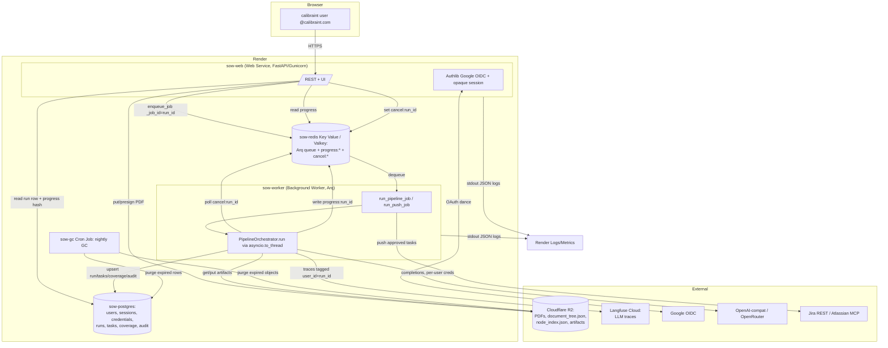

# Render Migration Design — SOW-to-Jira Elevation

**Status:** Locked design, pre-implementation
**Scope:** Local-first single-tenant tool → hosted multi-user SaaS on Render (single org: calibraint), plus intelligence-layer quality fixes.
**Author basis:** Reconciled from five component designs (topology, auth, data layer, async execution, secrets/observability).

---

## 0. Reconciled decisions (where designers disagreed)

The five designs were largely complementary but conflicted on a few specifics. Locked choices:

| Decision | Options seen | Locked choice | Why |
|---|---|---|---|
| Job queue library | RQ (topology) vs Arq (async-exec) | **Arq** | The app is async FastAPI + httpx + Pydantic. Arq is natively asyncio (no thread-pool shim, no Celery prefork/beat sprawl), has first-class SIGTERM drain, job timeouts, `max_tries`, and `_job_id` idempotency. Single new dep family (`arq` + `redis`). |
| Object storage | R2 (topology/data) vs S3 (alt) | **Cloudflare R2** (S3-compatible, boto3) behind a swappable `integrations/object_store.py` adapter | Zero egress fees, S3 API boto3 already speaks. Adapter isolation means S3 swap is a one-file change. |
| Encryption key env var name | `SOW_FERNET_KEY` (topology/data) vs `APP_ENCRYPTION_KEY`/`APP_ENC_KEY` (auth/secrets) | **`APP_ENC_KEY`** as canonical; `config/settings.py` already reads `SOW_FERNET_KEY`, so alias it. Support `APP_ENC_KEY_OLD` for `MultiFernet` rotation. | One name avoids drift; MultiFernet gives a seamless rotation path. |
| Auth library | Better Auth (Node, hinted by existing env var) vs Authlib (Python) | **Authlib + Google OIDC**, opaque server-side sessions in Postgres | Keep it Python-native; do not add a Node runtime. Google Workspace already enforces passwords/MFA for the org. |
| Run status store | Postgres only (data) vs Redis hash + Postgres fallback (topology/async) | **Both:** live progress in a Redis hash (`progress:<run_id>`), durable/terminal status in the `runs` table | Cheap polling without hammering Postgres; Postgres is the restart-safe source of truth. |
| Postgres plan | `basic-256mb` vs `standard` | **`basic-256mb` to start, documented bump to `basic-1gb`/standard before real load** | Single org, low volume. Connection ceiling is the real constraint — mitigated with small pools. |
| Crypto upgrade | KMS envelope encryption | **Rejected** — keep single-key Fernet/MultiFernet | Over-engineering for one internal org. Left as a seam. |
| Ollama | keep vs drop | **Dropped** | Hosted API providers only (OpenAI-compatible, OpenRouter). |
| Argus/Bifrost OTLP fleet | keep vs replace | **Replaced** by Render-native stdout logs + Langfuse Cloud for LLM traces | No collector fleet to run; Render ingests stdout JSON automatically. |

---

## 1. Target architecture overview

The single in-process FastAPI app (pipeline running as `BackgroundTasks`, all state on local disk + in-memory dicts) splits into **four Render services** wired by one `render.yaml` Blueprint, with externalized state.



**Data flow for one run:**
1. User authenticates via Google OIDC; opaque session cookie set, `user_id` resolved on every request.
2. User uploads a SOW PDF → web streams it to R2 under `users/{user_id}/runs/{run_id}/sow.pdf`, inserts a `QUEUED` `runs` row, and `enqueue_job("run_pipeline_job", run_id, user_id, _job_id=run_id)`.
3. The Arq worker dequeues, rebuilds `RunConfig` + per-user creds **from the DB row (never from the request body)**, runs `PipelineOrchestrator.run()` off the event loop via `asyncio.to_thread`, writing live progress to Redis and final tasks/coverage/audit to Postgres, artifacts to R2.
4. Web `/api/status` reads the Redis progress hash (fast path) with a Postgres fallback for terminal/restart-safe state.
5. Cancellation: web sets `cancel:<run_id>` in Redis; an asyncio watcher in the job flips the existing `threading.Event` the orchestrator already checks at every LLM call and per-node checkpoint.
6. Jira push runs as a second Arq job.

**Why this shape:** the pipeline is a multi-minute, 100+-LLM-call, cancellable, single-run-per-job CPU+IO task. On a multi-instance hosted web service the current model breaks immediately — status polling hits a different replica than the one running the job, and a deploy/SIGTERM kills in-flight runs. Worker + externalized state is the minimal correct elevation.

---

## 2. Service topology & render.yaml Blueprint

Four services + one database + one Key Value, all from a **single Docker image** role-switched by `SOW_ROLE` so the build caches once.

```yaml
databases:
  - name: sow-postgres
    plan: basic-256mb            # starter; bump to basic-1gb / standard before real load
    databaseName: sow
    user: sow
    postgresMajorVersion: "16"

services:
  - type: keyvalue
    name: sow-redis
    plan: starter                # NOT free — free Key Value has no persistence; queued jobs would vanish
    ipAllowList: []              # private-only; reachable from web + worker via internal URL
    maxmemoryPolicy: noeviction  # never evict queued jobs

  - type: web
    name: sow-web
    runtime: docker
    plan: starter
    dockerfilePath: ./Dockerfile
    dockerContext: .
    healthCheckPath: /healthz    # unauthenticated, cheap 200
    preDeployCommand: alembic upgrade head   # migrations gate the deploy
    autoDeploy: true
    envVars:
      - key: SOW_ROLE
        value: web
      - key: PORT
        value: "8000"
      - key: DATABASE_URL
        fromDatabase:
          name: sow-postgres
          property: connectionString
      - key: REDIS_URL
        fromService:
          type: keyvalue
          name: sow-redis
          property: connectionString
      - key: SESSION_SECRET
        generateValue: true
      - key: OAUTH_REDIRECT_URI
        value: https://sow-web.onrender.com/auth/callback
      - fromGroup: sow-shared

  - type: worker
    name: sow-worker
    runtime: docker
    plan: standard               # 2GB RAM: sentence-transformers all-MiniLM + pymupdf need headroom
    dockerfilePath: ./Dockerfile
    dockerContext: .
    autoDeploy: true
    envVars:
      - key: SOW_ROLE
        value: worker
      - key: DATABASE_URL
        fromDatabase:
          name: sow-postgres
          property: connectionString
      - key: REDIS_URL
        fromService:
          type: keyvalue
          name: sow-redis
          property: connectionString
      - fromGroup: sow-shared

  - type: cron
    name: sow-gc
    runtime: docker
    plan: starter
    dockerfilePath: ./Dockerfile
    dockerContext: .
    schedule: "0 3 * * *"        # 03:00 UTC daily
    dockerCommand: python -m scripts.gc_sessions
    envVars:
      - key: SOW_ROLE
        value: cron
      - key: DATABASE_URL
        fromDatabase:
          name: sow-postgres
          property: connectionString
      - fromGroup: sow-shared

envVarGroups:
  - name: sow-shared
    envVars:
      - key: APP_ENC_KEY          # app encryption key (Fernet) — was data/.keyfile. Dashboard secret.
        sync: false
      - key: APP_ENC_KEY_OLD      # optional, set ONLY during key rotation (MultiFernet decrypt-only)
        sync: false
      - key: GOOGLE_CLIENT_ID
        sync: false
      - key: GOOGLE_CLIENT_SECRET
        sync: false
      - key: LANGFUSE_PUBLIC_KEY
        sync: false
      - key: LANGFUSE_SECRET_KEY
        sync: false
      - key: LANGFUSE_HOST
        value: https://cloud.langfuse.com
      - key: R2_ENDPOINT_URL
        sync: false
      - key: R2_ACCESS_KEY_ID
        sync: false
      - key: R2_SECRET_ACCESS_KEY
        sync: false
      - key: R2_BUCKET
        value: sow-artifacts
      - key: SOW_LOG_LEVEL
        value: INFO
```

**Validate before first deploy:** `render blueprints validate`.

### Connection-string gotchas
- **`DATABASE_URL`**: Render Postgres `connectionString` is `postgresql://`; async SQLAlchemy/asyncpg wants `postgresql+asyncpg://`. Normalize **once** at startup in a single helper, not everywhere.
- **`REDIS_URL`**: the Key Value `connectionString` is the **internal** URL (private network, no TLS, no egress). Use it directly; `rediss://` only if ever exposed externally.

### Dockerfile changes (single image, role-switched)
- Keep the existing multi-stage build. Replace the single `CMD` with an entrypoint that branches on `SOW_ROLE`:
  - `web`: `gunicorn -k uvicorn.workers.UvicornWorker -w 2 -b 0.0.0.0:$PORT --graceful-timeout 30 ui.server:app`
  - `worker`: `arq pipeline.worker.WorkerSettings`
  - `cron`: exec the `dockerCommand`
- Bind to `$PORT` (Render injects it). `server.py` `__main__` currently hardcodes `127.0.0.1:8000` — fine for local, but the gunicorn command must use `0.0.0.0:$PORT`.
- Bake the embedding model into the image so the worker doesn't download ~90MB on first job and isn't subject to ephemeral-disk wipes:
  `RUN python -c "from sentence_transformers import SentenceTransformer; SentenceTransformer('all-MiniLM-L6-v2')"`
- **Remove the committed `.github_token`** from the repo and image (it's currently `COPY . .` into the container). Rotate it.

---

## 3. Postgres schema & object storage

Postgres 16 is the single source of truth for relational + run state. Every tenant-owned table carries `user_id` with an FK and index for **row-level isolation**. Large opaque artifacts go to R2 (referenced by key columns), never into Postgres and never onto a Render Disk.

### 3.1 DDL

```sql
-- ── Auth-owned ──────────────────────────────────────────────
CREATE TABLE users (
    id           UUID PRIMARY KEY DEFAULT gen_random_uuid(),
    email        TEXT UNIQUE NOT NULL,              -- must end @calibraint.com
    google_sub   TEXT UNIQUE NOT NULL,              -- stable Google subject id
    display_name TEXT,
    is_active    BOOLEAN NOT NULL DEFAULT TRUE,
    created_at   TIMESTAMPTZ NOT NULL DEFAULT now(),
    last_login   TIMESTAMPTZ
);

CREATE TABLE sessions (
    id           UUID PRIMARY KEY DEFAULT gen_random_uuid(),
    user_id      UUID NOT NULL REFERENCES users(id) ON DELETE CASCADE,
    token_hash   BYTEA UNIQUE NOT NULL,             -- sha256(raw cookie token); raw never stored
    created_at   TIMESTAMPTZ NOT NULL DEFAULT now(),
    expires_at   TIMESTAMPTZ NOT NULL,              -- created_at + 7 days
    last_seen_at TIMESTAMPTZ NOT NULL DEFAULT now(),
    user_agent   TEXT,
    ip           INET
);
CREATE INDEX ix_sessions_user ON sessions(user_id);

-- ── Per-user credentials (replaces data/settings.json + data/.keyfile) ──
CREATE TABLE user_credentials (
    id                UUID PRIMARY KEY DEFAULT gen_random_uuid(),
    user_id           UUID NOT NULL REFERENCES users(id) ON DELETE CASCADE,
    kind              TEXT NOT NULL,                -- 'llm' | 'jira'
    provider          TEXT,                         -- openai | openrouter (ollama dropped)
    config            JSONB NOT NULL DEFAULT '{}',  -- non-secret: model, api_base, jira_server_url,
                                                    --   jira_email, project_key, hierarchy default
    secret_ciphertext TEXT,                         -- Fernet token of api_key / jira_api_token
    key_version       SMALLINT NOT NULL DEFAULT 1,  -- supports MultiFernet rotation
    created_at        TIMESTAMPTZ NOT NULL DEFAULT now(),
    updated_at        TIMESTAMPTZ NOT NULL DEFAULT now(),
    UNIQUE (user_id, kind, provider)
);
CREATE INDEX ix_creds_user ON user_credentials(user_id);

-- ── Runs (replaces data/sessions/<id>/metadata.json + active_runs dict) ──
CREATE TABLE runs (
    id                    UUID PRIMARY KEY DEFAULT gen_random_uuid(),
    user_id               UUID NOT NULL REFERENCES users(id) ON DELETE CASCADE,
    legacy_run_id         TEXT,                     -- old "20260513-...-test-sow" string, traceability
    filename              TEXT NOT NULL,
    status                TEXT NOT NULL DEFAULT 'queued',
                            -- queued|indexing|extracting|dedup|coverage|critic|gap|complete|error|cancelled
    progress              REAL NOT NULL DEFAULT 0,
    current_step          INT NOT NULL DEFAULT 0,
    message               TEXT,
    config                JSONB NOT NULL,           -- RunConfig.model_dump(mode="json"), sans secrets
    pdf_object_key        TEXT,                     -- R2 key for uploaded SOW
    tree_object_key       TEXT,                     -- R2 key for document_tree.json
    node_index_object_key TEXT,                     -- R2 key for node_index.json
    coverage_pct          REAL,
    task_count            INTEGER,
    worker_heartbeat      TIMESTAMPTZ,              -- stale-run detection after worker SIGKILL
    error                 TEXT,
    created_at            TIMESTAMPTZ NOT NULL DEFAULT now(),
    updated_at            TIMESTAMPTZ NOT NULL DEFAULT now(),
    completed_at          TIMESTAMPTZ
);
CREATE INDEX ix_runs_user ON runs(user_id, created_at DESC);

-- ── Tasks (replaces the "tasks" array in pipeline_output.json; ManagedTask -> row) ──
CREATE TABLE tasks (
    id                  UUID PRIMARY KEY,           -- ManagedTask.id; do NOT regenerate
    run_id              UUID NOT NULL REFERENCES runs(id) ON DELETE CASCADE,
    user_id             UUID NOT NULL REFERENCES users(id) ON DELETE CASCADE,
    title               TEXT NOT NULL,
    short_description   TEXT,
    status              TEXT NOT NULL,              -- TaskStatus enum value
    confidence          REAL NOT NULL,
    continues_to_next   BOOLEAN NOT NULL DEFAULT FALSE,
    flags               JSONB NOT NULL DEFAULT '[]',-- list[TaskFlag]
    acceptance_criteria JSONB,                      -- list[AcceptanceCriterion]
    source_refs         JSONB NOT NULL DEFAULT '[]',-- list[SourceRef]
    dependencies        JSONB NOT NULL DEFAULT '[]',
    merged_from         JSONB NOT NULL DEFAULT '[]',
    extra               JSONB NOT NULL DEFAULT '{}',-- use_case, deliverables, considerations, mockup
    jira_issue_key      TEXT,                       -- set on push (JiraPushResult)
    jira_issue_url      TEXT,
    created_at          TIMESTAMPTZ NOT NULL DEFAULT now(),
    updated_at          TIMESTAMPTZ NOT NULL DEFAULT now()
);
CREATE INDEX ix_tasks_run  ON tasks(run_id);
CREATE INDEX ix_tasks_user ON tasks(user_id);

-- ── Coverage reports (replaces coverage_reports.json; first-class so the
--    100%-INCOMPLETE bug fix is queryable/eval-able) ──
CREATE TABLE coverage_reports (
    id         UUID PRIMARY KEY DEFAULT gen_random_uuid(),
    run_id     UUID NOT NULL REFERENCES runs(id) ON DELETE CASCADE,
    user_id    UUID NOT NULL REFERENCES users(id) ON DELETE CASCADE,
    node_id    TEXT NOT NULL,                       -- PageIndex node
    report     JSONB NOT NULL,                      -- CoverageChecker.check_section().model_dump()
    created_at TIMESTAMPTZ NOT NULL DEFAULT now()
);
CREATE INDEX ix_cov_run ON coverage_reports(run_id);

-- ── Audit log (1:1 lift of SQLite audit.db + user_id) ──
CREATE TABLE audit_log (
    id              BIGSERIAL PRIMARY KEY,
    run_id          UUID REFERENCES runs(id) ON DELETE CASCADE,
    user_id         UUID NOT NULL REFERENCES users(id) ON DELETE CASCADE,
    ts              TIMESTAMPTZ NOT NULL DEFAULT now(),
    agent           TEXT NOT NULL,
    node_id         TEXT,
    action          TEXT NOT NULL,
    task_id         TEXT,
    detail          TEXT,
    llm_tokens_used INTEGER NOT NULL DEFAULT 0,
    llm_model       TEXT NOT NULL DEFAULT ''
);
CREATE INDEX ix_audit_run ON audit_log(run_id, id);
```

### 3.2 Data-access layer (`pipeline/db.py`)
- `create_async_engine(DATABASE_URL, pool_size=3, max_overflow=2, pool_pre_ping=True, pool_recycle=300)`.
- Render Postgres `basic-256mb` caps connections low. **Total connections** = `(web replicas × pool) + (worker replicas × pool) + cron` must stay under the plan ceiling. Keep pools small; do not add PgBouncer for one org — switch `DATABASE_URL` to Render's **pooled** connection string before scaling replicas.
- ORM models mirror the schema; JSONB columns round-trip Pydantic via `model_dump(mode="json")` / `model_validate`. Run the existing `normalize_acceptance_criteria` seam on read to handle legacy/migrated rows.

### 3.3 Object storage plan (R2 via `integrations/object_store.py`)
- Thin boto3 client with `endpoint_url=R2_ENDPOINT_URL`. `put_object` (user-prefixed key), `presigned get_object` for UI downloads.
- **Key convention:** `users/{user_id}/runs/{run_id}/sow.pdf`, `.../document_tree.json`, `.../node_index.json`, `.../coverage_reports.json`, `.../cross_run_index.npz`.
- Every `Path("data/sessions/{run_id}/...")` and `data/uploads/` read/write in `orchestrator.py` and `ui/server.py` routes through `get_artifact` / `put_artifact(user_id, run_id, name)`.
- The worker streams the PDF to a `/tmp` scratch file for pymupdf, which only needs ephemeral local disk.
- **Render has no native blob store** — skipping R2 means the ephemeral container filesystem wipes all sessions on every redeploy.

---

## 4. Auth design

**Google OAuth 2.0 / OIDC via Authlib**, gated to `@calibraint.com`, with **server-side opaque sessions in Postgres**.

- **Why:** every user already has a Google Workspace identity → SSO is lowest-friction/liability. No password hashing, reset flow, or MFA to build. Email+password is disproportionate for one internal org; Better Auth is TypeScript (wrong runtime for a pure-Python app).
- **Libraries:** `authlib` (OIDC client), `itsdangerous` (signed OAuth state, already a Starlette transitive dep), reuse `cryptography.Fernet` (do not add a new crypto lib).

### Session strategy
- Opaque random token `secrets.token_urlsafe(32)` in an **`HttpOnly`, `Secure`, `SameSite=Lax`** cookie named `sid`.
- Store only `sha256(raw_token)` in `sessions.token_hash` — never the raw token. Gives server-side revocation (logout, admin kill) that stateless JWTs can't do without a denylist.
- 7-day expiry; `last_seen_at` touched per request.

### OAuth wiring (`auth/` module)
```python
# auth/oauth.py
oauth = OAuth()
oauth.register(
    name="google",
    server_metadata_url="https://accounts.google.com/.well-known/openid-configuration",
    client_id=os.environ["GOOGLE_CLIENT_ID"],
    client_secret=os.environ["GOOGLE_CLIENT_SECRET"],
    client_kwargs={"scope": "openid email profile",
                   "prompt": "select_account",
                   "hd": "calibraint.com"},   # UI hint only — NOT a security control
)
```
```python
# auth/routes.py — /auth/login, /auth/callback, /auth/logout
@router.get("/auth/callback")
async def callback(request):
    token  = await oauth.google.authorize_access_token(request)  # validates state + id_token sig
    claims = token["userinfo"]
    if not claims["email"].endswith("@calibraint.com") or not claims.get("email_verified"):
        raise HTTPException(403, "calibraint.com accounts only")   # the REAL guard
    user = await upsert_user(claims["sub"], claims["email"], claims.get("name"))
    raw  = secrets.token_urlsafe(32)
    await create_session(user.id, sha256(raw), expires=now() + timedelta(days=7))
    resp = RedirectResponse("/")
    resp.set_cookie("sid", raw, httponly=True, secure=True, samesite="lax",
                    max_age=7*24*3600, path="/")
    return resp
```
```python
# auth/deps.py — the isolation chokepoint every data route depends on
async def current_user(request) -> User:
    raw = request.cookies.get("sid")
    if not raw: raise HTTPException(401)
    sess = await session_by_hash(sha256(raw))
    if not sess or sess.expires_at < now(): raise HTTPException(401)
    await touch_session(sess.id)
    return await user_by_id(sess.user_id)
```

### Isolation & hardening
- Apply `dependencies=[Depends(current_user)]` on the data router; inject `user: User = Depends(current_user)` wherever the id feeds a `WHERE user_id = :uid` filter. Every owned query on `runs`/`tasks`/`coverage_reports`/`audit_log`/`user_credentials` filters by `user_id`.
- Add Starlette `SessionMiddleware(secret_key=SESSION_SECRET)` **only** for the short-lived OAuth state during the redirect — app auth itself is the opaque-cookie scheme above.
- **CORS/cookie:** replace `allow_credentials=True` + env-driven origin list with the single Render app origin; cookies are `Secure` + same-origin so cross-origin credentialed requests aren't needed.
- **CSRF:** double-submit token check (`X-CSRF-Token` header vs a non-`HttpOnly` `csrf` cookie) on the state-changing, credential-touching endpoints `POST /api/settings` and `POST /api/push`.
- **`/healthz`** is unauthenticated so Render's health check passes.
- The **owning `user_id` must be captured at enqueue time** and threaded into the worker job — runs must never be orphaned or mis-attributed once isolation is enforced. The job rebuilds `RunConfig` from the DB row, not the request.

> The existing `BETTER_AUTH_TRUSTED_ORIGINS` env var in `ui/server.py` (someone scoped Better Auth previously) is dropped — we stay Python-native.

---

## 5. Async execution: worker + queue

**Arq** (async Redis queue) on **Render Key Value (Redis)**, with a dedicated **Background Worker** running the Arq worker and the **web service only enqueuing**.

**Why Arq over Celery/RQ (this codebase specifically):**
1. The stack is already async FastAPI + httpx + Pydantic — Arq is natively asyncio (no `eventlet`/`gevent` monkeypatch like Celery prefork, no thread-pool shim like RQ).
2. Arq is a ~1-file-config dependency (`arq` + `redis`) vs Celery's broker/result-backend/beat sprawl — right weight for a single-org internal SaaS.
3. First-class SIGTERM graceful drain, job timeouts, retries via `max_tries`, and `_job_id` idempotency — exactly the four guarantees this component needs.

**The orchestrator caveat:** `PipelineOrchestrator.run()` is fully synchronous and CPU/IO-blocking (PageIndex, sync litellm, sync jira SDK). Run it inside the async worker via `await asyncio.to_thread(orchestrator.run)` so the worker loop stays responsive for heartbeats and cancellation polling. **Keep the existing `threading.Event` stop mechanism** — it already gates every LLM call and the per-node loop — and drive it from a Redis `cancel:<run_id>` flag.

### Job functions (`pipeline/jobs.py`)
```python
async def run_pipeline_job(ctx, run_id: str, user_id: str):
    pool = ctx["redis"]
    stop_event = threading.Event()

    async def _watch_cancel():
        while not stop_event.is_set():
            if await pool.get(f"cancel:{run_id}"):
                stop_event.set(); return
            await asyncio.sleep(2)
    watcher = asyncio.create_task(_watch_cancel())

    # Build from the DB row + per-user creds, NEVER from the request body (security)
    run_cfg, app_config, audit = await load_run_context(run_id, user_id)

    def status_cb(step, msg, progress):
        payload = json.dumps({"step": step, "message": msg, "progress": progress,
                              "is_running": True, "ts": time.time()})
        asyncio.run_coroutine_threadsafe(
            pool.set(f"progress:{run_id}", payload, ex=3600), ctx["loop"])

    orch = PipelineOrchestrator(run_cfg, app_config, audit,
                                status_callback=status_cb, stop_event=stop_event)
    try:
        tasks = await asyncio.to_thread(orch.run)          # blocking pipeline off the loop
        await persist_run_result(run_id, tasks, status="complete")   # -> Postgres + R2
    except Exception as e:
        await mark_run_failed(run_id, str(e)); raise
    finally:
        stop_event.set(); watcher.cancel()


async def run_push_job(ctx, run_id, user_id, hierarchy, project_key):
    ...   # same shape; wraps JiraClient.push_tasks in asyncio.to_thread
```

### Worker settings (`pipeline/worker.py`)
```python
class WorkerSettings:
    functions = [run_pipeline_job, run_push_job]
    redis_settings = RedisSettings.from_dsn(os.environ["REDIS_URL"])
    max_jobs = int(os.getenv("ARQ_MAX_JOBS", "4"))
    job_timeout = int(os.getenv("ARQ_JOB_TIMEOUT", "3600"))   # 1h hard cap; tune to real durations
    keep_result = 86400
    max_tries = 1               # pipeline runs are expensive + LLM-nondeterministic: NO auto-retry.
                                # push_job overrides to 3.
    health_check_interval = 30
    handle_signals = True       # Arq's built-in SIGTERM graceful drain
    async def on_startup(ctx): ctx["loop"] = asyncio.get_event_loop()
```

### Web side (replaces `BackgroundTasks` + `active_runs`/`active_orchestrators` + raw `threading.Thread` push)
```python
# FastAPI lifespan: app.state.arq = await create_pool(RedisSettings.from_dsn(REDIS_URL))

@app.post("/api/process")
async def start_processing(req, user=Depends(current_user)):
    run_id = make_run_id(req.pdf_filename)
    await create_run_row(run_id, user.id, status="queued")
    await app.state.arq.enqueue_job("run_pipeline_job", run_id, user.id, _job_id=run_id)  # idempotent
    return {"run_id": run_id}

@app.post("/api/cancel/{run_id}")
async def cancel_run(run_id, user=Depends(current_user)):
    await assert_owns_run(user.id, run_id)
    await app.state.redis.set(f"cancel:{run_id}", "1", ex=3600)
    return {"message": "Cancellation signal sent"}

@app.get("/api/status")
async def get_status(session_id, user=Depends(current_user)):
    await assert_owns_run(user.id, session_id)
    raw = await app.state.redis.get(f"progress:{session_id}")
    return json.loads(raw) if raw else await get_run_status_from_db(session_id)
```

### Idempotency, heartbeats, drain
- `_job_id=run_id` dedupes enqueues. Inside the job, first check the run row — if already `complete`/`running` on a live worker, return early (covers re-delivery after a crash).
- The job writes `worker_heartbeat` periodically. On worker startup, **requeue or fail any `running` row whose heartbeat is stale** (SIGKILL recovery).
- **No checkpoint-resume:** the orchestrator only checkpoints at the end of `run()`. A killed run restarts from scratch (re-index, re-extract). Acceptable for an internal tool; mid-pipeline resume is explicitly out of scope.

---

## 6. Secrets & hosted observability

### 6.1 Secrets — per-user Fernet, no `os.environ` globals
- The app encryption key moves from `data/.keyfile` to the **`APP_ENC_KEY`** Render secret (`config/settings.py` already prefers an env key — alias `SOW_FERNET_KEY` → `APP_ENC_KEY`, drop the keyfile-write fallback in hosted mode).
- New `config/crypto.py` generalizes encrypt/decrypt into a stateless `MultiFernet` helper supporting versioned rotation:
```python
from cryptography.fernet import Fernet, MultiFernet
def _load_keys():
    keys = [os.environ["APP_ENC_KEY"]]
    if os.environ.get("APP_ENC_KEY_OLD"):
        keys.append(os.environ["APP_ENC_KEY_OLD"])   # decrypt-only during rotation
    return MultiFernet([Fernet(k.encode()) for k in keys])
_mf = _load_keys()
def encrypt_secret(p: str) -> str: return _mf.encrypt(p.encode()).decode()
def decrypt_secret(t: str) -> str: return _mf.decrypt(t.encode()).decode()
# MultiFernet decrypts with any key, encrypts with the first -> seamless rotation.
```
- **Kill `os.environ` for credentials.** A frozen `RunCredentials` dataclass is resolved once per run and threaded explicitly through `PipelineOrchestrator` → `llm_router.configure_litellm_for_mode(mode, creds)` → `llm_client` (`litellm.completion(..., api_key=..., api_base=...)` per call) and into `JiraClient`/`JiraMCPClient` constructors. No process-global state, so concurrent users never collide.
- **Every** `os.environ["JIRA_*"]` / `["LITELLM_*"]` write must be removed (`jira_client.py`, `jira_mcp_client.py`, `ui/server.py` settings-apply paths) — a partial migration is a security bug (one user's creds leak into another's concurrent run). `jira_mcp_client` spawns a subprocess with `env=os.environ.copy()` — inject the per-user token into a **scoped env dict** for that subprocess only.
- `GET/POST /api/settings` read/write `user_credentials` rows scoped to the authenticated `user_id`; secrets still masked `***` on read.
- **Never-log enforcement:** extend the `telemetry.py` scrub denylist to `{api_key, api_token, jira_api_token, authorization, password, secret}` and add a loguru patcher that redacts those keys before any sink writes.

### 6.2 Observability — Render-native + Langfuse Cloud (Argus/Bifrost removed)
- **Logs:** rewrite `pipeline/observability.py` to a single loguru sink → `sys.stdout` with `serialize=True` (JSON). Render ingests stdout automatically into Logs + metrics — no collector. Bind `user_id` + `run_id` via `logger.contextualize` for filtering.
- **LLM traces:** Langfuse SDK directly in `llm_client.py`, each trace tagged `user_id` + `run_id`:
```python
from langfuse import Langfuse
lf = Langfuse()   # reads LANGFUSE_PUBLIC_KEY / SECRET_KEY / HOST from env
with lf.start_as_current_generation(name="extraction", model=cfg.model, input=...,
        metadata={"user_id": uid, "run_id": rid}) as gen:
    resp = litellm.completion(...); gen.update(output=..., usage_details={...})
```
- **Remove from `requirements.txt`:** all `opentelemetry-*`, `traceloop-sdk`. **Add:** `langfuse>=2.x`. Delete `init_argus`, OTLP exporters, `BIFROST_*`/`ARGUS_*`/`OLLAMA_*` config, file sinks (`system.log`, `audit.jsonl` — ephemeral FS is wrong on Render), and the `infra/` Argus compose stack.
- Langfuse must **fail-open** — never block a pipeline run on a tracing outage; use batched/async flushing.

---

## 7. Migration runbook (ordered)

Execute in this order; each step is independently shippable where possible.

**Phase A — Security & build prerequisites**
1. `git rm --cached .github_token`, scrub from history (`git filter-repo`), **rotate the leaked GitHub token**, confirm `.gitignore` covers it.
2. Dockerfile: add `$PORT` binding and the `SOW_ROLE` entrypoint branch; bake `all-MiniLM-L6-v2`; keep the single multi-stage image.

**Phase B — Postgres data layer**
3. Add deps: `sqlalchemy[asyncio]>=2.0`, `asyncpg`, `alembic`, `boto3`. Provision Render Postgres + R2 bucket; set `DATABASE_URL`, `APP_ENC_KEY`, `R2_*`.
4. Create `pipeline/db.py` (async engine + session factory + ORM models) and `integrations/object_store.py` (R2 boto3 adapter). Normalize the `postgresql://` → `postgresql+asyncpg://` scheme once at startup.
5. Initialize Alembic; author the initial migration creating all tables (§3). Wire `preDeployCommand: alembic upgrade head`.
6. Rewrite `audit/logger.py` to insert rows via the engine (same `.log()` signature + `user_id` param); `get_run_logs` → `SELECT ... WHERE run_id AND user_id`.

**Phase C — Auth & per-user credentials**
7. Create the Google OAuth Web Client in Calibraint's Google Cloud console; consent screen **Internal** (Workspace-only); redirect URI `https://sow-web.onrender.com/auth/callback`. Store client id/secret as Render secrets.
8. Build the `auth/` module (`oauth.py`, `routes.py`, `deps.py`, sessions CRUD). Add `SessionMiddleware` for OAuth state only.
9. Add `config/crypto.py` (MultiFernet). Add `RunCredentials` + `load_run_credentials(db, user_id)`. Thread creds through orchestrator → router → llm_client → JiraClient/JiraMCPClient.
10. Rewrite `GET/POST /api/settings` to per-user `user_credentials` rows; **delete every `os.environ["JIRA_*"]`/`["LITELLM_*"]` write** and the legacy settings-apply helper.
11. Add `dependencies=[Depends(current_user)]` to the data router; add `user_id` to every `runs`/`tasks`/`coverage`/`audit` query filter. Tighten CORS to the single Render origin; set cookie flags; add the double-submit CSRF check on `/api/settings` and `/api/push`.

**Phase D — In-process → worker**
12. Provision Render Key Value (`sow-redis`, `maxmemoryPolicy=noeviction`); add `REDIS_URL` to the shared env group. Add `arq` + `redis` deps.
13. Create `pipeline/jobs.py` (`run_pipeline_job`, `run_push_job`) and `pipeline/worker.py` (`WorkerSettings`).
14. In `ui/server.py`: add the FastAPI lifespan (Arq pool + redis client on `app.state`); **delete `active_runs`, `active_orchestrators`, `run_pipeline_task`, `run_push_task`, and the `threading`/`BackgroundTasks` imports.**
15. Rewrite `/api/process`, `/api/push` to insert a `queued` row then `enqueue_job(..., _job_id=run_id)`; rewrite `/api/cancel/{run_id}` to set `cancel:<run_id>`; rewrite `/api/status` to read the Redis progress hash with Postgres fallback. Add the asyncio cancel-watcher → existing `threading.Event`.
16. Move final output off `data/sessions/<run_id>/pipeline_output.json` to Postgres rows + R2 artifacts. Refactor orchestrator Step-5 save (the three `json.dump`-to-disk blocks) into DB upserts (`run`, `tasks`, `coverage_reports`) + R2 uploads. Add the `worker_heartbeat` + stale-run requeue on worker startup.

**Phase E — Observability & GC**
17. Rewrite `pipeline/observability.py` to stdout-JSON loguru + redaction patcher; remove OTLP/`traceloop`/`init_argus`/file sinks. Add `langfuse`; instrument LLM calls tagged `user_id`+`run_id`. Set `LANGFUSE_*` secrets. Remove the `infra/` Argus stack and `BIFROST_*`/`ARGUS_*`/`OLLAMA_*` config.
18. Add `scripts/gc_sessions.py` (purge expired R2 artifacts + orphan rows + expired sessions). Wire the `sow-gc` cron.

**Phase F — Cutover & data migration**
19. Write `scripts/migrate_fs_to_pg.py`: for each `data/sessions/<run_id>/`, read `metadata.json` + `pipeline_output.json` + `coverage_reports.json`, assign to a seed `calibraint-migration` user, insert `runs`+`tasks`+`coverage_reports`, upload PDF/tree/node_index to R2, set `legacy_run_id`. Route legacy string acceptance-criteria through `normalize_acceptance_criteria`. Lift `data/audit.db` rows into `audit_log`. Re-encrypt `data/settings.json` secrets under `APP_ENC_KEY` into one `user_credentials` pair.
20. Write `render.yaml` (§2); set all `sync:false` secrets in the dashboard; `render blueprints validate`.
21. Deploy the Blueprint (web + worker + cron from the same image); `alembic upgrade head` runs via `preDeployCommand`.
22. **Smoke-test:** one end-to-end run on a hosted provider (no Ollama); restart the web mid-run (progress keeps advancing from the worker); cancel a run (stop honored at next LLM call); redeploy the worker mid-run (SIGTERM drains, stale run requeues); two concurrent users get isolated credentials and rows. Assert migrated `task_count`/`coverage_pct` match the original `pipeline_output.json`. Then decommission `data/sessions` writes.

> **Note on intelligence-layer quality (Phase 12 bug):** the Postgres `tasks` / `coverage_reports` / `audit_log` tables are intentionally first-class and queryable so the extraction/dedup/critic/coverage fixes and their evals have a persistence substrate. Those fixes (100%-INCOMPLETE coverage over-reporting, zero-merge dedup JSON delimiter failure, critic conf=0.00) are tracked separately but **depend on this migration landing** to be eval-able across runs.

---

## 8. Risks & rollbacks

| # | Risk | Mitigation | Rollback |
|---|---|---|---|
| 1 | **SIGTERM mid-run** — Render gives ~30s drain; a 103-node run far exceeds it, so Arq's drain can't finish the job; worker dies. | `worker_heartbeat` + requeue/fail stale `running` rows on worker startup. Accept in-flight interruption on every worker deploy (no resume by design). | Re-enqueue from the run row; idempotent `_job_id`. |
| 2 | **Cross-instance state leak** — any surviving `active_runs`/`active_orchestrators`/in-process `stop_event` silently breaks status/cancel under >1 web replica (works in single-instance test, fails in prod). | Delete all in-memory dicts; status from Redis+Postgres; cancel via Redis flag. Test with 2 web replicas. | Pin web to 1 instance temporarily while the residual reference is removed. |
| 3 | **`os.environ` credential bleed** — leftover `JIRA_*`/`LITELLM_*` env writes leak one user's creds into another's concurrent run. | Remove every write; thread `RunCredentials` explicitly; integration test with two `user_id`s. | None safe — this is a security gate; block go-live until grep is clean. |
| 4 | **No native object store** — ephemeral FS wipes all sessions on redeploy if R2 is skipped. | R2 adapter; all artifact I/O via `object_store`. | N/A — required before any deploy. |
| 5 | **`DATABASE_URL` scheme mismatch** (`postgresql://` vs `+asyncpg`) throws at startup. | Normalize once at startup; use Render's **internal** connectionString (no egress). | Fix the helper; redeploy. |
| 6 | **Postgres connection exhaustion** — `basic-256mb` low ceiling; web+worker+cron pools can exceed it. | Small `pool_size`, `pool_pre_ping`, short `pool_recycle`; switch to pooled `DATABASE_URL` before scaling replicas. | Drop pool sizes / reduce worker `max_jobs`; restart. |
| 7 | **`APP_ENC_KEY` loss = permanent credential loss** — no `.keyfile` fallback anymore. | Back the key up out-of-band before go-live; MultiFernet `APP_ENC_KEY_OLD` rotation path (decrypt-old, encrypt-new). | Restore key from out-of-band backup; users re-enter creds if unrecoverable. |
| 8 | **OAuth consent left External / "Testing"** lets non-calibraint accounts reach the callback (the `hd` param is spoofable). | Consent screen **Internal**; the server-side `email.endswith("@calibraint.com")` + `email_verified` check is the real guard, never trust `hd` alone. | Revoke the OAuth client; flip consent to Internal. |
| 9 | **JSONB drift** — Pydantic shapes stored opaque; schema changes unenforced by DB. | Run `normalize_acceptance_criteria` on read; version migrations. | N/A — read-side normalization is the backstop. |
| 10 | **Migration fidelity** — legacy string run_ids + plain-string acceptance criteria. | `migrate_fs_to_pg.py` routes through `normalize_*`, keeps `legacy_run_id`, asserts `task_count`/`coverage_pct` match. | Re-run migration (idempotent on `legacy_run_id`); keep the original `data/sessions` until verified. |
| 11 | **Redis volatility** — flush loses in-flight live progress. | `maxmemoryPolicy=noeviction` for queued jobs; terminal state always in Postgres; size the plan for queue depth. | Progress reconstructs from Postgres fallback; jobs persist on starter+. |
| 12 | **Provider rate limits** — burst of enqueued runs hammers OpenRouter. | Per-user concurrency cap (refuse enqueue if user already has a `running`/`queued` run) before scaling workers; tune `max_jobs`. | Lower `max_jobs`; add backpressure at enqueue. |
| 13 | **Committed token in git history** — rotating doesn't remove history. | History scrub (`git filter-repo`) + rotation; audit for other plaintext secrets. | N/A — token already rotated. |

**Overall rollback posture:** keep the existing local-first path runnable until Phase F smoke-tests pass. The original `data/sessions/`, `data/audit.db`, and `data/settings.json` are read-only inputs to the one-shot migration and are not deleted until verification completes — so a failed cutover reverts to local operation by redeploying the prior image and pointing at the untouched `data/` tree.
